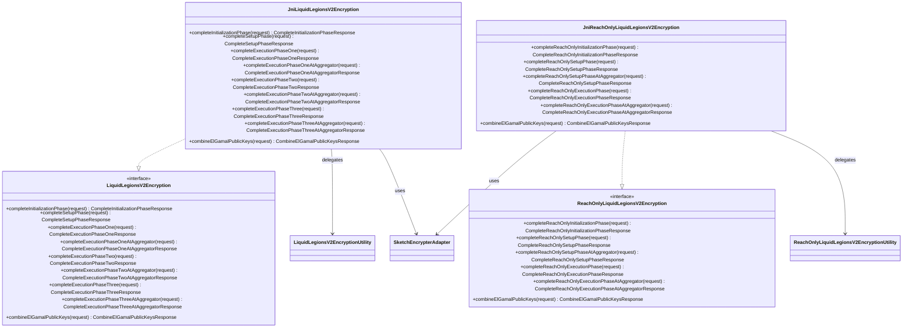

# org.wfanet.measurement.duchy.mill.liquidlegionsv2.crypto

## Overview
This package provides cryptographic operations for the Liquid Legions v2 protocol used in duchy mill computations. It defines interfaces for standard and reach-only variants of the protocol, along with JNI-based implementations that delegate to native C++ encryption utilities for secure multi-party computation.

## Components

### LiquidLegionsV2Encryption
Interface defining cryptographic operations for the full Liquid Legions v2 protocol across initialization, setup, and three execution phases.

| Method | Parameters | Returns | Description |
|--------|------------|---------|-------------|
| completeInitializationPhase | `request: CompleteInitializationPhaseRequest` | `CompleteInitializationPhaseResponse` | Completes initialization phase cryptographic operations |
| completeSetupPhase | `request: CompleteSetupPhaseRequest` | `CompleteSetupPhaseResponse` | Completes setup phase cryptographic operations |
| completeExecutionPhaseOne | `request: CompleteExecutionPhaseOneRequest` | `CompleteExecutionPhaseOneResponse` | Completes first execution phase operations |
| completeExecutionPhaseOneAtAggregator | `request: CompleteExecutionPhaseOneAtAggregatorRequest` | `CompleteExecutionPhaseOneAtAggregatorResponse` | Completes first execution phase at aggregator node |
| completeExecutionPhaseTwo | `request: CompleteExecutionPhaseTwoRequest` | `CompleteExecutionPhaseTwoResponse` | Completes second execution phase operations |
| completeExecutionPhaseTwoAtAggregator | `request: CompleteExecutionPhaseTwoAtAggregatorRequest` | `CompleteExecutionPhaseTwoAtAggregatorResponse` | Completes second execution phase at aggregator node |
| completeExecutionPhaseThree | `request: CompleteExecutionPhaseThreeRequest` | `CompleteExecutionPhaseThreeResponse` | Completes third execution phase operations |
| completeExecutionPhaseThreeAtAggregator | `request: CompleteExecutionPhaseThreeAtAggregatorRequest` | `CompleteExecutionPhaseThreeAtAggregatorResponse` | Completes third execution phase at aggregator node |
| combineElGamalPublicKeys | `request: CombineElGamalPublicKeysRequest` | `CombineElGamalPublicKeysResponse` | Combines multiple ElGamal public keys into one |

### JniLiquidLegionsV2Encryption
JNI-based implementation of LiquidLegionsV2Encryption that delegates to native encryption utilities.

| Method | Parameters | Returns | Description |
|--------|------------|---------|-------------|
| completeInitializationPhase | `request: CompleteInitializationPhaseRequest` | `CompleteInitializationPhaseResponse` | Delegates to native utility for initialization phase |
| completeSetupPhase | `request: CompleteSetupPhaseRequest` | `CompleteSetupPhaseResponse` | Delegates to native utility for setup phase |
| completeExecutionPhaseOne | `request: CompleteExecutionPhaseOneRequest` | `CompleteExecutionPhaseOneResponse` | Delegates to native utility for execution phase one |
| completeExecutionPhaseOneAtAggregator | `request: CompleteExecutionPhaseOneAtAggregatorRequest` | `CompleteExecutionPhaseOneAtAggregatorResponse` | Delegates to native aggregator utility for phase one |
| completeExecutionPhaseTwo | `request: CompleteExecutionPhaseTwoRequest` | `CompleteExecutionPhaseTwoResponse` | Delegates to native utility for execution phase two |
| completeExecutionPhaseTwoAtAggregator | `request: CompleteExecutionPhaseTwoAtAggregatorRequest` | `CompleteExecutionPhaseTwoAtAggregatorResponse` | Delegates to native aggregator utility for phase two |
| completeExecutionPhaseThree | `request: CompleteExecutionPhaseThreeRequest` | `CompleteExecutionPhaseThreeResponse` | Delegates to native utility for execution phase three |
| completeExecutionPhaseThreeAtAggregator | `request: CompleteExecutionPhaseThreeAtAggregatorRequest` | `CompleteExecutionPhaseThreeAtAggregatorResponse` | Delegates to native aggregator utility for phase three |
| combineElGamalPublicKeys | `request: CombineElGamalPublicKeysRequest` | `CombineElGamalPublicKeysResponse` | Delegates to sketch encrypter adapter for key combination |

**Companion Object:**
- Loads native libraries: `liquid_legions_v2_encryption_utility` and `sketch_encrypter_adapter`

### ReachOnlyLiquidLegionsV2Encryption
Interface defining cryptographic operations for the reach-only variant of Liquid Legions v2 protocol with simplified execution phases.

| Method | Parameters | Returns | Description |
|--------|------------|---------|-------------|
| completeReachOnlyInitializationPhase | `request: CompleteReachOnlyInitializationPhaseRequest` | `CompleteReachOnlyInitializationPhaseResponse` | Completes reach-only initialization phase operations |
| completeReachOnlySetupPhase | `request: CompleteReachOnlySetupPhaseRequest` | `CompleteReachOnlySetupPhaseResponse` | Completes reach-only setup phase operations |
| completeReachOnlySetupPhaseAtAggregator | `request: CompleteReachOnlySetupPhaseRequest` | `CompleteReachOnlySetupPhaseResponse` | Completes reach-only setup phase at aggregator node |
| completeReachOnlyExecutionPhase | `request: CompleteReachOnlyExecutionPhaseRequest` | `CompleteReachOnlyExecutionPhaseResponse` | Completes reach-only execution phase operations |
| completeReachOnlyExecutionPhaseAtAggregator | `request: CompleteReachOnlyExecutionPhaseAtAggregatorRequest` | `CompleteReachOnlyExecutionPhaseAtAggregatorResponse` | Completes reach-only execution phase at aggregator |
| combineElGamalPublicKeys | `request: CombineElGamalPublicKeysRequest` | `CombineElGamalPublicKeysResponse` | Combines multiple ElGamal public keys into one |

### JniReachOnlyLiquidLegionsV2Encryption
JNI-based implementation of ReachOnlyLiquidLegionsV2Encryption that delegates to native reach-only encryption utilities.

| Method | Parameters | Returns | Description |
|--------|------------|---------|-------------|
| completeReachOnlyInitializationPhase | `request: CompleteReachOnlyInitializationPhaseRequest` | `CompleteReachOnlyInitializationPhaseResponse` | Delegates to native utility for initialization |
| completeReachOnlySetupPhase | `request: CompleteReachOnlySetupPhaseRequest` | `CompleteReachOnlySetupPhaseResponse` | Delegates to native utility for setup phase |
| completeReachOnlySetupPhaseAtAggregator | `request: CompleteReachOnlySetupPhaseRequest` | `CompleteReachOnlySetupPhaseResponse` | Delegates to native aggregator utility for setup |
| completeReachOnlyExecutionPhase | `request: CompleteReachOnlyExecutionPhaseRequest` | `CompleteReachOnlyExecutionPhaseResponse` | Delegates to native utility for execution phase |
| completeReachOnlyExecutionPhaseAtAggregator | `request: CompleteReachOnlyExecutionPhaseAtAggregatorRequest` | `CompleteReachOnlyExecutionPhaseAtAggregatorResponse` | Delegates to native aggregator for execution phase |
| combineElGamalPublicKeys | `request: CombineElGamalPublicKeysRequest` | `CombineElGamalPublicKeysResponse` | Delegates to sketch encrypter adapter for key combination |

**Companion Object:**
- Loads native libraries: `reach_only_liquid_legions_v2_encryption_utility` and `sketch_encrypter_adapter`

## Dependencies
- `org.wfanet.anysketch.crypto` - Provides ElGamal public key combination and sketch encryption adapter
- `org.wfanet.measurement.internal.duchy.protocol` - Defines protocol request/response types for all phases
- `org.wfanet.measurement.internal.duchy.protocol.liquidlegionsv2` - Native JNI utility for standard protocol
- `org.wfanet.measurement.internal.duchy.protocol.reachonlyliquidlegionsv2` - Native JNI utility for reach-only protocol

## Usage Example
```kotlin
// Standard Liquid Legions v2 protocol
val encryption: LiquidLegionsV2Encryption = JniLiquidLegionsV2Encryption()

val initRequest = CompleteInitializationPhaseRequest.newBuilder()
  .setCombinedRegisterVector(sketchData)
  .build()
val initResponse = encryption.completeInitializationPhase(initRequest)

val setupRequest = CompleteSetupPhaseRequest.newBuilder()
  .setCombinedRegisterVector(initResponse.combinedRegisterVector)
  .build()
val setupResponse = encryption.completeSetupPhase(setupRequest)

// Reach-only variant
val reachEncryption: ReachOnlyLiquidLegionsV2Encryption = JniReachOnlyLiquidLegionsV2Encryption()

val reachInitRequest = CompleteReachOnlyInitializationPhaseRequest.newBuilder()
  .setCombinedRegisterVector(sketchData)
  .build()
val reachInitResponse = reachEncryption.completeReachOnlyInitializationPhase(reachInitRequest)
```

## Class Diagram

