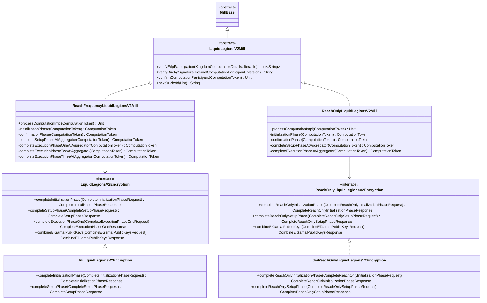

# org.wfanet.measurement.duchy.mill.liquidlegionsv2

## Overview
This package implements the Liquid Legions V2 secure multi-party computation protocol for privacy-preserving reach and frequency measurement. It provides mill implementations for both reach-only and reach-frequency computations, coordinating cryptographic operations across multiple duchy participants in a distributed measurement system.

## Components

### LiquidLegionsV2Mill
Abstract base class for Liquid Legions V2 mill implementations.

| Method | Parameters | Returns | Description |
|--------|------------|---------|-------------|
| verifyEdpParticipation | `details: KingdomComputationDetails`, `requisitions: Iterable<RequisitionMetadata>` | `List<String>` | Validates all EDPs participated |
| verifyDuchySignature | `duchy: InternalComputationParticipant`, `publicApiVersion: Version` | `String?` | Verifies ElGamal public key signature |
| confirmComputationParticipant | `token: ComputationToken` | `suspend Unit` | Confirms computation participant to kingdom |
| failComputationAtConfirmationPhase | `token: ComputationToken`, `errorList: List<String>` | `ComputationToken` | Fails computation with error messages |
| nextDuchyId | `duchyList: List<InternalComputationParticipant>` | `String` | Determines next duchy in processing sequence |
| aggregatorDuchyStub | `aggregatorId: String` | `ComputationControlCoroutineStub` | Retrieves gRPC stub for aggregator duchy |

### ReachFrequencyLiquidLegionsV2Mill
Mill for reach and frequency computations using the Liquid Legions V2 protocol.

| Method | Parameters | Returns | Description |
|--------|------------|---------|-------------|
| processComputationImpl | `token: ComputationToken` | `suspend Unit` | Processes computation stage transitions |
| initializationPhase | `token: ComputationToken` | `suspend ComputationToken` | Generates ElGamal key pair |
| confirmationPhase | `token: ComputationToken` | `suspend ComputationToken` | Verifies participants and signatures |
| completeSetupPhaseAtAggregator | `token: ComputationToken` | `suspend ComputationToken` | Aggregates and encrypts requisition data |
| completeSetupPhaseAtNonAggregator | `token: ComputationToken` | `suspend ComputationToken` | Encrypts local requisition data |
| completeExecutionPhaseOneAtAggregator | `token: ComputationToken` | `suspend ComputationToken` | Decrypts and adds frequency noise |
| completeExecutionPhaseOneAtNonAggregator | `token: ComputationToken` | `suspend ComputationToken` | Partially decrypts register vector |
| completeExecutionPhaseTwoAtAggregator | `token: ComputationToken` | `suspend ComputationToken` | Computes reach and frequency matrix |
| completeExecutionPhaseTwoAtNonAggregator | `token: ComputationToken` | `suspend ComputationToken` | Decrypts flag count tuples |
| completeExecutionPhaseThreeAtAggregator | `token: ComputationToken` | `suspend ComputationToken` | Finalizes frequency distribution |
| completeExecutionPhaseThreeAtNonAggregator | `token: ComputationToken` | `suspend ComputationToken` | Decrypts aggregator matrix |
| toCombinedPublicKey | `List<ElGamalPublicKey>`, `curveId: Int` | `ElGamalPublicKey` | Combines multiple ElGamal public keys |
| updatePublicElgamalKey | `token: ComputationToken` | `suspend ComputationToken` | Caches combined public keys |

### ReachOnlyLiquidLegionsV2Mill
Optimized mill for reach-only computations using Liquid Legions V2 protocol.

| Method | Parameters | Returns | Description |
|--------|------------|---------|-------------|
| processComputationImpl | `token: ComputationToken` | `suspend Unit` | Processes computation stage transitions |
| initializationPhase | `token: ComputationToken` | `suspend ComputationToken` | Generates ElGamal key pair |
| confirmationPhase | `token: ComputationToken` | `suspend ComputationToken` | Verifies participants and signatures |
| completeSetupPhaseAtAggregator | `token: ComputationToken` | `suspend ComputationToken` | Aggregates requisitions with noise ciphertext |
| completeSetupPhaseAtNonAggregator | `token: ComputationToken` | `suspend ComputationToken` | Encrypts local requisition with noise |
| completeExecutionPhaseAtAggregator | `token: ComputationToken` | `suspend ComputationToken` | Computes final reach estimate |
| completeExecutionPhaseAtNonAggregator | `token: ComputationToken` | `suspend ComputationToken` | Decrypts combined register vector |
| readAndCombineAllInputBlobsSetupPhaseAtAggregator | `token: ComputationToken`, `count: Int` | `suspend ByteString` | Combines register vectors and noise ciphertexts |
| toCombinedPublicKey | `List<ElGamalPublicKey>`, `curveId: Int` | `ElGamalPublicKey` | Combines multiple ElGamal public keys |

## Data Structures

### ComputationToken
| Property | Type | Description |
|----------|------|-------------|
| globalComputationId | `String` | Unique computation identifier |
| computationStage | `ComputationStage` | Current protocol stage |
| computationDetails | `ComputationDetails` | Protocol-specific details |
| requisitionsList | `List<RequisitionMetadata>` | Associated requisitions |
| participantCount | `Int` | Number of duchy participants |

### Parameters
| Property | Type | Description |
|----------|------|-------------|
| ellipticCurveId | `Int` | Elliptic curve identifier |
| maximumFrequency | `Int` | Maximum frequency bucket |
| noise | `NoiseConfig` | Differential privacy noise configuration |
| sketchParameters | `LiquidLegionsSketchParameters` | Sketch decay rate and size |

### Stage (ReachFrequencyLiquidLegionsV2Mill)
Enumeration of protocol stages:
- `INITIALIZATION_PHASE`: ElGamal key generation
- `WAIT_REQUISITIONS_AND_KEY_SET`: Awaiting data provider inputs
- `CONFIRMATION_PHASE`: Participant verification
- `WAIT_TO_START`: Awaiting aggregator signal
- `WAIT_SETUP_PHASE_INPUTS`: Awaiting non-aggregator setup outputs
- `SETUP_PHASE`: Sketch encryption and aggregation
- `WAIT_EXECUTION_PHASE_ONE_INPUTS`: Awaiting phase one inputs
- `EXECUTION_PHASE_ONE`: Partial decryption
- `WAIT_EXECUTION_PHASE_TWO_INPUTS`: Awaiting phase two inputs
- `EXECUTION_PHASE_TWO`: Reach computation
- `WAIT_EXECUTION_PHASE_THREE_INPUTS`: Awaiting phase three inputs
- `EXECUTION_PHASE_THREE`: Frequency distribution computation
- `COMPLETE`: Computation finished

## Crypto Subpackage

### LiquidLegionsV2Encryption
Interface defining cryptographic operations for reach-frequency protocol.

| Method | Parameters | Returns | Description |
|--------|------------|---------|-------------|
| completeInitializationPhase | `request: CompleteInitializationPhaseRequest` | `CompleteInitializationPhaseResponse` | Generates ElGamal key pair |
| completeSetupPhase | `request: CompleteSetupPhaseRequest` | `CompleteSetupPhaseResponse` | Encrypts and adds noise to sketches |
| completeExecutionPhaseOne | `request: CompleteExecutionPhaseOneRequest` | `CompleteExecutionPhaseOneResponse` | Partially decrypts register vector |
| completeExecutionPhaseOneAtAggregator | `request: CompleteExecutionPhaseOneAtAggregatorRequest` | `CompleteExecutionPhaseOneAtAggregatorResponse` | Decrypts and creates flag count tuples |
| completeExecutionPhaseTwo | `request: CompleteExecutionPhaseTwoRequest` | `CompleteExecutionPhaseTwoResponse` | Decrypts flag count tuples |
| completeExecutionPhaseTwoAtAggregator | `request: CompleteExecutionPhaseTwoAtAggregatorRequest` | `CompleteExecutionPhaseTwoAtAggregatorResponse` | Computes reach and frequency matrix |
| completeExecutionPhaseThree | `request: CompleteExecutionPhaseThreeRequest` | `CompleteExecutionPhaseThreeResponse` | Decrypts frequency matrix |
| completeExecutionPhaseThreeAtAggregator | `request: CompleteExecutionPhaseThreeAtAggregatorRequest` | `CompleteExecutionPhaseThreeAtAggregatorResponse` | Computes frequency distribution |
| combineElGamalPublicKeys | `request: CombineElGamalPublicKeysRequest` | `CombineElGamalPublicKeysResponse` | Combines ElGamal public keys |

### JniLiquidLegionsV2Encryption
Native implementation of LiquidLegionsV2Encryption using JNI bindings to C++ cryptographic library.

| Method | Parameters | Returns | Description |
|--------|------------|---------|-------------|
| All methods from LiquidLegionsV2Encryption | - | - | Delegates to native library |

### ReachOnlyLiquidLegionsV2Encryption
Interface defining cryptographic operations for reach-only protocol.

| Method | Parameters | Returns | Description |
|--------|------------|---------|-------------|
| completeReachOnlyInitializationPhase | `request: CompleteReachOnlyInitializationPhaseRequest` | `CompleteReachOnlyInitializationPhaseResponse` | Generates ElGamal key pair |
| completeReachOnlySetupPhase | `request: CompleteReachOnlySetupPhaseRequest` | `CompleteReachOnlySetupPhaseResponse` | Encrypts sketch with noise |
| completeReachOnlySetupPhaseAtAggregator | `request: CompleteReachOnlySetupPhaseRequest` | `CompleteReachOnlySetupPhaseResponse` | Aggregates encrypted sketches |
| completeReachOnlyExecutionPhase | `request: CompleteReachOnlyExecutionPhaseRequest` | `CompleteReachOnlyExecutionPhaseResponse` | Partially decrypts register vector |
| completeReachOnlyExecutionPhaseAtAggregator | `request: CompleteReachOnlyExecutionPhaseAtAggregatorRequest` | `CompleteReachOnlyExecutionPhaseAtAggregatorResponse` | Computes final reach |
| combineElGamalPublicKeys | `request: CombineElGamalPublicKeysRequest` | `CombineElGamalPublicKeysResponse` | Combines ElGamal public keys |

### JniReachOnlyLiquidLegionsV2Encryption
Native implementation of ReachOnlyLiquidLegionsV2Encryption using JNI bindings to C++ cryptographic library.

| Method | Parameters | Returns | Description |
|--------|------------|---------|-------------|
| All methods from ReachOnlyLiquidLegionsV2Encryption | - | - | Delegates to native library |

## Dependencies
- `org.wfanet.measurement.duchy.mill` - Base mill framework and certificate handling
- `org.wfanet.measurement.duchy.db.computation` - Computation storage clients for blob and metadata access
- `org.wfanet.measurement.system.v1alpha` - Kingdom system API for computation coordination
- `org.wfanet.measurement.internal.duchy` - Internal duchy protocol messages and computation state
- `org.wfanet.measurement.internal.duchy.protocol` - Liquid Legions V2 protocol-specific messages
- `org.wfanet.measurement.common.crypto` - Cryptographic key handling and signature verification
- `org.wfanet.measurement.consent.client.duchy` - Consent signaling and verification
- `org.wfanet.measurement.api.v2alpha` - Public measurement API specifications
- `org.wfanet.anysketch.crypto` - ElGamal encryption and sketch operations via native libraries
- `org.wfanet.measurement.measurementconsumer.stats` - Result methodology reporting

## Usage Example
```kotlin
// Initialize reach-frequency mill
val cryptoWorker = JniLiquidLegionsV2Encryption()
val mill = ReachFrequencyLiquidLegionsV2Mill(
  millId = "mill-worker-1",
  duchyId = "duchy-a",
  signingKey = signingKeyHandle,
  consentSignalCert = certificate,
  trustedCertificates = trustedCertsMap,
  dataClients = computationDataClients,
  systemComputationParticipantsClient = participantsClient,
  systemComputationsClient = computationsClient,
  systemComputationLogEntriesClient = logEntriesClient,
  computationStatsClient = statsClient,
  workerStubs = duchyStubsMap,
  cryptoWorker = cryptoWorker,
  workLockDuration = Duration.ofMinutes(5),
  parallelism = 4
)

// Process computation token through protocol stages
mill.processComputationImpl(computationToken)
```

## Class Diagram

