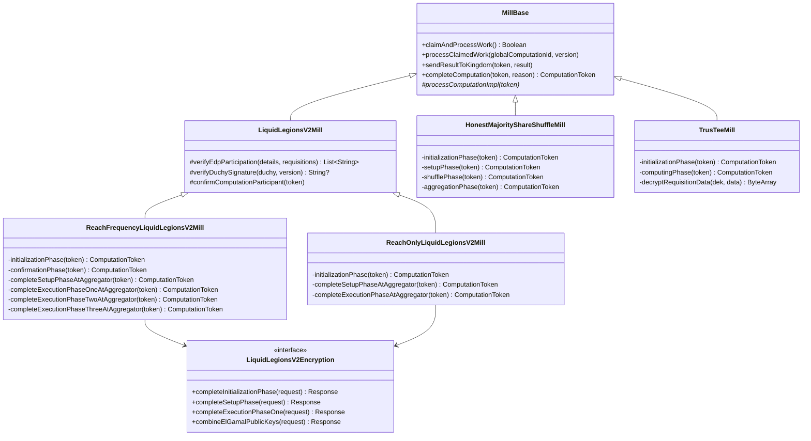

# org.wfanet.measurement.duchy.mill

## Overview
The mill package provides computation processing infrastructure for multi-party computation (MPC) protocols in the duchy service. Mills claim, process, and manage computational work items across distributed nodes, coordinating cryptographic operations, data transformations, and result aggregation for privacy-preserving measurement protocols including Liquid Legions V2, Honest Majority Share Shuffle, and TrusTEE.

## Components

### MillBase
Abstract base class providing common functionality for all mill implementations including work claiming, computation lifecycle management, error handling, metrics logging, and coordination with kingdom services.

| Method | Parameters | Returns | Description |
|--------|------------|---------|-------------|
| claimAndProcessWork | - | `Boolean` | Claims next available work item and processes it |
| processClaimedWork | `globalComputationId: String, version: Long` | `Unit` | Processes work item that has already been claimed |
| sendRequisitionParamsToKingdom | `token: ComputationToken, requisitionParams: RequisitionParams` | `Unit` | Sends requisition parameters to kingdom service |
| sendResultToKingdom | `token: ComputationToken, computationResult: ComputationResult` | `Unit` | Sends encrypted computation result to kingdom |
| completeComputation | `token: ComputationToken, reason: CompletedReason` | `ComputationToken` | Marks computation as complete with specified reason |
| updateComputationParticipant | `token: ComputationToken, callKingdom: suspend (ComputationParticipant) -> Unit` | `Unit` | Updates computation participant at kingdom with retry logic |
| sendAdvanceComputationRequest | `header: AdvanceComputationRequest.Header, content: Flow<ByteString>, stub: ComputationControlCoroutineStub` | `Unit` | Sends computation data to another duchy |
| existingOutputOr | `token: ComputationToken, block: suspend () -> ByteString` | `EncryptedComputationResult` | Returns cached result or computes new result |
| readAndCombineAllInputBlobs | `token: ComputationToken, count: Int` | `ByteString` | Reads and concatenates all input blobs |
| logStageDurationMetric | `token: ComputationToken, metricName: String, metricValue: Duration, histogram: DoubleHistogram` | `Unit` | Logs duration metric to logger and histogram |
| processComputationImpl | `token: ComputationToken` | `Unit` | Abstract method for protocol-specific computation processing |

### LiquidLegionsV2Mill
Parent class for Liquid Legions V2 protocol mills, providing verification and coordination logic for reach and frequency computations using ElGamal encryption and multi-party sketch aggregation.

| Method | Parameters | Returns | Description |
|--------|------------|---------|-------------|
| verifyEdpParticipation | `details: KingdomComputationDetails, requisitions: Iterable<RequisitionMetadata>` | `List<String>` | Verifies all data providers participated |
| verifyDuchySignature | `duchy: InternalComputationParticipant, publicApiVersion: Version` | `String?` | Verifies ElGamal public key signature of duchy |
| confirmComputationParticipant | `token: ComputationToken` | `Unit` | Confirms computation participant at kingdom |
| failComputationAtConfirmationPhase | `token: ComputationToken, errorList: List<String>` | `ComputationToken` | Fails computation during confirmation phase |
| nextDuchyId | `duchyList: List<InternalComputationParticipant>` | `String` | Returns ID of next duchy in participant list |
| aggregatorDuchyStub | `aggregatorId: String` | `ComputationControlCoroutineStub` | Returns gRPC stub for aggregator duchy |

### ReachFrequencyLiquidLegionsV2Mill
Implements Liquid Legions V2 protocol for reach and frequency measurements through multi-phase cryptographic operations including initialization, setup, and three execution phases.

| Method | Parameters | Returns | Description |
|--------|------------|---------|-------------|
| processComputationImpl | `token: ComputationToken` | `Unit` | Routes computation to appropriate phase handler |
| initializationPhase | `token: ComputationToken` | `ComputationToken` | Generates ElGamal keypair and sends params to kingdom |
| confirmationPhase | `token: ComputationToken` | `ComputationToken` | Verifies participation and duchy signatures |
| completeSetupPhaseAtAggregator | `token: ComputationToken` | `ComputationToken` | Aggregates requisitions and applies noise at aggregator |
| completeSetupPhaseAtNonAggregator | `token: ComputationToken` | `ComputationToken` | Processes requisitions at non-aggregator duchy |
| completeExecutionPhaseOneAtAggregator | `token: ComputationToken` | `ComputationToken` | Decrypts sketch and generates flag-count tuples |
| completeExecutionPhaseOneAtNonAggregator | `token: ComputationToken` | `ComputationToken` | Removes encryption layer at non-aggregator |
| completeExecutionPhaseTwoAtAggregator | `token: ComputationToken` | `ComputationToken` | Computes reach estimate at aggregator |
| completeExecutionPhaseTwoAtNonAggregator | `token: ComputationToken` | `ComputationToken` | Removes encryption and applies noise at non-aggregator |
| completeExecutionPhaseThreeAtAggregator | `token: ComputationToken` | `ComputationToken` | Computes frequency distribution and sends result |
| completeExecutionPhaseThreeAtNonAggregator | `token: ComputationToken` | `ComputationToken` | Final decryption layer at non-aggregator |

### ReachOnlyLiquidLegionsV2Mill
Optimized Liquid Legions V2 implementation for reach-only measurements with simplified execution phases and reduced computational overhead.

| Method | Parameters | Returns | Description |
|--------|------------|---------|-------------|
| processComputationImpl | `token: ComputationToken` | `Unit` | Routes computation to appropriate stage handler |
| initializationPhase | `token: ComputationToken` | `ComputationToken` | Generates ElGamal keypair for reach computation |
| confirmationPhase | `token: ComputationToken` | `ComputationToken` | Verifies participant signatures and data |
| completeSetupPhaseAtAggregator | `token: ComputationToken` | `ComputationToken` | Aggregates requisitions with noise ciphertext |
| completeSetupPhaseAtNonAggregator | `token: ComputationToken` | `ComputationToken` | Processes requisitions at non-aggregator |
| completeExecutionPhaseAtAggregator | `token: ComputationToken` | `ComputationToken` | Decrypts and computes reach result |
| completeExecutionPhaseAtNonAggregator | `token: ComputationToken` | `ComputationToken` | Removes encryption layer and forwards data |

### HonestMajorityShareShuffleMill
Implements honest majority share shuffle protocol where computations are split among three duchies with role-specific processing phases.

| Method | Parameters | Returns | Description |
|--------|------------|---------|-------------|
| processComputationImpl | `token: ComputationToken` | `Unit` | Dispatches to role-specific phase handler |
| initializationPhase | `token: ComputationToken` | `ComputationToken` | Sends participant parameters to kingdom |
| setupPhase | `token: ComputationToken` | `ComputationToken` | Exchanges shuffle phase inputs with peer duchy |
| shufflePhase | `token: ComputationToken` | `ComputationToken` | Verifies seeds and shuffles frequency vectors |
| aggregationPhase | `token: ComputationToken` | `ComputationToken` | Aggregates shuffled shares and computes result |
| verifySecretSeed | `secretSeed: SecretSeed, duchyPrivateKeyId: String, apiVersion: Version` | `RandomSeed` | Decrypts and verifies data provider secret seed |

### TrusTeeMill
Implements TrusTEE protocol processing within trusted execution environments for privacy-preserving computations with encrypted requisition data.

| Method | Parameters | Returns | Description |
|--------|------------|---------|-------------|
| processComputationImpl | `token: ComputationToken` | `Unit` | Routes to TrusTEE-specific stage handler |
| initializationPhase | `token: ComputationToken` | `ComputationToken` | Sends requisition params to kingdom |
| computingPhase | `token: ComputationToken` | `ComputationToken` | Decrypts requisitions and computes result |
| getKmsClient | `kmsClientFactory: KmsClientFactory, protocol: TrusTee` | `KmsClient` | Creates KMS client with workload identity |
| getDekKeysetHandle | `kmsClient: KmsClient, protocol: TrusTee` | `KeysetHandle` | Unwraps data encryption key from KMS |
| decryptRequisitionData | `dek: KeysetHandle, data: ByteString` | `ByteArray` | Decrypts requisition data using streaming AEAD |

### MillType
Enumeration of supported mill types mapping computation types to their corresponding mill implementations.

| Enum Value | Description |
|------------|-------------|
| LIQUID_LEGIONS_V2 | Liquid Legions V2 protocol variants |
| HONEST_MAJORITY_SHARE_SHUFFLE | Honest majority share shuffle protocol |
| TRUS_TEE | TrusTEE protocol for trusted execution |

## Data Structures

### MillFlags
| Property | Type | Description |
|----------|------|-------------|
| tlsFlags | `TlsFlags` | TLS configuration flags |
| millId | `String` | Mill instance identifier |
| computationControlServiceTargets | `Map<String, String>` | Map of duchy IDs to service targets |
| channelShutdownTimeout | `Duration` | gRPC channel shutdown timeout |
| workLockDuration | `Duration` | Duration to hold work locks |
| requestChunkSizeBytes | `Int` | Chunk size for RPC requests |
| csCertificateName | `String` | Consent signaling certificate resource name |
| csPrivateKeyDerFile | `File` | Consent signaling private key file |
| csCertificateDerFile | `File` | Consent signaling certificate file |

### ClaimedComputationFlags
| Property | Type | Description |
|----------|------|-------------|
| claimedGlobalComputationId | `String` | Global ID of claimed computation |
| claimedComputationVersion | `Long` | Token version of claimed work |
| claimedComputationType | `ComputationType` | Protocol type of claimed work |

### EncryptedComputationResult
| Property | Type | Description |
|----------|------|-------------|
| bytes | `Flow<ByteString>` | Flow of encrypted result bytes |
| token | `ComputationToken` | Updated computation token |

### Certificate
| Property | Type | Description |
|----------|------|-------------|
| name | `String` | Public API name of certificate |
| value | `X509Certificate` | X.509 certificate value |

### LiquidLegionsV2Encryption
Interface defining cryptographic operations for Liquid Legions V2 protocol.

| Method | Parameters | Returns | Description |
|--------|------------|---------|-------------|
| completeInitializationPhase | `request: CompleteInitializationPhaseRequest` | `CompleteInitializationPhaseResponse` | Generates ElGamal keypair |
| completeSetupPhase | `request: CompleteSetupPhaseRequest` | `CompleteSetupPhaseResponse` | Aggregates and encrypts sketch registers |
| completeExecutionPhaseOne | `request: CompleteExecutionPhaseOneRequest` | `CompleteExecutionPhaseOneResponse` | Removes one encryption layer |
| completeExecutionPhaseOneAtAggregator | `request: CompleteExecutionPhaseOneAtAggregatorRequest` | `CompleteExecutionPhaseOneAtAggregatorResponse` | Decrypts and generates flag counts |
| completeExecutionPhaseTwo | `request: CompleteExecutionPhaseTwoRequest` | `CompleteExecutionPhaseTwoResponse` | Removes encryption layer with noise |
| completeExecutionPhaseTwoAtAggregator | `request: CompleteExecutionPhaseTwoAtAggregatorRequest` | `CompleteExecutionPhaseTwoAtAggregatorResponse` | Computes reach estimate |
| completeExecutionPhaseThree | `request: CompleteExecutionPhaseThreeRequest` | `CompleteExecutionPhaseThreeResponse` | Final decryption layer |
| completeExecutionPhaseThreeAtAggregator | `request: CompleteExecutionPhaseThreeAtAggregatorRequest` | `CompleteExecutionPhaseThreeAtAggregatorResponse` | Computes frequency distribution |
| combineElGamalPublicKeys | `request: CombineElGamalPublicKeysRequest` | `CombineElGamalPublicKeysResponse` | Combines ElGamal public keys |

## Dependencies
- `org.wfanet.measurement.common` - Common utilities, crypto, gRPC, and instrumentation
- `org.wfanet.measurement.consent.client.duchy` - Consent signaling client libraries
- `org.wfanet.measurement.duchy.db.computation` - Computation database and blob storage clients
- `org.wfanet.measurement.internal.duchy` - Internal duchy protocol buffers
- `org.wfanet.measurement.system.v1alpha` - Kingdom system API clients
- `org.wfanet.measurement.api.v2alpha` - Public measurement API types
- `org.wfanet.anysketch.crypto` - Sketch cryptographic operations
- `com.google.crypto.tink` - Tink cryptographic library for TrusTEE
- `io.opentelemetry.api` - OpenTelemetry metrics and instrumentation
- `kotlinx.coroutines` - Coroutine support for async operations
- `io.grpc` - gRPC framework for inter-service communication

## Usage Example
```kotlin
// Create mill instance for Liquid Legions V2 protocol
val mill = ReachFrequencyLiquidLegionsV2Mill(
  millId = "mill-001",
  duchyId = "duchy-a",
  signingKey = signingKeyHandle,
  consentSignalCert = certificate,
  trustedCertificates = trustedCertsMap,
  dataClients = computationDataClients,
  systemComputationParticipantsClient = participantsClient,
  systemComputationsClient = computationsClient,
  systemComputationLogEntriesClient = logEntriesClient,
  computationStatsClient = statsClient,
  workerStubs = duchyStubsMap,
  cryptoWorker = liquidLegionsEncryption,
  workLockDuration = Duration.ofMinutes(5),
  requestChunkSizeBytes = 32768,
  maximumAttempts = 10
)

// Claim and process next available work item
val claimed = mill.claimAndProcessWork()

// Or process a specific claimed computation
mill.processClaimedWork(
  globalComputationId = "global-comp-123",
  version = 42L
)
```

## Class Diagram

