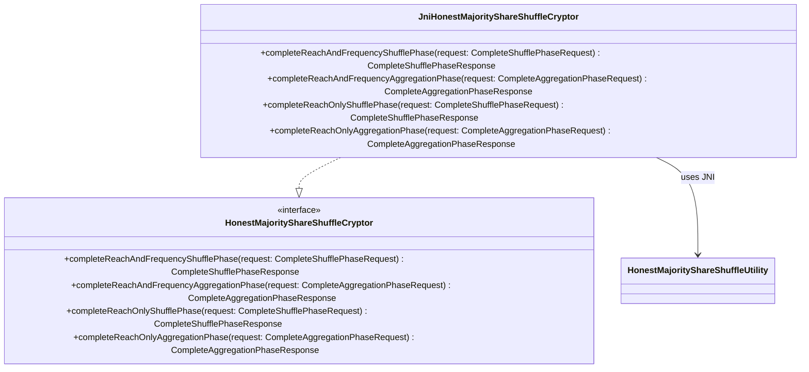

# org.wfanet.measurement.duchy.mill.shareshuffle.crypto

## Overview
This package provides cryptographic operations for the Honest Majority Share Shuffle protocol used in privacy-preserving measurement computations. It implements both shuffle and aggregation phases for reach-only and reach-and-frequency measurement types through a JNI bridge to native C++ cryptographic utilities.

## Components

### HonestMajorityShareShuffleCryptor
Interface defining cryptographic operations for the Honest Majority Share Shuffle protocol.

| Method | Parameters | Returns | Description |
|--------|------------|---------|-------------|
| completeReachAndFrequencyShufflePhase | `request: CompleteShufflePhaseRequest` | `CompleteShufflePhaseResponse` | Executes shuffle phase for reach and frequency measurements |
| completeReachAndFrequencyAggregationPhase | `request: CompleteAggregationPhaseRequest` | `CompleteAggregationPhaseResponse` | Executes aggregation phase for reach and frequency measurements |
| completeReachOnlyShufflePhase | `request: CompleteShufflePhaseRequest` | `CompleteShufflePhaseResponse` | Executes shuffle phase for reach-only measurements |
| completeReachOnlyAggregationPhase | `request: CompleteAggregationPhaseRequest` | `CompleteAggregationPhaseResponse` | Executes aggregation phase for reach-only measurements |

### JniHonestMajorityShareShuffleCryptor
JNI-based implementation of HonestMajorityShareShuffleCryptor that bridges to native C++ cryptographic utilities.

| Method | Parameters | Returns | Description |
|--------|------------|---------|-------------|
| completeReachAndFrequencyShufflePhase | `request: CompleteShufflePhaseRequest` | `CompleteShufflePhaseResponse` | Delegates to native library for reach-frequency shuffle |
| completeReachAndFrequencyAggregationPhase | `request: CompleteAggregationPhaseRequest` | `CompleteAggregationPhaseResponse` | Delegates to native library for reach-frequency aggregation |
| completeReachOnlyShufflePhase | `request: CompleteShufflePhaseRequest` | `CompleteShufflePhaseResponse` | Delegates to native library for reach-only shuffle |
| completeReachOnlyAggregationPhase | `request: CompleteAggregationPhaseRequest` | `CompleteAggregationPhaseResponse` | Delegates to native library for reach-only aggregation |

**Static Initialization**: Loads the native library `honest_majority_share_shuffle_utility` via companion object initializer.

## Dependencies
- `org.wfanet.measurement.internal.duchy.protocol` - Protocol buffer request/response types for shuffle and aggregation operations
- `org.wfanet.measurement.internal.duchy.protocol.shareshuffle.HonestMajorityShareShuffleUtility` - JNI bridge to native C++ cryptographic implementation
- Native library: `libhonest_majority_share_shuffle_utility` - C++ cryptographic operations (see `src/main/cc/wfa/measurement/internal/duchy/protocol/share_shuffle/honest_majority_share_shuffle_utility.h`)

## Usage Example
```kotlin
// Initialize the JNI cryptor
val cryptor: HonestMajorityShareShuffleCryptor = JniHonestMajorityShareShuffleCryptor()

// Execute reach-and-frequency shuffle phase
val shuffleRequest = CompleteShufflePhaseRequest.newBuilder()
  .setSketchParams(params)
  .addAllData(inputShares)
  .build()
val shuffleResponse = cryptor.completeReachAndFrequencyShufflePhase(shuffleRequest)

// Execute reach-and-frequency aggregation phase
val aggregationRequest = CompleteAggregationPhaseRequest.newBuilder()
  .setSketchParams(params)
  .addAllData(shuffledData)
  .build()
val aggregationResponse = cryptor.completeReachAndFrequencyAggregationPhase(aggregationRequest)
```

## Class Diagram

