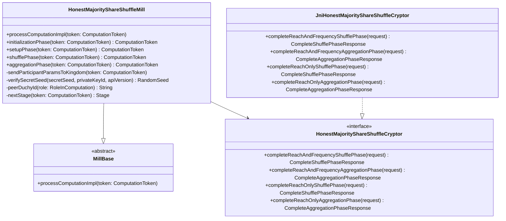

# org.wfanet.measurement.duchy.mill.shareshuffle

## Overview
Implements the Honest Majority Share Shuffle (HMSS) protocol for secure multi-party computation in the duchy mill system. This package orchestrates cryptographic operations across three duchies (two non-aggregators and one aggregator) to compute reach and frequency measurements while preserving privacy through secret sharing and shuffling techniques.

## Components

### HonestMajorityShareShuffleMill
Main coordinator class for executing the HMSS protocol across distributed duchy workers.

| Method | Parameters | Returns | Description |
|--------|------------|---------|-------------|
| processComputationImpl | `token: ComputationToken` | `Unit` | Routes computation to appropriate phase handler based on stage and role |
| initializationPhase | `token: ComputationToken` | `ComputationToken` | Sends participant encryption parameters to Kingdom and transitions to next stage |
| setupPhase | `token: ComputationToken` | `ComputationToken` | Exchanges shuffle phase inputs between non-aggregator duchies |
| shufflePhase | `token: ComputationToken` | `ComputationToken` | Performs secret seed verification, frequency vector shuffling, and sends results to aggregator |
| aggregationPhase | `token: ComputationToken` | `ComputationToken` | Combines frequency vectors from both non-aggregators and computes final reach/frequency results |
| sendParticipantParamsToKingdom | `token: ComputationToken` | `Unit` | Transmits signed encryption public keys to Kingdom for requisition fulfillment |
| verifySecretSeed | `secretSeed: ShufflePhaseInput.SecretSeed, duchyPrivateKeyId: String, apiVersion: Version` | `RandomSeed` | Decrypts and validates data provider secret seeds using certificate chain verification |
| getShufflePhaseInput | `token: ComputationToken` | `ShufflePhaseInput` | Reads and parses shuffle phase input from peer duchy |
| getAggregationPhaseInputs | `token: ComputationToken` | `List<AggregationPhaseInput>` | Retrieves both non-aggregator outputs for final aggregation |
| peerDuchyId | `role: RoleInComputation` | `String` | Determines peer duchy identifier based on current role |
| nextStage | `token: ComputationToken` | `Stage` | Calculates next protocol stage from current stage and role |

### HonestMajorityShareShuffleCryptor (Interface)
Defines cryptographic operations for the HMSS protocol.

| Method | Parameters | Returns | Description |
|--------|------------|---------|-------------|
| completeReachAndFrequencyShufflePhase | `request: CompleteShufflePhaseRequest` | `CompleteShufflePhaseResponse` | Executes shuffle phase crypto for reach and frequency measurements |
| completeReachAndFrequencyAggregationPhase | `request: CompleteAggregationPhaseRequest` | `CompleteAggregationPhaseResponse` | Performs aggregation phase crypto for reach and frequency measurements |
| completeReachOnlyShufflePhase | `request: CompleteShufflePhaseRequest` | `CompleteShufflePhaseResponse` | Executes shuffle phase crypto for reach-only measurements |
| completeReachOnlyAggregationPhase | `request: CompleteAggregationPhaseRequest` | `CompleteAggregationPhaseResponse` | Performs aggregation phase crypto for reach-only measurements |

### JniHonestMajorityShareShuffleCryptor
JNI bridge implementation delegating cryptographic operations to native C++ library.

| Method | Parameters | Returns | Description |
|--------|------------|---------|-------------|
| completeReachAndFrequencyShufflePhase | `request: CompleteShufflePhaseRequest` | `CompleteShufflePhaseResponse` | Invokes native shuffle phase implementation for reach and frequency |
| completeReachAndFrequencyAggregationPhase | `request: CompleteAggregationPhaseRequest` | `CompleteAggregationPhaseResponse` | Invokes native aggregation phase implementation for reach and frequency |
| completeReachOnlyShufflePhase | `request: CompleteShufflePhaseRequest` | `CompleteShufflePhaseResponse` | Invokes native shuffle phase implementation for reach-only |
| completeReachOnlyAggregationPhase | `request: CompleteAggregationPhaseRequest` | `CompleteAggregationPhaseResponse` | Invokes native aggregation phase implementation for reach-only |

## Data Structures

### Stage Transitions
| Stage | Role | Next Stage | Description |
|-------|------|------------|-------------|
| INITIALIZED | FIRST_NON_AGGREGATOR | WAIT_TO_START | First non-aggregator waits for protocol initiation |
| INITIALIZED | SECOND_NON_AGGREGATOR | WAIT_ON_SHUFFLE_INPUT_PHASE_ONE | Second non-aggregator awaits first input |
| INITIALIZED | AGGREGATOR | WAIT_ON_AGGREGATION_INPUT | Aggregator awaits both non-aggregator outputs |
| SETUP_PHASE | FIRST_NON_AGGREGATOR | WAIT_ON_SHUFFLE_INPUT_PHASE_TWO | First non-aggregator awaits second input |
| SETUP_PHASE | SECOND_NON_AGGREGATOR | SHUFFLE_PHASE | Second non-aggregator proceeds to shuffle |
| SHUFFLE_PHASE | FIRST_NON_AGGREGATOR | COMPLETE | First non-aggregator completes |
| SHUFFLE_PHASE | SECOND_NON_AGGREGATOR | COMPLETE | Second non-aggregator completes |
| AGGREGATION_PHASE | AGGREGATOR | COMPLETE | Aggregator finalizes computation |

### Stage Sequence
Ordered progression: `INITIALIZED → WAIT_TO_START → WAIT_ON_SHUFFLE_INPUT_PHASE_ONE → SETUP_PHASE → WAIT_ON_SHUFFLE_INPUT_PHASE_TWO → WAIT_ON_AGGREGATION_INPUT → SHUFFLE_PHASE → AGGREGATION_PHASE → COMPLETE`

## Dependencies
- `org.wfanet.measurement.duchy.mill` - Base mill infrastructure and protocol stage management
- `org.wfanet.measurement.duchy.db.computation` - Computation data persistence and blob storage
- `org.wfanet.measurement.common.crypto` - Cryptographic primitives, key management, and certificate handling
- `org.wfanet.measurement.consent.client.duchy` - Encryption public key signing and random seed operations
- `org.wfanet.measurement.api.v2alpha` - Public API protocol buffers for Kingdom communication
- `org.wfanet.measurement.internal.duchy.protocol` - Internal duchy protocol definitions and request/response messages
- `org.wfanet.measurement.system.v1alpha` - System API for inter-duchy computation coordination
- `org.wfanet.measurement.measurementconsumer.stats` - Methodology metadata for result reporting
- `org.wfanet.frequencycount` - Frequency vector data structures
- `com.google.protobuf` - Protocol buffer serialization
- `io.grpc` - gRPC communication between duchies

## Protocol Flow

### Three-Party Roles
1. **FIRST_NON_AGGREGATOR**: Initiates shuffle phase, sends input to second non-aggregator
2. **SECOND_NON_AGGREGATOR**: Receives first input, performs second shuffle, sends to aggregator
3. **AGGREGATOR**: Combines outputs from both non-aggregators and computes final results

### Phase Execution

#### Initialization Phase
All roles send encryption parameters to Kingdom for requisition fulfillment. Non-aggregators provide signed Tink public keys.

#### Setup Phase
Non-aggregators exchange `ShufflePhaseInput` containing peer random seeds and encrypted secret seeds from data providers.

#### Shuffle Phase
Non-aggregators verify secret seeds, decrypt requisition data, apply differential privacy noise, and shuffle frequency vectors using combined random seeds.

#### Aggregation Phase
Aggregator receives combined frequency vectors from both non-aggregators, applies final differential privacy parameters, and computes reach/frequency distribution.

## Usage Example
```kotlin
val mill = HonestMajorityShareShuffleMill(
  millId = "worker-1",
  duchyId = "duchy-a",
  signingKey = signingKeyHandle,
  consentSignalCert = certificate,
  trustedCertificates = trustedCerts,
  dataClients = computationDataClients,
  systemComputationParticipantsClient = participantsStub,
  systemComputationsClient = computationsStub,
  systemComputationLogEntriesClient = logEntriesStub,
  computationStatsClient = statsStub,
  certificateClient = certificatesStub,
  workerStubs = mapOf("duchy-b" to controlStubB, "duchy-c" to controlStubC),
  cryptoWorker = JniHonestMajorityShareShuffleCryptor(),
  protocolSetupConfig = protocolConfig,
  workLockDuration = Duration.ofMinutes(5),
  privateKeyStore = tinkPrivateKeyStore
)
```

## Class Diagram


## Error Handling
- **TransientErrorException**: Thrown when peer duchy stage is behind expected, triggering retry
- **PermanentErrorException**: Thrown for invalid certificates, missing private keys, or failed signature verification
- **StatusException**: Caught during certificate retrieval, converted to transient/permanent errors based on gRPC status code

## Security Features
- Certificate chain validation using trusted root certificates
- Signature verification of data provider random seeds
- Encrypted secret seed transmission using Tink hybrid encryption
- Differential privacy noise application in both shuffle and aggregation phases
- Authority Key Identifier matching for certificate trust validation
