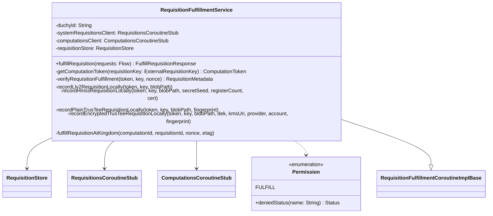

# org.wfanet.measurement.duchy.service.api.v2alpha

## Overview
This package provides the gRPC service implementation for requisition fulfillment in the duchy's public API (v2alpha). It handles the receipt and verification of requisition data from Data Providers, supporting multiple computation protocols including Liquid Legions V2, Honest Majority Share Shuffle (HMSS), and TrusTEE. The service authenticates requests, stores requisition data in blob storage, and coordinates with both internal duchy services and the Kingdom's system API.

## Components

### RequisitionFulfillmentService
gRPC service implementation that processes requisition fulfillment requests from Data Providers

| Method | Parameters | Returns | Description |
|--------|------------|---------|-------------|
| fulfillRequisition | `requests: Flow<FulfillRequisitionRequest>` | `FulfillRequisitionResponse` | Receives streaming requisition data, validates and stores it |
| getComputationToken | `requisitionKey: ExternalRequisitionKey` | `ComputationToken` | Retrieves computation token for a requisition |
| getComputationToken | `request: GetComputationTokenRequest` | `GetComputationTokenResponse` | Sends request to get computation token |
| verifyRequisitionFulfillment | `computationToken: ComputationToken, requisitionKey: ExternalRequisitionKey, nonce: Long` | `RequisitionMetadata` | Verifies requisition fulfillment using consent signaling |
| recordLlv2RequisitionLocally | `token: ComputationToken, key: ExternalRequisitionKey, blobPath: String` | `Unit` | Records Liquid Legions V2 requisition to duchy storage |
| recordHmssRequisitionLocally | `token: ComputationToken, key: ExternalRequisitionKey, blobPath: String, secretSeedCiphertext: ByteString, registerCount: Long, dataProviderCertificate: String` | `Unit` | Records HMSS requisition with protocol-specific details |
| recordPlainTrusTeeRequisitionLocally | `token: ComputationToken, key: ExternalRequisitionKey, blobPath: String, populationSpecFingerprint: Long` | `Unit` | Records plain TrusTEE frequency vector requisition |
| recordEncryptedTrusTeeRequisitionLocally | `token: ComputationToken, key: ExternalRequisitionKey, blobPath: String, encryptedDekCiphertext: ByteString, kmsKekUri: String, workloadIdentityProvider: String, impersonatedServiceAccount: String, populationSpecFingerprint: Long` | `Unit` | Records encrypted TrusTEE requisition with envelope encryption |
| fulfillRequisitionAtKingdom | `computationId: String, requisitionId: String, nonce: Long, etag: String` | `Unit` | Notifies Kingdom that requisition has been fulfilled |

**Constructor Parameters:**
- `duchyId: String` - Identifier for this duchy
- `systemRequisitionsClient: RequisitionsCoroutineStub` - Client for Kingdom system API
- `computationsClient: ComputationsCoroutineStub` - Client for duchy's internal computations service
- `requisitionStore: RequisitionStore` - Storage interface for requisition blob data
- `coroutineContext: CoroutineContext` - Coroutine execution context

### Permission (Private Enum)
Internal authorization enum for permission checking

| Value | Description |
|-------|-------------|
| FULFILL | Permission to fulfill requisitions |

## Extensions

### RequisitionMetadata.toConsentSignalingRequisition
Converts internal requisition metadata to consent signaling format

| Extension | Returns | Description |
|-----------|---------|-------------|
| toConsentSignalingRequisition | `ConsentSignalingRequisition` | Extracts fingerprint and nonce hash for verification |

## Data Structures

### FULFILLED_RESPONSE
Pre-built response constant indicating successful fulfillment

| Type | Description |
|------|-------------|
| `FulfillRequisitionResponse` | Singleton response with state set to FULFILLED |

## Dependencies

- `org.wfanet.measurement.api.v2alpha` - Public API protocol buffers and gRPC stubs
- `org.wfanet.measurement.consent.client.duchy` - Consent signaling verification logic
- `org.wfanet.measurement.duchy.storage` - Blob storage abstraction for requisition data
- `org.wfanet.measurement.internal.duchy` - Internal duchy protocol buffers and gRPC stubs
- `org.wfanet.measurement.system.v1alpha` - Kingdom system API protocol buffers
- `org.wfanet.measurement.common.grpc` - Common gRPC utilities for validation and error handling
- `com.google.protobuf` - Protocol buffer base library
- `io.grpc` - gRPC framework
- `kotlinx.coroutines` - Kotlin coroutines for asynchronous processing

## Usage Example

```kotlin
// Initialize service dependencies
val requisitionStore: RequisitionStore = createRequisitionStore()
val systemClient: RequisitionsCoroutineStub = createSystemClient()
val computationsClient: ComputationsCoroutineStub = createComputationsClient()

// Create service instance
val service = RequisitionFulfillmentService(
  duchyId = "worker1",
  systemRequisitionsClient = systemClient,
  computationsClient = computationsClient,
  requisitionStore = requisitionStore,
  coroutineContext = Dispatchers.Default
)

// Service handles streaming requests from Data Providers
// The gRPC framework routes incoming fulfillRequisition calls to the service
```

## Class Diagram


