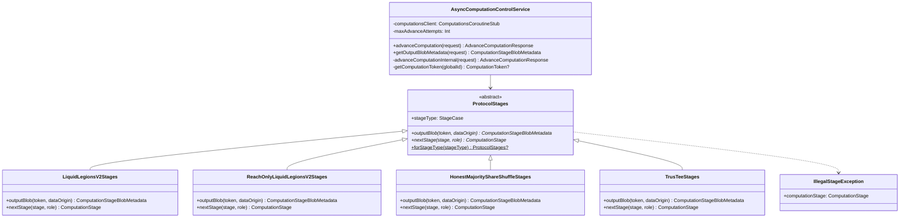

# org.wfanet.measurement.duchy.service.internal.computationcontrol

## Overview
The computationcontrol package provides an asynchronous gRPC service for managing multi-party computation (MPC) lifecycle in a duchy environment. It handles stage transitions, blob metadata management, and protocol-specific workflows for Liquid Legions v2, Reach-Only Liquid Legions v2, Honest Majority Share Shuffle, and TrusTEE protocols.

## Components

### AsyncComputationControlService
Internal gRPC service implementing asynchronous computation control with retry logic and stage advancement capabilities.

| Method | Parameters | Returns | Description |
|--------|------------|---------|-------------|
| advanceComputation | `request: AdvanceComputationRequest` | `AdvanceComputationResponse` | Advances computation to next stage after recording blob path |
| advanceComputationInternal | `request: AdvanceComputationRequest` | `AdvanceComputationResponse` | Internal implementation with stage mismatch tolerance |
| getOutputBlobMetadata | `request: GetOutputBlobMetadataRequest` | `ComputationStageBlobMetadata` | Retrieves output blob metadata for specified data origin |
| getComputationToken | `globalComputationId: String` | `ComputationToken?` | Fetches computation token from Computations service |

**Constructor Parameters:**
| Parameter | Type | Description |
|-----------|------|-------------|
| computationsClient | `ComputationsCoroutineStub` | gRPC client for Computations service |
| maxAdvanceAttempts | `Int` | Maximum retry attempts for advanceComputation (must be >= 1) |
| advanceRetryBackoff | `ExponentialBackoff` | Exponential backoff strategy for retries |
| coroutineContext | `CoroutineContext` | Coroutine execution context |

### ProtocolStages
Abstract utility class managing protocol-specific stage transitions and blob metadata retrieval.

| Method | Parameters | Returns | Description |
|--------|------------|---------|-------------|
| outputBlob | `token: ComputationToken, dataOrigin: String` | `ComputationStageBlobMetadata` | Returns output blob metadata for specified origin |
| nextStage | `stage: ComputationStage, role: RoleInComputation` | `ComputationStage` | Determines next stage based on current stage and role |
| forStageType | `stageType: ComputationStage.StageCase` | `ProtocolStages?` | Factory method returning protocol-specific implementation |

### LiquidLegionsV2Stages
Protocol stage manager for Liquid Legions v2 sketch aggregation protocol.

| Method | Parameters | Returns | Description |
|--------|------------|---------|-------------|
| outputBlob | `token: ComputationToken, dataOrigin: String` | `ComputationStageBlobMetadata` | Retrieves output blob for WAIT stages |
| nextStage | `stage: ComputationStage, role: RoleInComputation` | `ComputationStage` | Computes next stage in multi-phase execution |

**Supported Stages:**
- WAIT_SETUP_PHASE_INPUTS (multi-blob output)
- WAIT_EXECUTION_PHASE_ONE_INPUTS (single output)
- WAIT_EXECUTION_PHASE_TWO_INPUTS (single output)
- WAIT_EXECUTION_PHASE_THREE_INPUTS (single output)

### ReachOnlyLiquidLegionsV2Stages
Protocol stage manager for Reach-Only variant of Liquid Legions v2.

| Method | Parameters | Returns | Description |
|--------|------------|---------|-------------|
| outputBlob | `token: ComputationToken, dataOrigin: String` | `ComputationStageBlobMetadata` | Retrieves output blob for WAIT stages |
| nextStage | `stage: ComputationStage, role: RoleInComputation` | `ComputationStage` | Computes next stage in simplified execution flow |

**Supported Stages:**
- WAIT_SETUP_PHASE_INPUTS (multi-blob output)
- WAIT_EXECUTION_PHASE_INPUTS (single output)

### HonestMajorityShareShuffleStages
Protocol stage manager for Honest Majority Share Shuffle protocol.

| Method | Parameters | Returns | Description |
|--------|------------|---------|-------------|
| outputBlob | `token: ComputationToken, dataOrigin: String` | `ComputationStageBlobMetadata` | Retrieves output blob for WAIT stages |
| nextStage | `stage: ComputationStage, role: RoleInComputation` | `ComputationStage` | Computes next stage with role-specific branching |

**Supported Stages:**
- WAIT_ON_AGGREGATION_INPUT (multi-blob output)
- WAIT_ON_SHUFFLE_INPUT_PHASE_ONE (single output)
- WAIT_ON_SHUFFLE_INPUT_PHASE_TWO (single output)

### TrusTeeStages
Protocol stage manager for TrusTEE (Trusted Execution Environment) protocol.

| Method | Parameters | Returns | Description |
|--------|------------|---------|-------------|
| outputBlob | `token: ComputationToken, dataOrigin: String` | `ComputationStageBlobMetadata` | Always throws error (no output blobs) |
| nextStage | `stage: ComputationStage, role: RoleInComputation` | `ComputationStage` | Manages simple three-stage lifecycle |

**Stage Sequence:** INITIALIZED → WAIT_TO_START → COMPUTING → COMPLETE

## Data Structures

### RetryableException
| Property | Type | Description |
|----------|------|-------------|
| message | `String?` | Exception message |
| cause | `Throwable?` | Underlying cause |

### IllegalStageException
| Property | Type | Description |
|----------|------|-------------|
| computationStage | `ComputationStage` | The illegal stage that triggered exception |

## Dependencies
- `org.wfanet.measurement.internal.duchy` - Protobuf definitions for computation control messages
- `org.wfanet.measurement.duchy.db.computation` - Database operations for stage advancement
- `org.wfanet.measurement.common` - Common utilities including ExponentialBackoff
- `io.grpc` - gRPC framework for service implementation
- `kotlinx.coroutines` - Coroutine support for async operations

## Usage Example
```kotlin
// Create service instance
val service = AsyncComputationControlService(
  computationsClient = computationsStub,
  maxAdvanceAttempts = 5,
  advanceRetryBackoff = ExponentialBackoff(initialDelay = 1000, maxDelay = 30000)
)

// Advance computation after blob receipt
val response = service.advanceComputation(
  advanceComputationRequest {
    globalComputationId = "computation-123"
    computationStage = currentStage
    blobId = 456L
    blobPath = "gs://bucket/computation-123/output-456"
  }
)

// Retrieve output blob metadata
val blobMetadata = service.getOutputBlobMetadata(
  getOutputBlobMetadataRequest {
    globalComputationId = "computation-123"
    dataOrigin = "duchy-worker-1"
  }
)
```

## Class Diagram


## Key Behavior

### Stage Mismatch Tolerance
The service handles three stage mismatch scenarios:
1. **One step behind:** Treats as no-op if computation already advanced
2. **One step ahead:** Catches up by advancing with existing output paths
3. **Other mismatches:** Throws ABORTED status exception

### Retry Logic
- Retries on UNAVAILABLE and ABORTED gRPC status codes
- Uses exponential backoff between attempts
- Fails permanently after exceeding maxAdvanceAttempts
- Only applies to recordOutputBlobPath and advanceComputationStage operations

### Protocol-Specific Routing
Each protocol implementation determines:
- Valid WAIT stages that can provide output blobs
- Next stage transitions based on current stage and duchy role
- Blob ID resolution (single vs. multi-blob stages)
