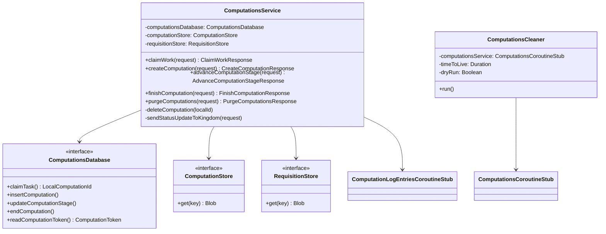

# org.wfanet.measurement.duchy.service.internal.computations

## Overview
This package provides the internal gRPC service implementation for managing multi-party computation (MPC) workflows in a Duchy. It handles computation lifecycle management including creation, state transitions, work claiming, blob storage references, and cleanup of completed computations.

## Components

### ComputationsService
Core gRPC service implementing the Computations API for managing computation state and orchestration.

| Method | Parameters | Returns | Description |
|--------|------------|---------|-------------|
| claimWork | `request: ClaimWorkRequest` | `ClaimWorkResponse` | Claims next available computation task for processing |
| createComputation | `request: CreateComputationRequest` | `CreateComputationResponse` | Creates new computation with initial stage and requisitions |
| deleteComputation | `request: DeleteComputationRequest` | `Empty` | Deletes computation and associated blob storage |
| purgeComputations | `request: PurgeComputationsRequest` | `PurgeComputationsResponse` | Removes terminal computations older than specified time |
| finishComputation | `request: FinishComputationRequest` | `FinishComputationResponse` | Marks computation as completed, failed, or canceled |
| getComputationToken | `request: GetComputationTokenRequest` | `GetComputationTokenResponse` | Retrieves computation token by global ID or requisition key |
| updateComputationDetails | `request: UpdateComputationDetailsRequest` | `UpdateComputationDetailsResponse` | Updates protocol-specific computation details and requisitions |
| recordOutputBlobPath | `request: RecordOutputBlobPathRequest` | `RecordOutputBlobPathResponse` | Associates output blob path with computation stage |
| advanceComputationStage | `request: AdvanceComputationStageRequest` | `AdvanceComputationStageResponse` | Transitions computation to next stage with blob dependencies |
| getComputationIds | `request: GetComputationIdsRequest` | `GetComputationIdsResponse` | Retrieves global IDs for computations in specified stages |
| enqueueComputation | `request: EnqueueComputationRequest` | `EnqueueComputationResponse` | Adds computation to work queue with optional delay |
| recordRequisitionFulfillment | `request: RecordRequisitionFulfillmentRequest` | `RecordRequisitionFulfillmentResponse` | Records blob path for fulfilled requisition data |

**Constructor Parameters:**
- `computationsDatabase: ComputationsDatabase` - Database interface for computation state
- `computationLogEntriesClient: ComputationLogEntriesCoroutineStub` - Kingdom status update client
- `computationStore: ComputationStore` - Storage for computation blobs
- `requisitionStore: RequisitionStore` - Storage for requisition data blobs
- `duchyName: String` - Identity of this Duchy instance
- `coroutineContext: CoroutineContext` - Coroutine execution context (default: EmptyCoroutineContext)
- `clock: Clock` - Time provider (default: Clock.systemUTC())
- `defaultLockDuration: Duration` - Default computation lock duration (default: 5 minutes)

### ComputationsCleaner
Scheduled utility that purges completed computations past their time-to-live threshold.

| Method | Parameters | Returns | Description |
|--------|------------|---------|-------------|
| run | - | `Unit` | Executes cleanup by purging old completed computations |

**Constructor Parameters:**
- `computationsService: ComputationsCoroutineStub` - Computations service client for purge operations
- `timeToLive: Duration` - Maximum age before computation is eligible for deletion
- `dryRun: Boolean` - When true, reports without deleting (default: false)

## Data Structures

### Extension Functions (Protos.kt)

Utility functions for converting between internal protobuf types and response objects.

| Function | Returns | Description |
|----------|---------|-------------|
| String.toGetTokenRequest() | `GetComputationTokenRequest` | Converts global computation ID to token request |
| ComputationToken.toAdvanceComputationStageResponse() | `AdvanceComputationStageResponse` | Wraps token in stage advancement response |
| ComputationToken.toCreateComputationResponse() | `CreateComputationResponse` | Wraps token in creation response |
| ComputationToken.toClaimWorkResponse() | `ClaimWorkResponse` | Wraps token in work claim response |
| ComputationToken.toUpdateComputationDetailsResponse() | `UpdateComputationDetailsResponse` | Wraps token in details update response |
| ComputationToken.toFinishComputationResponse() | `FinishComputationResponse` | Wraps token in finish response |
| ComputationToken.toGetComputationTokenResponse() | `GetComputationTokenResponse` | Wraps token in get token response |
| ComputationToken.toRecordOutputBlobPathResponse() | `RecordOutputBlobPathResponse` | Wraps token in output blob path response |
| ComputationToken.toRecordRequisitionBlobPathResponse() | `RecordRequisitionFulfillmentResponse` | Wraps token in requisition fulfillment response |
| ComputationToken.outputPathList() | `List<String>` | Extracts output and pass-through blob paths |
| ComputationToken.inputPathList() | `List<String>` | Extracts input blob paths |
| ComputationToken.role() | `RoleInComputation` | Determines duchy role from protocol details |
| newInputBlobMetadata(id: Long, key: String) | `ComputationStageBlobMetadata` | Creates metadata for input blob |
| newPassThroughBlobMetadata(id: Long, key: String) | `ComputationStageBlobMetadata` | Creates metadata for pass-through blob |
| newOutputBlobMetadata(id: Long, key: String) | `ComputationStageBlobMetadata` | Creates metadata for output blob |
| newEmptyOutputBlobMetadata(id: Long) | `ComputationStageBlobMetadata` | Creates metadata for output blob without path |

## Dependencies

- `org.wfanet.measurement.duchy.db.computation` - Database layer for computation state management
- `org.wfanet.measurement.duchy.storage` - Blob storage interfaces for computation and requisition data
- `org.wfanet.measurement.internal.duchy` - Internal gRPC service definitions and protobuf messages
- `org.wfanet.measurement.system.v1alpha` - Kingdom system API for computation logging
- `io.grpc` - gRPC framework for service implementation
- `kotlinx.coroutines` - Kotlin coroutines for asynchronous operations
- `com.google.protobuf` - Protocol buffer library
- `java.time` - Time and duration utilities for TTL and locking

## Usage Example

```kotlin
// Initialize the service
val service = ComputationsService(
  computationsDatabase = database,
  computationLogEntriesClient = kingdomClient,
  computationStore = computationBlobStore,
  requisitionStore = requisitionBlobStore,
  duchyName = "worker1",
  defaultLockDuration = Duration.ofMinutes(5)
)

// Claim work for processing
val claimRequest = ClaimWorkRequest.newBuilder()
  .setOwner("worker-instance-1")
  .setComputationType(ComputationType.LIQUID_LEGIONS_V2)
  .addPrioritizedStages(ComputationStage.INITIALIZATION_PHASE)
  .build()
val claimResponse = service.claimWork(claimRequest)

// Advance computation to next stage
val advanceRequest = AdvanceComputationStageRequest.newBuilder()
  .setToken(claimResponse.token)
  .setNextComputationStage(ComputationStage.SETUP_PHASE)
  .setAfterTransition(AfterTransition.ADD_UNCLAIMED_TO_QUEUE)
  .build()
val advanceResponse = service.advanceComputationStage(advanceRequest)

// Schedule cleanup of old computations
val cleaner = ComputationsCleaner(
  computationsService = computationsClient,
  timeToLive = Duration.ofDays(30),
  dryRun = false
)
cleaner.run()
```

## Class Diagram



## Error Handling

The service converts database exceptions to gRPC status exceptions:

- `ComputationNotFoundException` → `Status.NOT_FOUND`
- `ComputationTokenVersionMismatchException` → `Status.ABORTED`
- `ComputationLockOwnerMismatchException` → `Status.ABORTED`
- Duplicate computation creation → `Status.ALREADY_EXISTS`

## State Transitions

Computations progress through protocol-specific stages with state management:

1. **Creation** - `createComputation()` initializes with requisitions
2. **Work Claiming** - `claimWork()` locks computation for processing with TTL
3. **Stage Advancement** - `advanceComputationStage()` transitions with blob dependencies
4. **Completion** - `finishComputation()` marks terminal state (succeeded/failed/canceled)
5. **Cleanup** - `purgeComputations()` removes old terminal computations

## Blob Management

The service tracks three types of blob dependencies per stage:

- **INPUT** - Required input data consumed by current stage
- **OUTPUT** - Data produced by current stage
- **PASS_THROUGH** - Data passed unchanged to subsequent stages

Blobs are stored in separate stores for computation artifacts and requisition data, with automatic cleanup on computation deletion.
