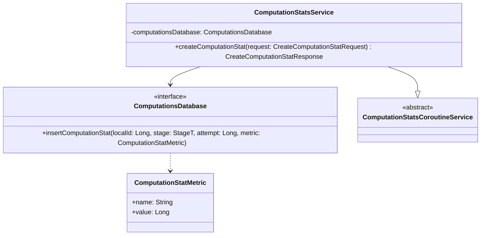

# org.wfanet.measurement.duchy.service.internal.computationstats

## Overview
This package provides a gRPC service implementation for recording computation statistics in the Duchy. It serves as the internal API layer for tracking metrics related to computation execution, including stage-specific measurements and attempt-level performance data. The service validates requests and delegates storage operations to the computations database layer.

## Components

### ComputationStatsService
gRPC service implementation for creating and persisting computation statistics.

| Method | Parameters | Returns | Description |
|--------|------------|---------|-------------|
| createComputationStat | `request: CreateComputationStatRequest` | `CreateComputationStatResponse` | Validates and persists a computation statistic metric |

#### Constructor Parameters
| Parameter | type | Description |
|-----------|------|-------------|
| computationsDatabase | `ComputationsDatabase` | Database interface for storing computation statistics |
| coroutineContext | `CoroutineContext` | Coroutine context for service execution (defaults to EmptyCoroutineContext) |

#### Request Validation
The service performs the following validations on `CreateComputationStatRequest`:
- **localComputationId**: Must be non-zero
- **metricName**: Must be non-empty

## Data Structures

### CreateComputationStatRequest Fields
| Field | Type | Description |
|-------|------|-------------|
| localComputationId | `Long` | Local identifier for the computation |
| computationStage | `ComputationStage` | Stage at which the metric was recorded |
| attempt | `Int` | Attempt number for the computation stage |
| metricName | `String` | Name of the metric being recorded |
| metricValue | `Long` | Numeric value of the metric |

## Dependencies
- `org.wfanet.measurement.duchy.db.computation` - Provides `ComputationsDatabase` interface and `ComputationStatMetric` data class for database operations
- `org.wfanet.measurement.internal.duchy` - Protocol buffer definitions for gRPC service and request/response messages
- `org.wfanet.measurement.common.grpc` - Utility function `grpcRequire` for request validation with gRPC error handling
- `kotlin.coroutines` - Coroutine context management for asynchronous service operations

## Usage Example
```kotlin
val database: ComputationsDatabase = // ... database implementation
val service = ComputationStatsService(
  computationsDatabase = database,
  coroutineContext = Dispatchers.IO
)

// Create a computation statistic
val request = createComputationStatRequest {
  localComputationId = 12345L
  computationStage = ComputationStage.WAIT_TO_START
  attempt = 1
  metricName = "processing_time_ms"
  metricValue = 1500L
}

val response = service.createComputationStat(request)
```

## Class Diagram

