# org.wfanet.measurement.duchy.service.internal

## Overview
Internal gRPC services and utilities for duchy computation management within the Cross-Media Measurement system. Provides asynchronous computation control, computation lifecycle management, computation statistics tracking, and error handling for multi-party computation protocols including Liquid Legions v2, Reach-Only Liquid Legions v2, Honest Majority Share Shuffle, and TrusTEE.

## Components

### DuchyInternalException
Sealed exception hierarchy for duchy-specific errors with gRPC status mapping.

| Method | Parameters | Returns | Description |
|--------|------------|---------|-------------|
| asStatusRuntimeException | `statusCode: Status.Code`, `message: String = this.message` | `StatusRuntimeException` | Converts exception to gRPC StatusRuntimeException with ErrorInfo |

### ContinuationTokenInvalidException
Thrown when continuation token validation fails.

| Property | Type | Description |
|----------|------|-------------|
| continuationToken | `String` | The invalid token value |
| code | `ErrorCode` | CONTINUATION_TOKEN_INVALID |

### ContinuationTokenMalformedException
Thrown when continuation token cannot be parsed.

| Property | Type | Description |
|----------|------|-------------|
| continuationToken | `String` | The malformed token value |
| code | `ErrorCode` | CONTINUATION_TOKEN_MALFORMED |

### ComputationNotFoundException
Thrown when computation with specified ID does not exist.

| Property | Type | Description |
|----------|------|-------------|
| computationId | `Long` | Local computation identifier |
| code | `ErrorCode` | COMPUTATION_NOT_FOUND |

### ComputationDetailsNotFoundException
Thrown when computation details for specific stage and attempt are missing.

| Property | Type | Description |
|----------|------|-------------|
| computationId | `Long` | Local computation identifier |
| computationStage | `String` | Current computation stage |
| attempt | `Long` | Attempt number |
| code | `ErrorCode` | COMPUTATION_DETAILS_NOT_FOUND |

### ComputationAlreadyExistsException
Thrown when attempting to create duplicate computation.

| Property | Type | Description |
|----------|------|-------------|
| globalComputationId | `String` | Global computation identifier |
| code | `ErrorCode` | COMPUTATION_ALREADY_EXISTS |

### ComputationTokenVersionMismatchException
Thrown when computation token version does not match stored version.

| Property | Type | Description |
|----------|------|-------------|
| computationId | `Long` | Local computation identifier |
| version | `Long` | Current database version |
| tokenVersion | `Long` | Provided token version |
| code | `ErrorCode` | COMPUTATION_TOKEN_VERSION_MISMATCH |

### ComputationLockOwnerMismatchException
Thrown when attempting to modify computation with incorrect lock ownership.

| Property | Type | Description |
|----------|------|-------------|
| computationId | `Long` | Local computation identifier |
| expectedOwner | `String` | Required lock owner |
| actualOwner | `String?` | Current lock owner or null |
| code | `ErrorCode` | COMPUTATION_LOCK_OWNER_MISMATCH |

## Computation Control

### AsyncComputationControlService
Manages asynchronous advancement of computation stages through blob receipt notifications.

| Method | Parameters | Returns | Description |
|--------|------------|---------|-------------|
| advanceComputation | `request: AdvanceComputationRequest` | `AdvanceComputationResponse` | Records blob path and advances stage when ready |
| getOutputBlobMetadata | `request: GetOutputBlobMetadataRequest` | `ComputationStageBlobMetadata` | Retrieves output blob metadata for computation |

**Constructor Parameters:**
- `computationsClient: ComputationsCoroutineStub` - Client for computations service
- `maxAdvanceAttempts: Int` - Maximum retry attempts for advancement
- `advanceRetryBackoff: ExponentialBackoff` - Retry backoff strategy
- `coroutineContext: CoroutineContext` - Coroutine execution context

**Key Features:**
- Tolerates stage mismatches when one step behind or ahead
- Automatic retry with exponential backoff for UNAVAILABLE/ABORTED errors
- Advances computation when all output blob paths are recorded
- Validates stage compatibility with protocol type

### ProtocolStages
Abstract factory for protocol-specific stage transition logic.

| Method | Parameters | Returns | Description |
|--------|------------|---------|-------------|
| outputBlob | `token: ComputationToken`, `dataOrigin: String` | `ComputationStageBlobMetadata` | Gets output blob metadata for origin duchy |
| nextStage | `stage: ComputationStage`, `role: RoleInComputation` | `ComputationStage` | Calculates next stage based on role |
| forStageType | `stageType: ComputationStage.StageCase` | `ProtocolStages?` | Factory method for protocol-specific implementation |

**Implementations:**
- `LiquidLegionsV2Stages` - Liquid Legions Sketch Aggregation V2 protocol
- `ReachOnlyLiquidLegionsV2Stages` - Reach-Only Liquid Legions V2 protocol
- `HonestMajorityShareShuffleStages` - Honest Majority Share Shuffle protocol
- `TrusTeeStages` - TrusTEE protocol

### IllegalStageException
Thrown when computation is in invalid stage for requested operation.

| Property | Type | Description |
|----------|------|-------------|
| computationStage | `ComputationStage` | The invalid computation stage |

## Computation Management

### ComputationsService
Core service implementing computation lifecycle operations including creation, claiming, advancement, and deletion.

| Method | Parameters | Returns | Description |
|--------|------------|---------|-------------|
| claimWork | `request: ClaimWorkRequest` | `ClaimWorkResponse` | Claims next available computation task |
| createComputation | `request: CreateComputationRequest` | `CreateComputationResponse` | Creates new computation with initial stage |
| deleteComputation | `request: DeleteComputationRequest` | `Empty` | Deletes computation and associated blobs |
| purgeComputations | `request: PurgeComputationsRequest` | `PurgeComputationsResponse` | Purges old computations in terminal stages |
| finishComputation | `request: FinishComputationRequest` | `FinishComputationResponse` | Ends computation with success/failure/cancel |
| getComputationToken | `request: GetComputationTokenRequest` | `GetComputationTokenResponse` | Retrieves token by global ID or requisition |
| updateComputationDetails | `request: UpdateComputationDetailsRequest` | `UpdateComputationDetailsResponse` | Updates protocol-specific details |
| recordOutputBlobPath | `request: RecordOutputBlobPathRequest` | `RecordOutputBlobPathResponse` | Records path for output blob |
| advanceComputationStage | `request: AdvanceComputationStageRequest` | `AdvanceComputationStageResponse` | Advances computation to next stage |
| getComputationIds | `request: GetComputationIdsRequest` | `GetComputationIdsResponse` | Lists global IDs for specified stages |
| enqueueComputation | `request: EnqueueComputationRequest` | `EnqueueComputationResponse` | Adds computation to work queue |
| recordRequisitionFulfillment | `request: RecordRequisitionFulfillmentRequest` | `RecordRequisitionFulfillmentResponse` | Records requisition blob path |

**Constructor Parameters:**
- `computationsDatabase: ComputationsDatabase` - Database access layer
- `computationLogEntriesClient: ComputationLogEntriesCoroutineStub` - Kingdom log client
- `computationStore: ComputationStore` - Computation blob storage
- `requisitionStore: RequisitionStore` - Requisition blob storage
- `duchyName: String` - Identity of this duchy
- `coroutineContext: CoroutineContext` - Coroutine execution context
- `clock: Clock` - Time source for timestamps
- `defaultLockDuration: Duration` - Default lock duration (5 minutes)

### ComputationsCleaner
Utility for purging completed computations older than specified TTL.

| Method | Parameters | Returns | Description |
|--------|------------|---------|-------------|
| run | - | `Unit` | Purges computations based on TTL |

**Constructor Parameters:**
- `computationsService: ComputationsCoroutineStub` - Computations service client
- `timeToLive: Duration` - Age threshold for deletion
- `dryRun: Boolean` - If true, reports without deleting

## Computation Statistics

### ComputationStatsService
Records computational metrics for performance monitoring and debugging.

| Method | Parameters | Returns | Description |
|--------|------------|---------|-------------|
| createComputationStat | `request: CreateComputationStatRequest` | `CreateComputationStatResponse` | Inserts metric for computation stage attempt |

**Constructor Parameters:**
- `computationsDatabase: ComputationsDatabase` - Database access layer
- `coroutineContext: CoroutineContext` - Coroutine execution context

## Extension Functions

### ComputationToken Extensions
Utility functions in `Protos.kt` for ComputationToken manipulation.

| Function | Parameters | Returns | Description |
|----------|------------|---------|-------------|
| outputPathList | `ComputationToken` | `List<String>` | Extracts output and pass-through blob paths |
| inputPathList | `ComputationToken` | `List<String>` | Extracts input blob paths |
| role | `ComputationToken` | `RoleInComputation` | Extracts duchy role from protocol details |
| toAdvanceComputationStageResponse | `ComputationToken` | `AdvanceComputationStageResponse` | Wraps token in response message |
| toCreateComputationResponse | `ComputationToken` | `CreateComputationResponse` | Wraps token in response message |
| toClaimWorkResponse | `ComputationToken` | `ClaimWorkResponse` | Wraps token in response message |
| toUpdateComputationDetailsResponse | `ComputationToken` | `UpdateComputationDetailsResponse` | Wraps token in response message |
| toFinishComputationResponse | `ComputationToken` | `FinishComputationResponse` | Wraps token in response message |
| toGetComputationTokenResponse | `ComputationToken` | `GetComputationTokenResponse` | Wraps token in response message |
| toRecordOutputBlobPathResponse | `ComputationToken` | `RecordOutputBlobPathResponse` | Wraps token in response message |
| toRecordRequisitionBlobPathResponse | `ComputationToken` | `RecordRequisitionFulfillmentResponse` | Wraps token in response message |

### Blob Metadata Factory Functions

| Function | Parameters | Returns | Description |
|----------|------------|---------|-------------|
| newInputBlobMetadata | `id: Long`, `key: String` | `ComputationStageBlobMetadata` | Creates INPUT dependency metadata |
| newPassThroughBlobMetadata | `id: Long`, `key: String` | `ComputationStageBlobMetadata` | Creates PASS_THROUGH dependency metadata |
| newOutputBlobMetadata | `id: Long`, `key: String` | `ComputationStageBlobMetadata` | Creates OUTPUT dependency metadata |
| newEmptyOutputBlobMetadata | `id: Long` | `ComputationStageBlobMetadata` | Creates OUTPUT metadata without path |

## Dependencies
- `io.grpc` - gRPC framework for service implementation
- `kotlinx.coroutines` - Coroutine support for async operations
- `com.google.protobuf` - Protocol buffer message handling
- `com.google.rpc` - Standard RPC error details
- `org.wfanet.measurement.common` - Common utilities and backoff
- `org.wfanet.measurement.duchy.db.computation` - Database access layer
- `org.wfanet.measurement.duchy.storage` - Blob storage abstraction
- `org.wfanet.measurement.internal.duchy` - Internal duchy protobuf definitions
- `org.wfanet.measurement.system.v1alpha` - Kingdom system API for logging

## Usage Example
```kotlin
// Create computation service
val service = ComputationsService(
  computationsDatabase = database,
  computationLogEntriesClient = kingdomClient,
  computationStore = blobStore,
  requisitionStore = requisitionStore,
  duchyName = "worker1"
)

// Claim work
val claimRequest = ClaimWorkRequest.newBuilder()
  .setOwner("mill-1")
  .setComputationType(ComputationType.LIQUID_LEGIONS_SKETCH_AGGREGATION_V2)
  .build()
val claimed = service.claimWork(claimRequest)

// Advance computation
val advanceRequest = AdvanceComputationStageRequest.newBuilder()
  .setToken(claimed.token)
  .setNextComputationStage(nextStage)
  .addAllInputBlobs(inputPaths)
  .setAfterTransition(AfterTransition.ADD_UNCLAIMED_TO_QUEUE)
  .build()
val advanced = service.advanceComputationStage(advanceRequest)
```

## Class Diagram

```mermaid
classDiagram
    class DuchyInternalException {
        <<sealed>>
        +code: ErrorCode
        +context: Map~String, String~
        +asStatusRuntimeException(statusCode: Status.Code) StatusRuntimeException
    }

    class ComputationsService {
        +claimWork(request: ClaimWorkRequest) ClaimWorkResponse
        +createComputation(request: CreateComputationRequest) CreateComputationResponse
        +advanceComputationStage(request: AdvanceComputationStageRequest) AdvanceComputationStageResponse
        +finishComputation(request: FinishComputationRequest) FinishComputationResponse
    }

    class AsyncComputationControlService {
        +advanceComputation(request: AdvanceComputationRequest) AdvanceComputationResponse
        +getOutputBlobMetadata(request: GetOutputBlobMetadataRequest) ComputationStageBlobMetadata
    }

    class ProtocolStages {
        <<abstract>>
        +stageType: ComputationStage.StageCase
        +outputBlob(token: ComputationToken, dataOrigin: String) ComputationStageBlobMetadata
        +nextStage(stage: ComputationStage, role: RoleInComputation) ComputationStage
        +forStageType(stageType: ComputationStage.StageCase)$ ProtocolStages
    }

    class LiquidLegionsV2Stages {
        +outputBlob(token: ComputationToken, dataOrigin: String) ComputationStageBlobMetadata
        +nextStage(stage: ComputationStage, role: RoleInComputation) ComputationStage
    }

    class ReachOnlyLiquidLegionsV2Stages {
        +outputBlob(token: ComputationToken, dataOrigin: String) ComputationStageBlobMetadata
        +nextStage(stage: ComputationStage, role: RoleInComputation) ComputationStage
    }

    class HonestMajorityShareShuffleStages {
        +outputBlob(token: ComputationToken, dataOrigin: String) ComputationStageBlobMetadata
        +nextStage(stage: ComputationStage, role: RoleInComputation) ComputationStage
    }

    class TrusTeeStages {
        +outputBlob(token: ComputationToken, dataOrigin: String) ComputationStageBlobMetadata
        +nextStage(stage: ComputationStage, role: RoleInComputation) ComputationStage
    }

    class ComputationStatsService {
        +createComputationStat(request: CreateComputationStatRequest) CreateComputationStatResponse
    }

    class ComputationsCleaner {
        +run() Unit
    }

    DuchyInternalException <|-- ComputationNotFoundException
    DuchyInternalException <|-- ComputationAlreadyExistsException
    DuchyInternalException <|-- ComputationTokenVersionMismatchException
    DuchyInternalException <|-- ComputationLockOwnerMismatchException
    DuchyInternalException <|-- ContinuationTokenInvalidException
    DuchyInternalException <|-- ContinuationTokenMalformedException

    ProtocolStages <|-- LiquidLegionsV2Stages
    ProtocolStages <|-- ReachOnlyLiquidLegionsV2Stages
    ProtocolStages <|-- HonestMajorityShareShuffleStages
    ProtocolStages <|-- TrusTeeStages

    AsyncComputationControlService --> ProtocolStages
    AsyncComputationControlService --> ComputationsService
    ComputationsCleaner --> ComputationsService
```

