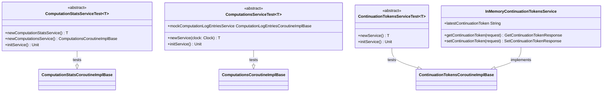

# org.wfanet.measurement.duchy.service.internal.testing

## Overview
Provides abstract test base classes and in-memory implementations for testing Duchy internal services. This package enables service implementers to validate their implementations against standard test suites covering computation statistics, computation management, and continuation token persistence.

## Components

### ComputationStatsServiceTest
Abstract test suite for validating ComputationStatsCoroutineImplBase implementations.

| Method | Parameters | Returns | Description |
|--------|------------|---------|-------------|
| newComputationStatsService | - | `T` | Creates service instance under test |
| newComputationsService | - | `ComputationsCoroutineImplBase` | Creates supporting computations service |
| initService | - | `Unit` | Initializes services before each test |

**Test Coverage:**
- Validates INVALID_ARGUMENT when computation ID is missing
- Validates INVALID_ARGUMENT when metric name is missing
- Validates IllegalStateException when computation stage is missing
- Verifies successful stat creation returns empty response

### ComputationsServiceTest
Abstract test suite for validating ComputationsCoroutineImplBase implementations with comprehensive computation lifecycle testing.

| Method | Parameters | Returns | Description |
|--------|------------|---------|-------------|
| newService | `clock: Clock` | `T` | Creates service instance with clock dependency |
| initService | - | `Unit` | Initializes service before each test |

**Test Coverage:**
- Computation creation and retrieval (by global ID and requisition key)
- Deletion and purging of computations
- Work claiming and lock management
- Computation stage advancement with validation
- Computation finishing with terminal states
- Output blob path recording
- Requisition fulfillment tracking
- Computation enqueueing
- Computation ID queries by stage

**Key Features:**
- Mocked ComputationLogEntriesCoroutineImplBase for logging validation
- Clock-based timestamp testing with TestClockWithNamedInstants
- Liquid Legions V2 protocol support

### ContinuationTokensServiceTest
Abstract test suite for validating ContinuationTokensCoroutineImplBase implementations.

| Method | Parameters | Returns | Description |
|--------|------------|---------|-------------|
| newService | - | `T` | Creates service instance under test |
| initService | - | `Unit` | Initializes service before each test |

**Test Coverage:**
- Validates initial token retrieval returns empty string
- Verifies token creation and updates
- Validates FAILED_PRECONDITION when setting older token

### InMemoryContinuationTokensService
Simple in-memory implementation of ContinuationTokensCoroutineImplBase for testing.

| Method | Parameters | Returns | Description |
|--------|------------|---------|-------------|
| getContinuationToken | `request: GetContinuationTokenRequest` | `GetContinuationTokenResponse` | Retrieves stored continuation token |
| setContinuationToken | `request: SetContinuationTokenRequest` | `SetContinuationTokenResponse` | Updates stored continuation token |

**Properties:**
- `latestContinuationToken: String` - In-memory storage for continuation token

## Data Structures

### Services (nested in ComputationStatsServiceTest)
| Property | Type | Description |
|----------|------|-------------|
| computationStatsService | `T` | The computation stats service instance |
| computationsService | `ComputationsCoroutineImplBase` | Supporting computations service |

## Dependencies
- `org.wfanet.measurement.internal.duchy` - Duchy internal gRPC service definitions and request/response messages
- `org.wfanet.measurement.internal.duchy.protocol` - Protocol-specific computation details (Liquid Legions V2)
- `org.wfanet.measurement.system.v1alpha` - System API for computation log entries
- `org.wfanet.measurement.common.testing` - Test utilities including TestClockWithNamedInstants
- `org.wfanet.measurement.common.grpc.testing` - gRPC mocking utilities
- `org.junit` - JUnit 4 testing framework
- `com.google.common.truth` - Truth assertion library with protocol buffer support
- `io.grpc` - gRPC runtime for status handling

## Usage Example
```kotlin
class PostgresComputationStatsServiceTest :
    ComputationStatsServiceTest<ComputationStatsCoroutineImplBase>() {

    private lateinit var database: Database

    override fun newComputationStatsService(): ComputationStatsCoroutineImplBase {
        return PostgresComputationStatsService(database)
    }

    override fun newComputationsService(): ComputationsCoroutineImplBase {
        return PostgresComputationsService(database)
    }
}

class InMemoryComputationsServiceTest :
    ComputationsServiceTest<ComputationsCoroutineImplBase>() {

    override fun newService(clock: Clock): ComputationsCoroutineImplBase {
        return InMemoryComputationsService(clock, mockComputationLogEntriesService)
    }
}
```

## Class Diagram

