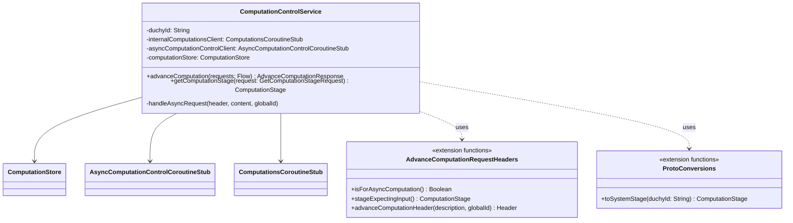

# org.wfanet.measurement.duchy.service.system.v1alpha

## Overview
This package implements the duchy-side system API v1alpha service layer for inter-duchy computation control. It handles incoming computation advancement requests from other duchies, manages protocol-specific stage transitions, and provides conversions between internal and system API representations for multi-party computation protocols including Liquid Legions V2, Reach-Only Liquid Legions V2, and Honest Majority Share Shuffle.

## Components

### ComputationControlService
gRPC service implementation for controlling inter-duchy computation operations, including receiving computation data from other duchies and retrieving computation stage information.

| Method | Parameters | Returns | Description |
|--------|------------|---------|-------------|
| advanceComputation | `requests: Flow<AdvanceComputationRequest>` | `AdvanceComputationResponse` | Receives streamed computation data and advances computation stage |
| getComputationStage | `request: GetComputationStageRequest` | `ComputationStage` | Retrieves current computation stage for specified computation |
| handleAsyncRequest | `header: Header`, `content: Flow<ByteString>`, `globalId: String` | `Unit` (suspend) | Writes payload data to blob storage and advances asynchronous computation |

**Constructor Parameters:**
| Parameter | Type | Description |
|-----------|------|-------------|
| duchyId | `String` | Identifier of the duchy hosting this service |
| internalComputationsClient | `ComputationsCoroutineStub` | Client for internal computations service |
| asyncComputationControlClient | `AsyncComputationControlCoroutineStub` | Client for internal async computation control |
| computationStore | `ComputationStore` | Storage interface for computation blobs |
| coroutineContext | `CoroutineContext` | Coroutine context for service operations |
| duchyIdentityProvider | `() -> DuchyIdentity` | Provider function for caller's duchy identity |

## Extensions

### AdvanceComputationRequest.Header

| Function | Returns | Description |
|----------|---------|-------------|
| isForAsyncComputation | `Boolean` | Determines if the protocol is asynchronous |
| stageExpectingInput | `ComputationStage` | Returns the computation stage expecting the input payload |

### ComputationToken

| Function | Parameters | Returns | Description |
|----------|------------|---------|-------------|
| toSystemStage | `duchyId: String` | `ComputationStage` | Converts internal computation token to system API stage representation |

### Protocol-Specific Stage Conversions

| Function | Returns | Description |
|----------|---------|-------------|
| LiquidLegionsV2.stageExpectingInput | `ComputationStage` | Maps Liquid Legions V2 description to internal stage |
| ReachOnlyLiquidLegionsV2.stageExpectingInput | `ComputationStage` | Maps Reach-Only Liquid Legions V2 description to internal stage |
| HonestMajorityShareShuffle.stageExpectingInput | `ComputationStage` | Maps Honest Majority Share Shuffle description to internal stage |

### Header Factory Functions

| Function | Parameters | Returns | Description |
|----------|------------|---------|-------------|
| advanceComputationHeader | `liquidLegionsV2ContentDescription: Description`, `globalComputationId: String` | `Header` | Creates header for Liquid Legions V2 computation |
| advanceComputationHeader | `reachOnlyLiquidLegionsV2ContentDescription: Description`, `globalComputationId: String` | `Header` | Creates header for Reach-Only Liquid Legions V2 computation |
| advanceComputationHeader | `honestMajorityShareShuffleContentDescription: Description`, `globalComputationId: String` | `Header` | Creates header for Honest Majority Share Shuffle computation |

## Dependencies
- `org.wfanet.measurement.common.grpc` - gRPC utilities for validation and error handling
- `org.wfanet.measurement.common.identity` - Duchy identity extraction from gRPC context
- `org.wfanet.measurement.duchy.storage` - Computation blob storage abstraction
- `org.wfanet.measurement.internal.duchy` - Internal duchy API stubs and messages
- `org.wfanet.measurement.internal.duchy.protocol` - Protocol-specific internal stage definitions
- `org.wfanet.measurement.system.v1alpha` - System API v1alpha protobuf messages
- `org.wfanet.measurement.storage` - Storage client interface
- `com.google.protobuf` - Protocol buffer ByteString for data streaming
- `io.grpc` - gRPC status handling
- `kotlinx.coroutines.flow` - Kotlin Flow for streaming operations

## Usage Example
```kotlin
// Initialize service
val service = ComputationControlService(
  duchyId = "duchy-1",
  internalComputationsClient = computationsStub,
  asyncComputationControlClient = asyncControlStub,
  computationStore = ComputationStore(storageClient),
  coroutineContext = Dispatchers.Default
)

// Create advance computation header
val header = advanceComputationHeader(
  liquidLegionsV2ContentDescription = LiquidLegionsV2.Description.SETUP_PHASE_INPUT,
  globalComputationId = "global-comp-123"
)

// Check if protocol is asynchronous
val isAsync = header.isForAsyncComputation() // true

// Get expected stage
val expectedStage = header.stageExpectingInput()
```

## Class Diagram

