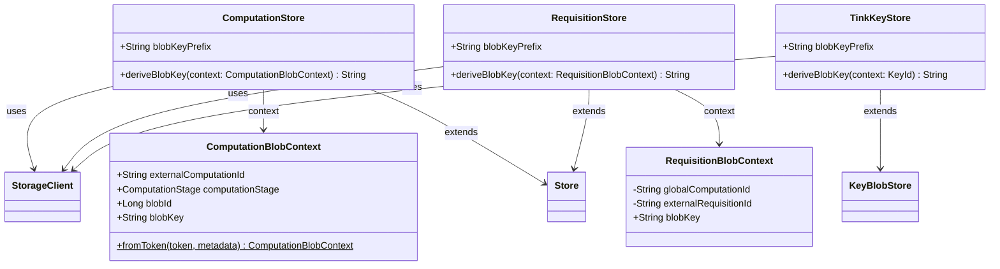

# org.wfanet.measurement.duchy.storage

## Overview
This package provides storage abstractions for managing blob data within the Duchy component of the Cross-Media Measurement system. It implements specialized Store instances for computations, requisitions, and cryptographic keys, each with domain-specific blob key derivation strategies that organize data by computation lifecycle stages and entity identifiers.

## Components

### ComputationStore
Manages blob storage for computation-related data, organizing blobs by computation ID, stage, and blob ID.

| Method | Parameters | Returns | Description |
|--------|------------|---------|-------------|
| deriveBlobKey | `context: ComputationBlobContext` | `String` | Derives blob storage key from context |

**Properties:**
- `blobKeyPrefix`: `String` - Returns "computations" as the prefix for all blob keys

**Constructor:**
- `ComputationStore(storageClient: StorageClient)` - Initializes store with storage client

### RequisitionStore
Manages blob storage for requisition-related data, organizing blobs by computation and requisition identifiers.

| Method | Parameters | Returns | Description |
|--------|------------|---------|-------------|
| deriveBlobKey | `context: RequisitionBlobContext` | `String` | Derives blob storage key from context |

**Properties:**
- `blobKeyPrefix`: `String` - Returns "requisitions" as the prefix for all blob keys

**Constructor:**
- `RequisitionStore(storageClient: StorageClient)` - Initializes store with storage client

### TinkKeyStore
Manages blob storage for Tink private cryptographic keys used in the Duchy.

| Method | Parameters | Returns | Description |
|--------|------------|---------|-------------|
| deriveBlobKey | `context: PrivateKeyStore.KeyId` | `String` | Derives blob storage key from key identifier |

**Properties:**
- `blobKeyPrefix`: `String` - Returns "tink-private-key" as the prefix for all blob keys

**Constructor:**
- `TinkKeyStore(storageClient: StorageClient)` - Initializes store with storage client

## Data Structures

### ComputationBlobContext
Context object for deriving blob keys in computation storage, encoding the computation lifecycle stage.

| Property | Type | Description |
|----------|------|-------------|
| externalComputationId | `String` | External identifier for the computation |
| computationStage | `ComputationStage` | Current stage of the computation lifecycle |
| blobId | `Long` | Unique identifier for the blob within the stage |
| blobKey | `String` | Computed blob key in format `{computationId}/{stageName}/{blobId}` |

**Companion Methods:**
- `fromToken(computationToken: ComputationToken, blobMetadata: ComputationStageBlobMetadata): ComputationBlobContext` - Creates context from computation token and blob metadata

### RequisitionBlobContext
Context object for deriving blob keys in requisition storage.

| Property | Type | Description |
|----------|------|-------------|
| globalComputationId | `String` | Global identifier for the associated computation |
| externalRequisitionId | `String` | External identifier for the requisition |
| blobKey | `String` | Computed blob key in format `{computationId}/{requisitionId}` |

## Dependencies
- `org.wfanet.measurement.storage` - Provides base StorageClient and Store abstractions
- `org.wfanet.measurement.internal.duchy` - Defines computation stage and token types
- `org.wfanet.measurement.common.crypto` - Provides key storage abstractions for Tink integration

## Usage Example
```kotlin
// Initialize storage client (implementation-specific)
val storageClient: StorageClient = createStorageClient()

// Create computation store
val computationStore = ComputationStore(storageClient)

// Define context for a computation blob
val context = ComputationBlobContext(
  externalComputationId = "comp-12345",
  computationStage = ComputationStage.CONFIRMATION_PHASE,
  blobId = 42L
)

// Write blob data
computationStore.write(context, blobData)

// Read blob data
val data = computationStore.get(context)

// Create requisition store
val requisitionStore = RequisitionStore(storageClient)
val reqContext = RequisitionBlobContext(
  globalComputationId = "comp-12345",
  externalRequisitionId = "req-67890"
)

// Manage Tink keys
val keyStore = TinkKeyStore(storageClient)
val keyId = PrivateKeyStore.KeyId("my-key-id")
keyStore.write(keyId, encryptedKeyData)
```

## Class Diagram

