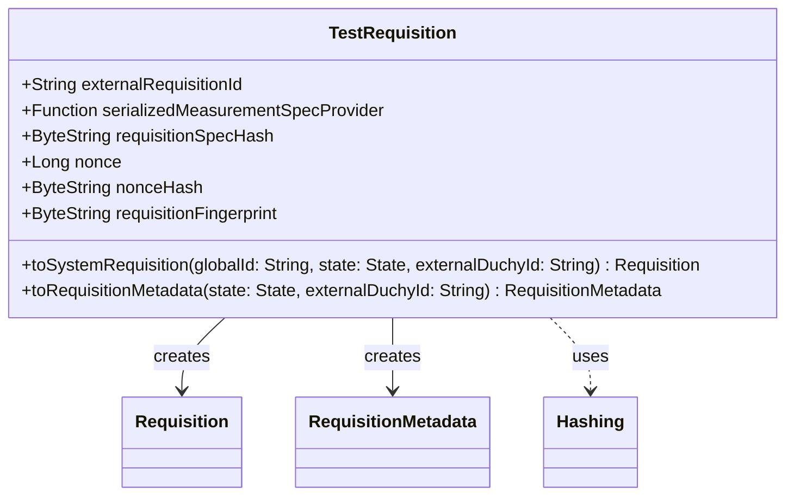

# org.wfanet.measurement.duchy.testing

## Overview
Provides testing utilities for duchy requisition management. This package contains test data structures and factory methods for creating requisition objects in both system API and internal duchy formats during unit and integration tests.

## Components

### TestRequisition
Data class representing a test requisition with cryptographic hashing capabilities for testing duchy computation workflows.

| Method | Parameters | Returns | Description |
|--------|------------|---------|-------------|
| toSystemRequisition | `globalId: String`, `state: Requisition.State`, `externalDuchyId: String = ""` | `Requisition` | Converts to system API requisition format |
| toRequisitionMetadata | `state: Requisition.State`, `externalDuchyId: String = ""` | `RequisitionMetadata` | Converts to internal duchy requisition metadata |

## Data Structures

### TestRequisition
| Property | Type | Description |
|----------|------|-------------|
| externalRequisitionId | `String` | External identifier for the requisition |
| serializedMeasurementSpecProvider | `() -> ByteString` | Lambda providing serialized measurement specification |
| requisitionSpecHash | `ByteString` | Random 32-byte hash of requisition specification |
| nonce | `Long` | Random nonce value for cryptographic operations |
| nonceHash | `ByteString` | SHA-256 hash of the nonce |
| requisitionFingerprint | `ByteString` | SHA-256 hash of measurement spec concatenated with spec hash |

## Dependencies
- `org.wfanet.measurement.common.crypto` - Provides SHA-256 hashing utilities
- `org.wfanet.measurement.internal.duchy` - Internal duchy protocol buffer definitions
- `org.wfanet.measurement.system.v1alpha` - System API protocol buffer definitions

## Usage Example
```kotlin
val testRequisition = TestRequisition(
    externalRequisitionId = "req-123",
    serializedMeasurementSpecProvider = { ByteString.copyFromUtf8("measurement-spec") }
)

// Create system API requisition
val systemReq = testRequisition.toSystemRequisition(
    globalId = "computation-456",
    state = Requisition.State.FULFILLED,
    externalDuchyId = "duchy-1"
)

// Create internal metadata
val metadata = testRequisition.toRequisitionMetadata(
    state = Requisition.State.FULFILLED,
    externalDuchyId = "duchy-1"
)
```

## Class Diagram

