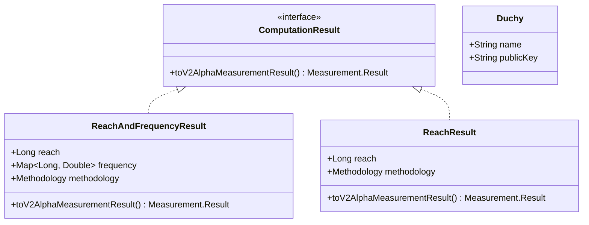

# org.wfanet.measurement.duchy.utils

## Overview
This package provides utility functions and data structures for duchy-level computations in the Cross-Media Measurement system. It handles conversions between different API versions (system v1alpha, public v2alpha) and internal duchy representations, manages duchy ordering for multi-party computation protocols, and provides cryptographic key transformations for secure measurements.

## Components

### ComputationConversions.kt

Extension functions and data classes for converting between system API, public API, and duchy internal protobuf representations.

#### Extension Functions

| Method | Parameters | Returns | Description |
|--------|------------|---------|-------------|
| toKingdomComputationDetails | - | `KingdomComputationDetails` | Converts SystemComputation to duchy internal computation details |
| key | - | `ComputationKey` | Extracts resource key from SystemComputation name |
| toDuchyEncryptionPublicKey | `publicApiVersion: Version` | `EncryptionPublicKey` | Converts ProtoAny to duchy internal encryption public key |
| toDuchyElGamalPublicKey | `publicApiVersion: Version` | `ElGamalPublicKey` | Parses ByteString to duchy internal ElGamal public key |
| toDuchyEncryptionPublicKey | - | `EncryptionPublicKey` | Converts V2AlphaEncryptionPublicKey to duchy internal format |
| toV2AlphaEncryptionPublicKey | - | `V2AlphaEncryptionPublicKey` | Converts duchy internal EncryptionPublicKey to v2alpha format |
| toDuchyDifferentialPrivacyParams | - | `DifferentialPrivacyParams` | Converts SystemDifferentialPrivacyParams to duchy internal format |
| key | - | `ComputationParticipantKey` | Extracts resource key from ComputationParticipant name |
| toRequisitionEntries | `serializedMeasurementSpec: ByteString` | `Iterable<RequisitionEntry>` | Converts system API requisitions to duchy internal entries |
| toDuchyRequisitionDetails | - | `RequisitionDetails` | Converts SystemRequisition to duchy internal format |
| key | - | `RequisitionKey` | Extracts resource key from SystemRequisition name |
| toDuchyDifferentialPrivacyParams | - | `DifferentialPrivacyParams` | Converts V2AlphaDifferentialPrivacyParams to duchy internal format |
| toV2AlphaElGamalPublicKey | - | `V2AlphaElGamalPublicKey` | Converts duchy internal ElGamalPublicKey to v2alpha format |
| toDuchyElGamalPublicKey | - | `ElGamalPublicKey` | Converts V2AlphaElGamalPublicKey to duchy internal format |
| toCmmsElGamalPublicKey | - | `ElGamalPublicKey` | Converts AnySketch ElGamalPublicKey to CMMS format |
| toAnySketchElGamalPublicKey | - | `AnySketchElGamalPublicKey` | Converts duchy internal ElGamalPublicKey to AnySketch format |

#### Top-Level Functions

| Function | Parameters | Returns | Description |
|----------|------------|---------|-------------|
| getComputationParticipantKey | `name: String` | `ComputationParticipantKey` | Parses computation participant key from resource name |

### DuchyOrder.kt

Functions and data structures for establishing deterministic ordering of duchies in multi-party computation protocols.

#### Top-Level Functions

| Function | Parameters | Returns | Description |
|----------|------------|---------|-------------|
| getDuchyOrderByPublicKeysAndComputationId | `nodes: Set<Duchy>`, `globalComputationId: String` | `List<String>` | Orders duchies by SHA1 hash of public key concatenated with computation ID |
| getNextDuchy | `duchyOrder: List<String>`, `currentDuchy: String` | `String` | Returns next duchy in ring topology, wrapping to first if at end |
| getFollowingDuchies | `duchyOrder: List<String>`, `currentDuchy: String` | `List<String>` | Returns all duchies following current duchy in order |
| sha1Hash | `value: String` | `BigInteger` | Computes SHA1 hash and converts to BigInteger |

## Data Structures

### Duchy
| Property | Type | Description |
|----------|------|-------------|
| name | `String` | Identifier for the duchy |
| publicKey | `String` | Duchy's public cryptographic key |

### ComputationResult (Interface)
| Method | Returns | Description |
|--------|---------|-------------|
| toV2AlphaMeasurementResult | `Measurement.Result` | Converts computation result to v2alpha measurement result |

### ReachAndFrequencyResult
| Property | Type | Description |
|----------|------|-------------|
| reach | `Long` | Total reach value |
| frequency | `Map<Long, Double>` | Frequency distribution map |
| methodology | `Methodology` | Measurement methodology used |

Implements `ComputationResult` to provide v2alpha measurement result conversion.

### ReachResult
| Property | Type | Description |
|----------|------|-------------|
| reach | `Long` | Total reach value |
| methodology | `Methodology` | Measurement methodology used |

Implements `ComputationResult` to provide v2alpha measurement result conversion.

## Dependencies
- `com.google.protobuf` - Protobuf message handling and Any type unpacking
- `org.wfanet.anysketch.crypto` - AnySketch cryptographic primitives for ElGamal keys
- `org.wfanet.measurement.api.v2alpha` - Public v2alpha API protobuf messages
- `org.wfanet.measurement.api` - API versioning support
- `org.wfanet.measurement.consent.client.duchy` - Requisition fingerprint computation
- `org.wfanet.measurement.internal.duchy` - Internal duchy protobuf messages
- `org.wfanet.measurement.measurementconsumer.stats` - Methodology definitions for measurement computation
- `org.wfanet.measurement.system.v1alpha` - System v1alpha API protobuf messages
- `java.security.MessageDigest` - SHA1 hash computation for duchy ordering
- `java.math.BigInteger` - Large integer operations for hash values

## Usage Example
```kotlin
// Convert system API computation to duchy internal format
val systemComputation: SystemComputation = // ... from API
val details: KingdomComputationDetails = systemComputation.toKingdomComputationDetails()

// Establish duchy order for multi-party computation
val duchies = setOf(
  Duchy("duchy1", "publicKey1"),
  Duchy("duchy2", "publicKey2"),
  Duchy("duchy3", "publicKey3")
)
val order = getDuchyOrderByPublicKeysAndComputationId(duchies, "computation-123")
val nextDuchy = getNextDuchy(order, "duchy1")

// Convert computation results to v2alpha format
val result = ReachAndFrequencyResult(
  reach = 1000000,
  frequency = mapOf(1L to 0.5, 2L to 0.3, 3L to 0.2),
  methodology = LiquidLegionsV2Methodology()
)
val measurementResult = result.toV2AlphaMeasurementResult()

// Convert encryption keys between formats
val v2alphaKey: V2AlphaElGamalPublicKey = // ... from API
val duchyKey = v2alphaKey.toDuchyElGamalPublicKey()
```

## Class Diagram

