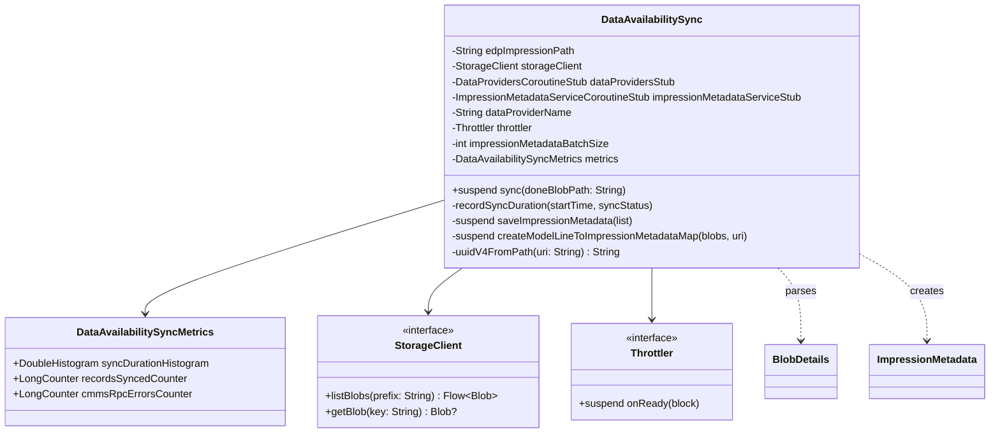

# org.wfanet.measurement.edpaggregator.dataavailability

## Overview
This package provides synchronization of impression data availability between Cloud Storage and the Kingdom service. It handles the discovery, validation, and persistence of impression metadata after data uploads are complete, and updates data provider availability intervals accordingly.

## Components

### DataAvailabilitySync
Coordinates the complete workflow for synchronizing impression metadata from Cloud Storage to the Kingdom after a "done" blob signals upload completion.

| Method | Parameters | Returns | Description |
|--------|------------|---------|-------------|
| sync | `doneBlobPath: String` | `Unit` | Synchronizes impression availability data after completion signal |
| asUriString | Extension on `BlobUri` | `String` | Converts BlobUri to URI string format |

**Constructor Parameters:**
| Parameter | Type | Description |
|-----------|------|-------------|
| edpImpressionPath | `String` | Path name for the EDP; all impressions reside in subfolders |
| storageClient | `StorageClient` | Client for accessing Cloud Storage blobs |
| dataProvidersStub | `DataProvidersCoroutineStub` | gRPC stub for Kingdom Data Providers service |
| impressionMetadataServiceStub | `ImpressionMetadataServiceCoroutineStub` | gRPC stub for impression metadata operations |
| dataProviderName | `String` | Resource name of the data provider |
| throttler | `Throttler` | Rate limiting utility for external service requests |
| impressionMetadataBatchSize | `Int` | Batch size for creating impression metadata |
| metrics | `DataAvailabilitySyncMetrics` | OpenTelemetry metrics (default instance created) |

**Private Methods:**
| Method | Parameters | Returns | Description |
|--------|------------|---------|-------------|
| recordSyncDuration | `startTime: ValueTimeMark`, `syncStatus: String` | `Unit` | Records sync operation duration to metrics |
| saveImpressionMetadata | `impressionMetadataList: List<ImpressionMetadata>` | `Unit` | Persists impression metadata in batches |
| createModelLineToImpressionMetadataMap | `impressionMetadataBlobs: Flow<Blob>`, `doneBlobUri: BlobUri` | `Map<String, List<ImpressionMetadata>>` | Parses metadata blobs and groups by model line |
| uuidV4FromPath | `metadataBlobUri: String` | `String` | Generates deterministic UUIDv4 from blob path |

### DataAvailabilitySyncMetrics
Encapsulates OpenTelemetry instruments for monitoring DataAvailabilitySync operations.

| Property | Type | Description |
|----------|------|-------------|
| syncDurationHistogram | `DoubleHistogram` | Tracks duration of sync fetch and write cycles |
| recordsSyncedCounter | `LongCounter` | Counts impression metadata records synced per EDP |
| cmmsRpcErrorsCounter | `LongCounter` | Counts CMMS API call errors |

**Constructor Parameters:**
| Parameter | Type | Description |
|-----------|------|-------------|
| meter | `Meter` | OpenTelemetry meter (default: Instrumentation.meter) |

## Workflow

The synchronization process follows these steps:

1. **Trigger**: A "done" blob path is provided to `sync()`
2. **Discovery**: Metadata blobs in the same folder are discovered via `storageClient.listBlobs()`
3. **Parsing**: Metadata files (.binpb or .json) are parsed into `ImpressionMetadata` objects
4. **Validation**: Intervals are validated and presence of impression blobs is verified
5. **Persistence**: Valid impression metadata are saved via `batchCreateImpressionMetadata`
6. **Computation**: Model line availability intervals are computed from stored metadata
7. **Update**: Data provider availability intervals are updated in the Kingdom
8. **Metrics**: Duration, record counts, and errors are recorded to OpenTelemetry

## Data Structures

### ImpressionMetadata (from edpaggregator.v1alpha)
| Field | Type | Description |
|-------|------|-------------|
| blobUri | `String` | Cloud Storage URI of the metadata blob |
| blobTypeUrl | `String` | Type URL for the blob format |
| eventGroupReferenceId | `String` | Reference ID for the event group |
| modelLine | `String` | Model line identifier for grouping |
| interval | `Interval` | Time interval for data availability |

### BlobDetails (from edpaggregator.v1alpha)
| Field | Type | Description |
|-------|------|-------------|
| blobUri | `String` | URI of the impression data blob |
| eventGroupReferenceId | `String` | Reference ID for the event group |
| modelLine | `String` | Model line identifier |
| interval | `Interval` | Time interval covered by the data |

## Dependencies

- `org.wfanet.measurement.api.v2alpha` - Kingdom API for data provider management
- `org.wfanet.measurement.edpaggregator.v1alpha` - EDP Aggregator API for impression metadata
- `org.wfanet.measurement.storage` - Cloud Storage abstraction layer
- `org.wfanet.measurement.common.throttler` - Request throttling utilities
- `io.opentelemetry.api.metrics` - OpenTelemetry metrics instrumentation
- `com.google.protobuf` - Protocol buffer serialization
- `io.grpc` - gRPC communication framework
- `kotlinx.coroutines.flow` - Kotlin coroutines Flow API

## Error Handling

The sync process handles several error conditions:

- **Invalid path validation**: Ensures edpImpressionPath matches expected pattern
- **Protocol buffer parsing**: Falls back to JSON parsing if binary parsing fails
- **Missing impression blobs**: Skips metadata entries where impression data is absent
- **RPC errors**: Records CMMS RPC errors to metrics with status codes
- **Interval validation**: Requires both startTime and endTime in intervals

All errors during sync are recorded with duration metrics before being propagated.

## Metrics Instrumentation

### Histogram Metrics
- `edpa.data_availability.sync_duration` - Duration in seconds of sync operations
  - Attributes: `data_provider_key`, `sync_status` (success/failed)

### Counter Metrics
- `edpa.data_availability.records_synced` - Count of records synced per operation
  - Attributes: `data_provider_key`, `sync_status`
- `edpa.data_availability.cmms_rpc_errors` - Count of CMMS API failures
  - Attributes: `data_provider_key`, `rpc_method`, `status_code`

## Usage Example

```kotlin
import org.wfanet.measurement.edpaggregator.dataavailability.DataAvailabilitySync
import org.wfanet.measurement.edpaggregator.dataavailability.DataAvailabilitySyncMetrics
import org.wfanet.measurement.storage.StorageClient
import org.wfanet.measurement.common.throttler.MinimumIntervalThrottler
import kotlin.time.Duration.Companion.milliseconds

// Initialize dependencies
val storageClient: StorageClient = // ... storage client instance
val dataProvidersStub = // ... Kingdom data providers stub
val impressionMetadataStub = // ... impression metadata service stub
val throttler = MinimumIntervalThrottler(50.milliseconds)

// Create sync instance
val sync = DataAvailabilitySync(
  edpImpressionPath = "edp-example",
  storageClient = storageClient,
  dataProvidersStub = dataProvidersStub,
  impressionMetadataServiceStub = impressionMetadataStub,
  dataProviderName = "dataProviders/12345",
  throttler = throttler,
  impressionMetadataBatchSize = 100,
  metrics = DataAvailabilitySyncMetrics()
)

// Trigger synchronization when done blob is detected
suspend fun onDoneBlobCreated(blobPath: String) {
  sync.sync(blobPath)
}
```

## File Format Support

The package supports two metadata file formats:

1. **Binary Protocol Buffer** (`.binpb`)
   - Parsed directly using `BlobDetails.parseFrom(bytes)`
   - Preferred for efficiency

2. **JSON** (`.json`)
   - Parsed using `JsonFormat.parser().ignoringUnknownFields()`
   - Allows for schema evolution with unknown fields ignored

Files must contain "metadata" in the filename and reside in the same folder as the "done" blob.

## Class Diagram


