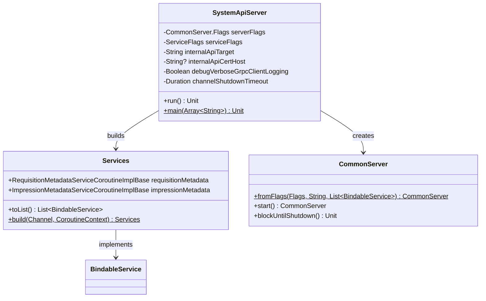

# org.wfanet.measurement.edpaggregator.deploy.common.server

## Overview
This package provides the EDP Aggregator System API Server deployment implementation. The server acts as a gRPC gateway that exposes public v1alpha services by proxying requests to the internal EDP Aggregator API server. It configures mutual TLS communication channels and manages service lifecycle for impression and requisition metadata operations.

## Components

### SystemApiServer
Command-line executable server that bootstraps and runs the EDP Aggregator public API services with gRPC connectivity to internal services.

| Method | Parameters | Returns | Description |
|--------|------------|---------|-------------|
| run | None | `Unit` | Initializes TLS certificates, builds internal API channel, constructs services, and starts the server |
| main | `args: Array<String>` | `Unit` | Entry point that parses command-line arguments and executes the server |

#### Configuration Parameters

| Parameter | Type | Description |
|-----------|------|-------------|
| serverFlags | `CommonServer.Flags` | Standard gRPC server configuration flags |
| serviceFlags | `ServiceFlags` | Service execution context configuration |
| internalApiTarget | `String` | gRPC target address of the internal API server |
| internalApiCertHost | `String?` | Optional TLS DNS-ID override for internal API certificate validation |
| debugVerboseGrpcClientLogging | `Boolean` | Enables detailed request/response logging for outgoing gRPC calls |
| channelShutdownTimeout | `Duration` | Maximum time allowed for graceful channel shutdown (default: 3 seconds) |

## Key Functionality

### Server Initialization
The `run()` method performs the following initialization sequence:

1. **Certificate Loading**: Loads client certificates from PEM files for mutual TLS authentication
2. **Channel Construction**: Creates a mutual TLS channel to the internal API server with shutdown timeout and optional verbose logging
3. **Service Building**: Constructs RequisitionMetadataService and ImpressionMetadataService instances via `Services.build()`
4. **Server Startup**: Creates a CommonServer instance from flags and starts serving with blocking shutdown behavior

### Service Architecture
The server exposes two primary gRPC services:
- **RequisitionMetadataService**: Handles requisition metadata operations
- **ImpressionMetadataService**: Handles impression metadata operations

Both services proxy requests to corresponding internal API implementations using coroutine-based stubs.

## Dependencies

### Internal Dependencies
- `org.wfanet.measurement.common.crypto.SigningCerts` - TLS certificate management
- `org.wfanet.measurement.common.grpc.CommonServer` - Base gRPC server implementation
- `org.wfanet.measurement.common.grpc.ServiceFlags` - Service execution configuration
- `org.wfanet.measurement.common.grpc.buildMutualTlsChannel` - Mutual TLS channel factory
- `org.wfanet.measurement.edpaggregator.service.v1alpha.Services` - Service factory for v1alpha API

### External Dependencies
- `io.grpc.BindableService` - gRPC service binding interface
- `kotlinx.coroutines.CoroutineDispatcher` - Coroutine execution context
- `picocli.CommandLine` - Command-line argument parsing framework

## Usage Example
```kotlin
// Command-line execution
fun main(args: Array<String>) {
  SystemApiServer.main(
    arrayOf(
      "--port=8080",
      "--tls-cert-file=/path/to/cert.pem",
      "--tls-key-file=/path/to/key.pem",
      "--cert-collection-file=/path/to/trusted-certs.pem",
      "--edp-aggregator-internal-api-target=localhost:9090",
      "--edp-aggregator-internal-api-cert-host=internal.example.com",
      "--channel-shutdown-timeout=5s",
      "--debug-verbose-grpc-client-logging=true"
    )
  )
}
```

## Class Diagram

