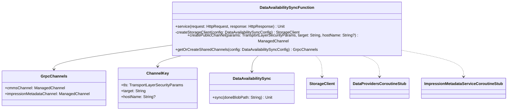

# org.wfanet.measurement.edpaggregator.deploy.gcloud.dataavailability

## Overview
This package provides a Google Cloud Function implementation for synchronizing data availability state between ImpressionMetadataStorage and the Kingdom service. The function is triggered when an EDP finishes uploading impressions and writes a "done" blob to Google Cloud Storage, then synchronizes the new availability data with both the ImpressionMetadataStorage and the Kingdom's impression availability interval.

## Components

### DataAvailabilitySyncFunction
Google Cloud HTTP Function that orchestrates data availability synchronization between storage systems.

| Method | Parameters | Returns | Description |
|--------|------------|---------|-------------|
| service | `request: HttpRequest`, `response: HttpResponse` | `Unit` | Handles incoming HTTP requests, parses configuration, creates clients, and executes sync |

### ChannelKey
Internal data class for caching gRPC channel instances based on connection parameters.

| Property | Type | Description |
|----------|------|-------------|
| tls | `TransportLayerSecurityParams` | TLS configuration parameters |
| target | `String` | Server target endpoint |
| hostName | `String?` | Optional hostname override for TLS verification |

### GrpcChannels
Data class containing paired gRPC channels for CMMS and ImpressionMetadata services.

| Property | Type | Description |
|----------|------|-------------|
| cmmsChannel | `ManagedChannel` | Channel for Kingdom/CMMS service communication |
| impressionMetadataChannel | `ManagedChannel` | Channel for ImpressionMetadata service communication |

## Key Functionality

### Synchronization Workflow
1. Receives HTTP request with `DataAvailabilitySyncConfig` in JSON format
2. Extracts "done" blob path from `X-DataWatcher-Path` header
3. Creates or retrieves cached gRPC channels with mutual TLS
4. Instantiates storage client (GCS or FileSystem for testing)
5. Invokes `DataAvailabilitySync.sync()` with W3C trace context
6. Flushes telemetry metrics before function termination

### Channel Management
- Channels are cached globally using `ConcurrentHashMap` keyed by TLS parameters and target
- Mutual TLS configured using certificate files from configuration
- Channels instrumented with OpenTelemetry gRPC interceptors
- Shutdown timeout configurable via environment variable

### Storage Client Selection
- Production: `GcsStorageClient` using Google Cloud Storage
- Testing: `FileSystemStorageClient` when `DATA_AVAILABILITY_FILE_SYSTEM_PATH` is set
- GCS bucket and project ID configured via `DataAvailabilitySyncConfig`

## Environment Variables

| Variable | Required | Default | Description |
|----------|----------|---------|-------------|
| `KINGDOM_TARGET` | Yes | - | Target endpoint for Kingdom service |
| `KINGDOM_CERT_HOST` | No | - | TLS authority override for testing |
| `IMPRESSION_METADATA_TARGET` | Yes | - | Target endpoint for ImpressionMetadata service |
| `IMPRESSION_METADATA_CERT_HOST` | No | - | TLS authority override for testing |
| `CHANNEL_SHUTDOWN_DURATION_SECONDS` | No | 3 | gRPC channel shutdown timeout in seconds |
| `DATA_AVAILABILITY_FILE_SYSTEM_PATH` | No | - | Enables FileSystemStorageClient for testing |
| `THROTTLER_MILLIS` | No | 1000 | Minimum interval between operations in milliseconds |
| `IMPRESSION_METADATA_BATCH_SIZE` | No | 100 | Batch size for impression metadata processing |

## Dependencies
- `com.google.cloud.functions` - Cloud Functions HTTP runtime
- `com.google.cloud.storage` - Google Cloud Storage client
- `com.google.protobuf.util` - JSON to Protobuf parsing
- `io.grpc` - gRPC channel and stub infrastructure
- `io.opentelemetry` - Distributed tracing and instrumentation
- `org.wfanet.measurement.api.v2alpha` - Kingdom DataProviders API
- `org.wfanet.measurement.common.crypto` - TLS certificate management
- `org.wfanet.measurement.common.grpc` - gRPC channel builders
- `org.wfanet.measurement.common.throttler` - Rate limiting utilities
- `org.wfanet.measurement.config.edpaggregator` - Configuration protobuf messages
- `org.wfanet.measurement.edpaggregator.dataavailability` - Core sync logic
- `org.wfanet.measurement.edpaggregator.telemetry` - EDPA-specific telemetry
- `org.wfanet.measurement.edpaggregator.v1alpha` - ImpressionMetadataService API
- `org.wfanet.measurement.gcloud.gcs` - GCS storage client wrapper
- `org.wfanet.measurement.storage` - Storage abstraction layer

## Configuration

### Request Body Format
The function expects a JSON-formatted `DataAvailabilitySyncConfig` containing:
- `edpImpressionPath`: Base path for EDP impression data
- `dataProvider`: Data provider resource name
- `cmmsConnection`: TLS parameters for Kingdom connection
- `impressionMetadataStorageConnection`: TLS parameters for ImpressionMetadata connection
- `dataAvailabilityStorage.gcs`: GCS bucket and project configuration

### Request Headers
- `X-DataWatcher-Path`: Path to the "done" blob that triggered the function (required)

### EDP Blob Path Convention
The "done" blob must be written under the pattern:
```
/edp/<edp_name>/<unique_identifier>/[optional_subfolder]/
```

## Usage Example
```kotlin
// Cloud Function deployment configuration (function.yaml)
val config = DataAvailabilitySyncConfig.newBuilder()
  .setEdpImpressionPath("gs://bucket/edp/edp-001/")
  .setDataProvider("dataProviders/12345")
  .setCmmsConnection(
    TransportLayerSecurityParams.newBuilder()
      .setCertFilePath("/certs/client.pem")
      .setPrivateKeyFilePath("/certs/client.key")
      .setCertCollectionFilePath("/certs/ca.pem")
  )
  .setImpressionMetadataStorageConnection(/* similar TLS params */)
  .setDataAvailabilityStorage(
    DataAvailabilityStorageConfig.newBuilder()
      .setGcs(
        GcsConfig.newBuilder()
          .setBucketName("edpa-impressions")
          .setProjectId("my-gcp-project")
      )
  )
  .build()

// Triggering HTTP request
POST /dataAvailabilitySync
Headers:
  X-DataWatcher-Path: /edp/edp-001/2026-01-15/done.txt
Body:
  {JSON representation of config}
```

## Class Diagram

