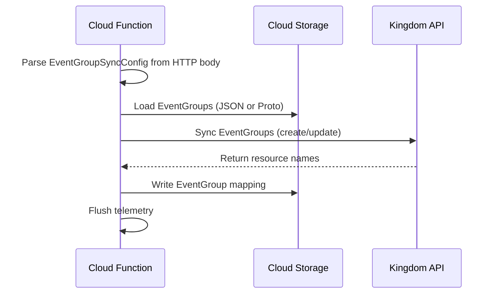
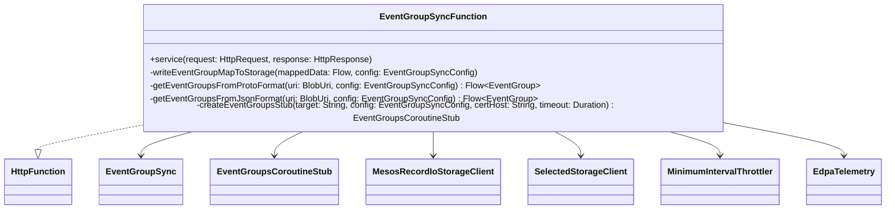

# org.wfanet.measurement.edpaggregator.deploy.gcloud.eventgroups

## Overview
This package provides Google Cloud Function deployment components for synchronizing EventGroups between an EDP (Event Data Provider) and the Kingdom API. It implements an HTTP-triggered function that reads EventGroup definitions from cloud storage, registers/updates them with the Kingdom, and writes a mapping of reference IDs to resource names back to storage.

## Components

### EventGroupSyncFunction
Cloud Run Function that orchestrates EventGroup synchronization workflow with the Kingdom API.

| Method | Parameters | Returns | Description |
|--------|------------|---------|-------------|
| service | `request: HttpRequest`, `response: HttpResponse` | `Unit` | Processes HTTP request containing EventGroupSyncConfig, syncs EventGroups with Kingdom |
| writeEventGroupMapToStorage | `mappedData: Flow<MappedEventGroup>`, `eventGroupSyncConfig: EventGroupSyncConfig` | `Unit` (suspend) | Writes EventGroup mapping data to blob storage |
| getEventGroupsFromProtoFormat | `eventGroupsBlobUri: BlobUri`, `eventGroupSyncConfig: EventGroupSyncConfig` | `Flow<EventGroup>` (suspend) | Loads EventGroups from Protocol Buffer format |
| getEventGroupsFromJsonFormat | `eventGroupsBlobUri: BlobUri`, `eventGroupSyncConfig: EventGroupSyncConfig` | `Flow<EventGroup>` (suspend) | Loads EventGroups from JSON format |
| createEventGroupsStub | `target: String`, `eventGroupSyncConfig: EventGroupSyncConfig`, `certHost: String?`, `shutdownTimeout: Duration` | `EventGroupsCoroutineStub` | Creates instrumented gRPC stub with mTLS and OpenTelemetry |

**Key Features:**
- Implements `HttpFunction` interface for Google Cloud Functions deployment
- Supports both Protocol Buffer (`.binpb`) and JSON (`.json`) EventGroup file formats
- Integrates OpenTelemetry tracing with custom spans for observability
- Configurable via environment variables and HTTP request headers
- Automatic telemetry flushing to prevent data loss in Cloud Functions environment

**Configuration Constants:**

| Constant | Default | Environment Variable | Description |
|----------|---------|---------------------|-------------|
| KINGDOM_SHUTDOWN_DURATION_SECONDS | 3 | KINGDOM_SHUTDOWN_DURATION_SECONDS | gRPC channel shutdown timeout |
| THROTTLER_DURATION_MILLIS | 1000 | THROTTLER_MILLIS | Minimum interval between API calls |
| LIST_EVENT_GROUPS_PAGE_SIZE | 100 | LIST_EVENT_GROUPS_PAGE_SIZE | Page size for Kingdom API pagination |
| DATA_WATCHER_PATH_HEADER | "X-DataWatcher-Path" | DATA_WATCHER_PATH_HEADER | HTTP header for overriding EventGroup source path |

## Dependencies

- `com.google.cloud.functions` - Google Cloud Functions HTTP framework
- `org.wfanet.measurement.api.v2alpha` - Kingdom Public API gRPC client
- `org.wfanet.measurement.edpaggregator.eventgroups` - Core EventGroup synchronization logic
- `org.wfanet.measurement.edpaggregator.telemetry` - OpenTelemetry instrumentation and tracing
- `org.wfanet.measurement.storage` - Cloud storage abstraction (GCS, filesystem)
- `org.wfanet.measurement.common.crypto` - mTLS certificate management
- `org.wfanet.measurement.common.grpc` - gRPC channel utilities
- `org.wfanet.measurement.common.throttler` - Rate limiting for API calls
- `org.wfanet.measurement.config.edpaggregator` - Configuration protobuf definitions
- `io.opentelemetry.instrumentation.grpc` - OpenTelemetry gRPC instrumentation
- `com.google.protobuf.util` - JSON/Protobuf conversion utilities

## Environment Variables

| Variable | Required | Description |
|----------|----------|-------------|
| KINGDOM_TARGET | Yes | Kingdom API gRPC endpoint (e.g., "kingdom.example.com:443") |
| KINGDOM_CERT_HOST | No | Expected certificate hostname for verification |
| THROTTLER_MILLIS | No | Minimum milliseconds between Kingdom API calls |
| KINGDOM_SHUTDOWN_DURATION_SECONDS | No | Graceful shutdown timeout for gRPC channel |
| LIST_EVENT_GROUPS_PAGE_SIZE | No | Number of EventGroups per page when listing |
| FILE_STORAGE_ROOT | No | Root directory for filesystem storage backend |
| DATA_WATCHER_PATH_HEADER | No | Custom header name for DataWatcher path override |

## Usage Example

```kotlin
// HTTP request body (JSON format EventGroupSyncConfig)
val requestBody = """
{
  "dataProvider": "dataProviders/123",
  "eventGroupsBlobUri": "gs://bucket/event-groups.json",
  "eventGroupMapBlobUri": "gs://bucket/event-group-map.binpb",
  "cmmsConnection": {
    "certFilePath": "/path/to/cert.pem",
    "privateKeyFilePath": "/path/to/key.pem",
    "certCollectionFilePath": "/path/to/ca.pem"
  },
  "eventGroupStorage": {
    "gcs": { "projectId": "my-project" }
  },
  "eventGroupMapStorage": {
    "gcs": { "projectId": "my-project" }
  }
}
"""

// Deploy as Cloud Function
// The function reads EventGroups from storage, syncs with Kingdom, and writes mapping
val function = EventGroupSyncFunction()
function.service(httpRequest, httpResponse)
```

## Workflow Sequence



## Class Diagram



## Error Handling

- **Unsupported file format**: Throws error if EventGroup file suffix is neither `.binpb` nor `.json`
- **Missing blob**: Throws `IllegalStateException` if specified blob does not exist in storage
- **Empty EventGroups**: Requires at least one EventGroup in the input file
- **Certificate validation**: Fails if required certificate files are not found or invalid
- **Telemetry flushing**: Always flushes telemetry in `finally` block to prevent data loss

## Tracing Spans

The function creates the following OpenTelemetry spans:

- `event_group_sync_function` - Overall function execution
- `load_event_groups` - Reading EventGroups from storage
- `write_event_group_map` - Writing mapping results to storage
- Additional spans automatically created by gRPC instrumentation for Kingdom API calls
