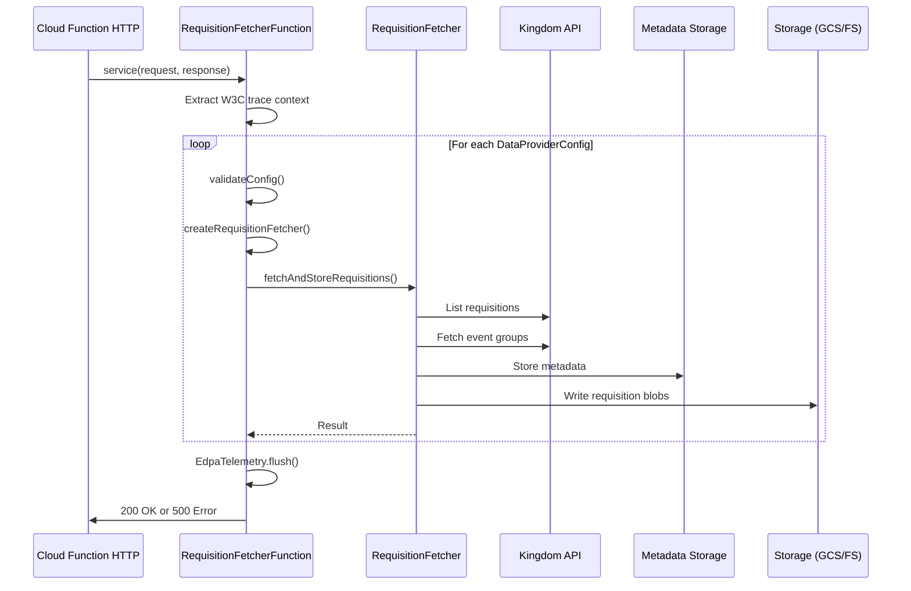

# org.wfanet.measurement.edpaggregator.deploy.gcloud.requisitionfetcher

## Overview
This package provides a Google Cloud Function deployment implementation for fetching and storing requisitions from the Kingdom API for configured data providers. The function integrates with Google Cloud Storage (or local filesystem for testing), uses mutual TLS for secure gRPC communication, and implements OpenTelemetry instrumentation for distributed tracing and telemetry.

## Components

### RequisitionFetcherFunction
A Google Cloud Function (HttpFunction) that orchestrates the requisition fetching workflow for multiple data providers.

| Method | Parameters | Returns | Description |
|--------|------------|---------|-------------|
| service | `request: HttpRequest`, `response: HttpResponse` | `Unit` | HTTP entry point handling incoming Cloud Function requests |
| handleRequest | `response: HttpResponse` | `Unit` | Processes all configured data providers and writes status response |
| processDataProvider | `dataProviderConfig: DataProviderRequisitionConfig` | `Result<Unit>` | Executes fetch workflow for single data provider with telemetry |
| createRequisitionFetcher | `dataProviderConfig: DataProviderRequisitionConfig` | `RequisitionFetcher` | Builds fully initialized RequisitionFetcher with gRPC stubs and storage |
| createStorageClient | `dataProviderConfig: DataProviderRequisitionConfig` | `StorageClient` | Creates filesystem or GCS storage client based on environment |
| createRequisitionBlobPrefix | `dataProviderConfig: DataProviderRequisitionConfig` | `String` | Generates storage prefix for requisition blobs |
| createInstrumentedChannel | `tlsParams: TransportLayerSecurityParams`, `target: String`, `certHost: String?` | `Channel` | Creates mutual TLS gRPC channel with OpenTelemetry interceptors |
| loadSigningCerts | `transportLayerSecurityParams: TransportLayerSecurityParams` | `SigningCerts` | Loads PEM-encoded certificates and private keys for mutual TLS |
| validateConfig | `dataProviderConfig: DataProviderRequisitionConfig` | `Unit` | Validates required configuration fields and throws IllegalArgumentException |
| withDataProviderTelemetry | `dataProviderName: String`, `block: () -> Unit` | `Result<Unit>` | Wraps execution with OpenTelemetry span and event recording |

## Configuration

### Required Environment Variables
| Variable | Description |
|----------|-------------|
| `KINGDOM_TARGET` | gRPC target address for Kingdom services |
| `METADATA_STORAGE_TARGET` | gRPC target address for requisition metadata storage |
| `GRPC_REQUEST_INTERVAL` | Minimum interval between gRPC calls (default: 1s) |

### Optional Environment Variables
| Variable | Default | Description |
|----------|---------|-------------|
| `REQUISITION_FILE_SYSTEM_PATH` | null | Local filesystem path for requisitions (overrides GCS) |
| `KINGDOM_CERT_HOST` | null | TLS certificate hostname override for Kingdom |
| `METADATA_STORAGE_CERT_HOST` | null | TLS certificate hostname override for metadata storage |
| `PAGE_SIZE` | 50 | Number of requisitions fetched per page |
| `GRPC_CHANNEL_SHUTDOWN_DURATION_SECONDS` | 3 | Graceful shutdown timeout for gRPC channels |

### Configuration File
- **Blob Key**: `requisition-fetcher-config.textproto`
- **Type**: `RequisitionFetcherConfig` protobuf message
- **Contains**: List of `DataProviderRequisitionConfig` entries

### DataProviderRequisitionConfig Fields
| Field | Required | Description |
|-------|----------|-------------|
| `dataProvider` | Yes | Data provider identifier |
| `requisitionStorage` | Yes | Storage configuration (GCS or FileSystem) |
| `storagePathPrefix` | Yes | Path prefix for stored requisitions |
| `edpPrivateKeyPath` | Yes | Path to EDP private key for signature validation |
| `cmmsConnection` | Yes | TLS parameters for Kingdom connection |
| `requisitionMetadataStorageConnection` | Yes | TLS parameters for metadata storage connection |

## Dependencies

### External Services
- `org.wfanet.measurement.api.v2alpha` - Kingdom API (Requisitions, EventGroups)
- `org.wfanet.measurement.edpaggregator.v1alpha` - Requisition metadata storage API
- `com.google.cloud.functions` - Google Cloud Functions framework
- `com.google.cloud.storage` - Google Cloud Storage client
- `io.grpc` - gRPC communication framework
- `io.opentelemetry` - Distributed tracing and telemetry

### Internal Dependencies
- `org.wfanet.measurement.edpaggregator.requisitionfetcher.RequisitionFetcher` - Core requisition fetching logic
- `org.wfanet.measurement.edpaggregator.requisitionfetcher.RequisitionGrouperByReportId` - Groups requisitions by report identifier
- `org.wfanet.measurement.edpaggregator.requisitionfetcher.RequisitionsValidator` - Validates requisition signatures
- `org.wfanet.measurement.edpaggregator.telemetry.EdpaTelemetry` - OpenTelemetry initialization and metrics flushing
- `org.wfanet.measurement.common.crypto.SigningCerts` - Mutual TLS certificate management
- `org.wfanet.measurement.common.throttler.MinimumIntervalThrottler` - Rate limiting for gRPC calls
- `org.wfanet.measurement.storage.StorageClient` - Abstraction over GCS and filesystem storage
- `org.wfanet.measurement.gcloud.gcs.GcsStorageClient` - GCS storage implementation
- `org.wfanet.measurement.storage.filesystem.FileSystemStorageClient` - Local filesystem storage implementation

## Execution Flow



## Usage Example

```kotlin
// Deployed as Cloud Function - invoked via HTTP
// Configuration loaded from gs://[bucket]/requisition-fetcher-config.textproto

// Example configuration (textproto):
configs {
  data_provider: "edp-001"
  storage_path_prefix: "requisitions/edp-001"
  edp_private_key_path: "/secrets/edp-001-private-key.pem"

  cmms_connection {
    cert_file_path: "/certs/client-cert.pem"
    private_key_file_path: "/certs/client-key.pem"
    cert_collection_file_path: "/certs/ca-certs.pem"
  }

  requisition_metadata_storage_connection {
    cert_file_path: "/certs/metadata-cert.pem"
    private_key_file_path: "/certs/metadata-key.pem"
    cert_collection_file_path: "/certs/metadata-ca.pem"
  }

  requisition_storage {
    gcs {
      project_id: "my-gcp-project"
      bucket_name: "requisition-data"
    }
  }
}
```

## Telemetry and Observability

### OpenTelemetry Spans
- **Span Name**: `requisition_fetcher.data_provider`
- **Attributes**: `data_provider_name`

### Events
| Event Name | Attributes | Description |
|------------|------------|-------------|
| `requisition_fetcher.data_provider_completed` | `data_provider_name`, `status=success` | Data provider processing succeeded |
| `requisition_fetcher.data_provider_failed` | `data_provider_name`, `status=failure`, `error_type` | Data provider processing failed |

### gRPC Instrumentation
All gRPC channels are instrumented with OpenTelemetry interceptors for automatic span creation and context propagation.

## Error Handling

1. **Configuration Validation Errors**: Returns 500 with "Invalid config for data provider" message
2. **Fetch Failures**: Returns 500 with "Failed to fetch and store requisitions" message
3. **Partial Failures**: Processes all data providers before responding; aggregates errors
4. **Telemetry Flush**: Always flushed in finally block to ensure metrics are exported before function freezes

## Security Features

- **Mutual TLS**: All gRPC connections use client certificates for authentication
- **Private Key Validation**: Requisitions validated using EDP private keys
- **Certificate Verification**: Supports cert host override for custom certificate validation
- **Secure Storage**: Supports both GCS with IAM and local filesystem with appropriate permissions
