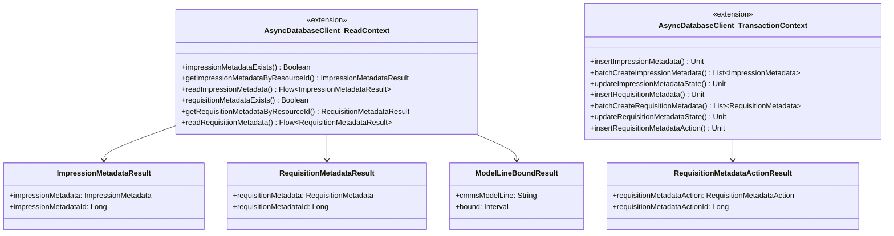

# org.wfanet.measurement.edpaggregator.deploy.gcloud.spanner.db

## Overview
This package provides database access layer for EDP (Event Data Provider) Aggregator using Google Cloud Spanner. It contains data models and extension functions for managing impression metadata and requisition metadata entities, including CRUD operations, batch processing, and state transitions within transactional contexts.

## Components

### ImpressionMetadata.kt

#### Data Structures

**ImpressionMetadataResult**
| Property | Type | Description |
|----------|------|-------------|
| impressionMetadata | `ImpressionMetadata` | The impression metadata protobuf message |
| impressionMetadataId | `Long` | Internal database identifier |

**ModelLineBoundResult**
| Property | Type | Description |
|----------|------|-------------|
| cmmsModelLine | `String` | CMMS model line identifier |
| bound | `Interval` | Time interval bounds for the model line |

#### Extension Functions

| Function | Parameters | Returns | Description |
|----------|------------|---------|-------------|
| impressionMetadataExists | `dataProviderResourceId: String`, `impressionMetadataId: Long` | `Boolean` | Checks whether impression metadata exists by ID |
| getImpressionMetadataByResourceId | `dataProviderResourceId: String`, `impressionMetadataResourceId: String` | `ImpressionMetadataResult` | Retrieves impression metadata by public resource ID |
| getImpressionMetadataByResourceIds | `dataProviderResourceId: String`, `impressionMetadataResourceIds: List<String>` | `Map<String, ImpressionMetadataResult>` | Retrieves multiple impression metadata entities by resource IDs |
| findExistingImpressionMetadataByRequestIds | `dataProviderResourceId: String`, `requestIds: List<String>` | `Map<String, ImpressionMetadataResult>` | Finds existing impression metadata by create request IDs |
| findExistingImpressionMetadataByBlobUris | `dataProviderResourceId: String`, `blobUris: List<String>` | `Map<String, ImpressionMetadataResult>` | Finds existing impression metadata by blob URIs |
| insertImpressionMetadata | `impressionMetadataId: Long`, `impressionMetadata: ImpressionMetadata`, `createRequestId: String` | `Unit` | Buffers insert mutation for impression metadata row |
| batchCreateImpressionMetadata | `requests: List<CreateImpressionMetadataRequest>` | `suspend List<ImpressionMetadata>` | Creates multiple impression metadata in single transaction |
| updateImpressionMetadataState | `dataProviderResourceId: String`, `impressionMetadataId: Long`, `state: State` | `Unit` | Updates impression metadata state and timestamp |
| readImpressionMetadata | `dataProviderResourceId: String`, `filter: Filter`, `limit: Int`, `after: After?` | `Flow<ImpressionMetadataResult>` | Reads impression metadata with filtering and pagination |
| readModelLinesBounds | `dataProviderResourceId: String`, `cmmsModelLines: List<String>` | `suspend List<ModelLineBoundResult>` | Retrieves time bounds for specified model lines |

### RequisitionMetadata.kt

#### Data Structures

**RequisitionMetadataResult**
| Property | Type | Description |
|----------|------|-------------|
| requisitionMetadata | `RequisitionMetadata` | The requisition metadata protobuf message |
| requisitionMetadataId | `Long` | Internal database identifier |

#### Extension Functions

| Function | Parameters | Returns | Description |
|----------|------------|---------|-------------|
| requisitionMetadataExists | `dataProviderResourceId: String`, `requisitionMetadataId: Long` | `Boolean` | Checks whether requisition metadata exists by ID |
| getRequisitionMetadataByResourceId | `dataProviderResourceId: String`, `requisitionMetadataResourceId: String` | `RequisitionMetadataResult` | Retrieves requisition metadata by public resource ID |
| getRequisitionMetadataByCmmsRequisition | `dataProviderResourceId: String`, `cmmsRequisition: String` | `RequisitionMetadataResult` | Retrieves requisition metadata by CMMS requisition identifier |
| getRequisitionMetadataByBlobUris | `dataProviderResourceId: String`, `blobUris: List<String>` | `Map<String, RequisitionMetadataResult>` | Finds requisition metadata by blob URIs |
| getRequisitionMetadataByCmmsRequisitions | `dataProviderResourceId: String`, `cmmsRequisitions: List<String>` | `Map<String, RequisitionMetadataResult>` | Finds requisition metadata by CMMS requisition identifiers |
| getRequisitionMetadataByCreateRequestIds | `dataProviderResourceId: String`, `createRequestIds: List<String>` | `Map<String, RequisitionMetadataResult>` | Finds requisition metadata by create request IDs |
| readRequisitionMetadata | `dataProviderResourceId: String`, `filter: Filter?`, `limit: Int`, `after: After?` | `Flow<RequisitionMetadataResult>` | Reads requisition metadata with filtering and pagination |
| getRequisitionMetadataByCreateRequestId | `dataProviderResourceId: String`, `createRequestId: String` | `RequisitionMetadataResult?` | Retrieves single requisition metadata by create request ID |
| insertRequisitionMetadata | `requisitionMetadataId: Long`, `requisitionMetadataResourceId: String`, `state: State`, `requisitionMetadata: RequisitionMetadata`, `createRequestId: String` | `Unit` | Buffers insert mutation for requisition metadata row |
| updateRequisitionMetadataState | `dataProviderResourceId: String`, `requisitionMetadataId: Long`, `state: State`, `block: WriteBuilder.() -> Unit?` | `Unit` | Updates requisition metadata state with optional mutations |
| fetchLatestCmmsCreateTime | `dataProviderResourceId: String` | `suspend Timestamp` | Retrieves latest CMMS creation timestamp for data provider |
| batchCreateRequisitionMetadata | `requests: List<CreateRequisitionMetadataRequest>` | `suspend List<RequisitionMetadata>` | Creates multiple requisition metadata in single transaction |

### RequisitionMetadataActions.kt

#### Data Structures

**RequisitionMetadataActionResult**
| Property | Type | Description |
|----------|------|-------------|
| requisitionMetadataAction | `RequisitionMetadataAction` | The action protobuf message |
| requisitionMetadataActionId | `Long` | Internal action identifier |

#### Extension Functions

| Function | Parameters | Returns | Description |
|----------|------------|---------|-------------|
| insertRequisitionMetadataAction | `dataProviderResourceId: String`, `requisitionMetadataId: Long`, `actionId: Long`, `previousState: State`, `currentState: State` | `Unit` | Buffers insert for requisition metadata action row |

## Key Functionality

### Batch Operations
Both `batchCreateImpressionMetadata` and `batchCreateRequisitionMetadata` implement idempotent batch creation with automatic deduplication based on create request IDs. Existing entities are returned without duplication errors, while conflicts on blob URIs or CMMS requisitions throw exceptions.

### State Management
State transitions are tracked through timestamped update operations. Requisition metadata additionally logs state changes through action records, creating an audit trail of previous and current states.

### Resource ID Generation
New entities automatically generate resource IDs with prefixes (`imp-` for impressions, `req-` for requisitions) using UUID when not explicitly provided.

### Query Optimization
Read operations use Spanner query tags for observability and include indexed lookups by resource IDs, blob URIs, CMMS identifiers, and create request IDs.

### Pagination Support
List operations support cursor-based pagination using `after` tokens with compound ordering (update time and resource ID for requisitions, resource ID only for impressions).

## Dependencies

- `com.google.cloud.spanner` - Cloud Spanner client for database operations
- `com.google.type` - Protocol buffer type definitions for intervals
- `org.wfanet.measurement.gcloud.spanner` - Custom Spanner utilities and extensions
- `org.wfanet.measurement.common` - Common utilities for ID generation and ETags
- `org.wfanet.measurement.internal.edpaggregator` - Internal protobuf message definitions
- `org.wfanet.measurement.edpaggregator.service.internal` - Exception types for error handling
- `kotlinx.coroutines.flow` - Asynchronous stream processing
- `io.grpc` - gRPC status codes for exception handling
- `java.util.UUID` - UUID generation for resource identifiers

## Usage Example

```kotlin
// Create impression metadata in batch
val createRequests = listOf(
  CreateImpressionMetadataRequest.newBuilder()
    .setRequestId("req-001")
    .setImpressionMetadata(impressionMetadata {
      dataProviderResourceId = "dp-123"
      blobUri = "gs://bucket/impressions/data1.avro"
      blobTypeUrl = "type.googleapis.com/ImpressionData"
      eventGroupReferenceId = "eg-456"
      cmmsModelLine = "model-line-1"
      interval = interval {
        startTime = timestamp { seconds = 1234567890 }
        endTime = timestamp { seconds = 1234571490 }
      }
    })
    .build()
)

val results = transactionContext.batchCreateImpressionMetadata(createRequests)

// Query requisition metadata by state
val requisitions = readContext.readRequisitionMetadata(
  dataProviderResourceId = "dp-123",
  filter = ListRequisitionMetadataRequest.Filter.newBuilder()
    .setState(State.REQUISITION_METADATA_STATE_STORED)
    .build(),
  limit = 50
).toList()

// Update requisition state
transactionContext.updateRequisitionMetadataState(
  dataProviderResourceId = "dp-123",
  requisitionMetadataId = 789L,
  state = State.REQUISITION_METADATA_STATE_PROCESSING
)
```

## Class Diagram


