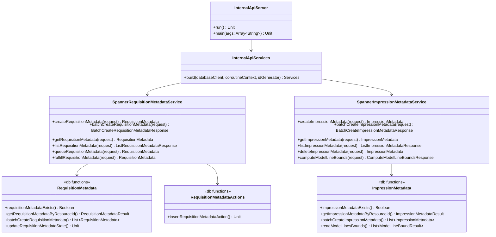

# org.wfanet.measurement.edpaggregator.deploy.gcloud.spanner

## Overview
This package provides Google Cloud Spanner-backed implementation for the EDP Aggregator's internal API services. It includes server deployment components, gRPC service implementations for requisition and impression metadata management, and database access layer operations that interact with Cloud Spanner storage.

## Components

### InternalApiServer
Command-line runnable server that bootstraps the EDP Aggregator's internal API services using Cloud Spanner as the persistence layer.

| Method | Parameters | Returns | Description |
|--------|------------|---------|-------------|
| run | - | `Unit` | Initializes Spanner client and starts gRPC server |
| main | `args: Array<String>` | `Unit` | Entry point for command-line execution |

### InternalApiServices
Factory object that constructs the internal API service implementations with Spanner dependencies.

| Method | Parameters | Returns | Description |
|--------|------------|---------|-------------|
| build | `databaseClient: AsyncDatabaseClient`, `coroutineContext: CoroutineContext`, `idGenerator: IdGenerator` | `Services` | Creates Services containing Spanner-backed implementations |

### SpannerRequisitionMetadataService
gRPC service implementation for managing requisition metadata stored in Cloud Spanner with full lifecycle state transitions.

| Method | Parameters | Returns | Description |
|--------|------------|---------|-------------|
| createRequisitionMetadata | `request: CreateRequisitionMetadataRequest` | `RequisitionMetadata` | Creates new requisition metadata with idempotency support |
| batchCreateRequisitionMetadata | `request: BatchCreateRequisitionMetadataRequest` | `BatchCreateRequisitionMetadataResponse` | Creates multiple requisitions atomically |
| getRequisitionMetadata | `request: GetRequisitionMetadataRequest` | `RequisitionMetadata` | Retrieves requisition by resource ID |
| lookupRequisitionMetadata | `request: LookupRequisitionMetadataRequest` | `RequisitionMetadata` | Finds requisition by CMMS requisition ID |
| listRequisitionMetadata | `request: ListRequisitionMetadataRequest` | `ListRequisitionMetadataResponse` | Lists requisitions with filtering and pagination |
| queueRequisitionMetadata | `request: QueueRequisitionMetadataRequest` | `RequisitionMetadata` | Transitions requisition to QUEUED state |
| startProcessingRequisitionMetadata | `request: StartProcessingRequisitionMetadataRequest` | `RequisitionMetadata` | Transitions requisition to PROCESSING state |
| fulfillRequisitionMetadata | `request: FulfillRequisitionMetadataRequest` | `RequisitionMetadata` | Transitions requisition to FULFILLED state |
| refuseRequisitionMetadata | `request: RefuseRequisitionMetadataRequest` | `RequisitionMetadata` | Transitions requisition to REFUSED state |
| markWithdrawnRequisitionMetadata | `request: MarkWithdrawnRequisitionMetadataRequest` | `RequisitionMetadata` | Transitions requisition to WITHDRAWN state |
| fetchLatestCmmsCreateTime | `request: FetchLatestCmmsCreateTimeRequest` | `Timestamp` | Retrieves latest CMMS creation timestamp |

### SpannerImpressionMetadataService
gRPC service implementation for managing impression metadata with support for batch operations and model line analytics.

| Method | Parameters | Returns | Description |
|--------|------------|---------|-------------|
| createImpressionMetadata | `request: CreateImpressionMetadataRequest` | `ImpressionMetadata` | Creates new impression metadata with validation |
| batchCreateImpressionMetadata | `request: BatchCreateImpressionMetadataRequest` | `BatchCreateImpressionMetadataResponse` | Creates multiple impressions atomically |
| getImpressionMetadata | `request: GetImpressionMetadataRequest` | `ImpressionMetadata` | Retrieves impression by resource ID |
| listImpressionMetadata | `request: ListImpressionMetadataRequest` | `ListImpressionMetadataResponse` | Lists impressions with filtering and pagination |
| deleteImpressionMetadata | `request: DeleteImpressionMetadataRequest` | `ImpressionMetadata` | Soft-deletes impression by updating state |
| batchDeleteImpressionMetadata | `request: BatchDeleteImpressionMetadataRequest` | `BatchDeleteImpressionMetadataResponse` | Soft-deletes multiple impressions atomically |
| computeModelLineBounds | `request: ComputeModelLineBoundsRequest` | `ComputeModelLineBoundsResponse` | Computes time interval bounds for model lines |

## Database Layer (db subpackage)

### RequisitionMetadata
Database access functions for requisition metadata entities in Spanner.

| Function | Parameters | Returns | Description |
|----------|------------|---------|-------------|
| requisitionMetadataExists | `dataProviderResourceId: String`, `requisitionMetadataId: Long` | `Boolean` | Checks requisition existence by ID |
| getRequisitionMetadataByResourceId | `dataProviderResourceId: String`, `requisitionMetadataResourceId: String` | `RequisitionMetadataResult` | Retrieves requisition by public resource ID |
| getRequisitionMetadataByCmmsRequisition | `dataProviderResourceId: String`, `cmmsRequisition: String` | `RequisitionMetadataResult` | Retrieves requisition by CMMS requisition ID |
| getRequisitionMetadataByBlobUris | `dataProviderResourceId: String`, `blobUris: List<String>` | `Map<String, RequisitionMetadataResult>` | Finds requisitions matching blob URIs |
| getRequisitionMetadataByCmmsRequisitions | `dataProviderResourceId: String`, `cmmsRequisitions: List<String>` | `Map<String, RequisitionMetadataResult>` | Finds requisitions matching CMMS requisitions |
| getRequisitionMetadataByCreateRequestIds | `dataProviderResourceId: String`, `createRequestIds: List<String>` | `Map<String, RequisitionMetadataResult>` | Finds requisitions by creation request IDs |
| readRequisitionMetadata | `dataProviderResourceId: String`, `filter: Filter?`, `limit: Int`, `after: After?` | `Flow<RequisitionMetadataResult>` | Streams filtered requisitions with pagination |
| insertRequisitionMetadata | `requisitionMetadataId: Long`, `requisitionMetadataResourceId: String`, `state: State`, `requisitionMetadata: RequisitionMetadata`, `createRequestId: String` | `Unit` | Buffers insert mutation for requisition |
| updateRequisitionMetadataState | `dataProviderResourceId: String`, `requisitionMetadataId: Long`, `state: State`, `block: WriteBuilder.() -> Unit?` | `Unit` | Buffers state update mutation |
| fetchLatestCmmsCreateTime | `dataProviderResourceId: String` | `Timestamp` | Retrieves latest CMMS creation timestamp |
| batchCreateRequisitionMetadata | `requests: List<CreateRequisitionMetadataRequest>` | `List<RequisitionMetadata>` | Creates multiple requisitions with deduplication |

### ImpressionMetadata
Database access functions for impression metadata entities in Spanner.

| Function | Parameters | Returns | Description |
|----------|------------|---------|-------------|
| impressionMetadataExists | `dataProviderResourceId: String`, `impressionMetadataId: Long` | `Boolean` | Checks impression existence by ID |
| getImpressionMetadataByResourceId | `dataProviderResourceId: String`, `impressionMetadataResourceId: String` | `ImpressionMetadataResult` | Retrieves impression by public resource ID |
| getImpressionMetadataByResourceIds | `dataProviderResourceId: String`, `impressionMetadataResourceIds: List<String>` | `Map<String, ImpressionMetadataResult>` | Retrieves multiple impressions by resource IDs |
| findExistingImpressionMetadataByRequestIds | `dataProviderResourceId: String`, `requestIds: List<String>` | `Map<String, ImpressionMetadataResult>` | Finds impressions by creation request IDs |
| findExistingImpressionMetadataByBlobUris | `dataProviderResourceId: String`, `blobUris: List<String>` | `Map<String, ImpressionMetadataResult>` | Finds impressions matching blob URIs |
| insertImpressionMetadata | `impressionMetadataId: Long`, `impressionMetadata: ImpressionMetadata`, `createRequestId: String` | `Unit` | Buffers insert mutation for impression |
| batchCreateImpressionMetadata | `requests: List<CreateImpressionMetadataRequest>` | `List<ImpressionMetadata>` | Creates multiple impressions with deduplication |
| updateImpressionMetadataState | `dataProviderResourceId: String`, `impressionMetadataId: Long`, `state: State` | `Unit` | Buffers state update mutation |
| readImpressionMetadata | `dataProviderResourceId: String`, `filter: Filter`, `limit: Int`, `after: After?` | `Flow<ImpressionMetadataResult>` | Streams filtered impressions with pagination |
| readModelLinesBounds | `dataProviderResourceId: String`, `cmmsModelLines: List<String>` | `List<ModelLineBoundResult>` | Computes time bounds grouped by model line |

### RequisitionMetadataActions
Database access functions for requisition state transition audit logging.

| Function | Parameters | Returns | Description |
|----------|------------|---------|-------------|
| insertRequisitionMetadataAction | `dataProviderResourceId: String`, `requisitionMetadataId: Long`, `actionId: Long`, `previousState: State`, `currentState: State` | `Unit` | Buffers insert for state transition record |

## Data Structures

### RequisitionMetadataResult
| Property | Type | Description |
|----------|------|-------------|
| requisitionMetadata | `RequisitionMetadata` | The requisition metadata proto message |
| requisitionMetadataId | `Long` | Internal Spanner primary key |

### ImpressionMetadataResult
| Property | Type | Description |
|----------|------|-------------|
| impressionMetadata | `ImpressionMetadata` | The impression metadata proto message |
| impressionMetadataId | `Long` | Internal Spanner primary key |

### ModelLineBoundResult
| Property | Type | Description |
|----------|------|-------------|
| cmmsModelLine | `String` | CMMS model line identifier |
| bound | `Interval` | Time interval spanning all impressions for the model line |

### RequisitionMetadataActionResult
| Property | Type | Description |
|----------|------|-------------|
| requisitionMetadataAction | `RequisitionMetadataAction` | State transition audit record |
| requisitionMetadataActionId | `Long` | Internal Spanner primary key |

## Testing Support

### Schemata
Provides access to database schema definition resources for testing.

| Property | Type | Description |
|----------|------|-------------|
| EDP_AGGREGATOR_CHANGELOG_PATH | `Path` | Path to Liquibase changelog YAML file |

## Dependencies
- `org.wfanet.measurement.gcloud.spanner` - Async Spanner database client and utilities
- `org.wfanet.measurement.common` - Common utilities for ID generation, ETags, coroutines
- `org.wfanet.measurement.edpaggregator.service.internal` - Internal service interfaces and exceptions
- `org.wfanet.measurement.internal.edpaggregator` - Protocol buffer message definitions
- `io.grpc` - gRPC framework for service implementation
- `com.google.cloud.spanner` - Google Cloud Spanner client library
- `kotlinx.coroutines` - Kotlin coroutines for asynchronous operations
- `picocli` - Command-line interface framework

## Usage Example
```kotlin
// Initialize the server
val server = InternalApiServer()
server.run()

// Build services programmatically
val services = InternalApiServices.build(
    databaseClient = asyncDatabaseClient,
    coroutineContext = Dispatchers.IO,
    idGenerator = IdGenerator.Default
)

// Use requisition metadata service
val requisitionService = services.requisitionMetadataService
val created = requisitionService.createRequisitionMetadata(
    createRequisitionMetadataRequest {
        requestId = UUID.randomUUID().toString()
        requisitionMetadata = requisitionMetadata {
            dataProviderResourceId = "dp-123"
            cmmsRequisition = "requisitions/456"
            blobUri = "gs://bucket/blob"
            blobTypeUrl = "type.googleapis.com/MyType"
            groupId = "group-1"
            report = "reports/789"
            cmmsCreateTime = Timestamp.getDefaultInstance()
        }
    }
)

// Transition states
val queued = requisitionService.queueRequisitionMetadata(
    queueRequisitionMetadataRequest {
        dataProviderResourceId = created.dataProviderResourceId
        requisitionMetadataResourceId = created.requisitionMetadataResourceId
        etag = created.etag
        workItem = "work-item-abc"
    }
)
```

## Class Diagram

