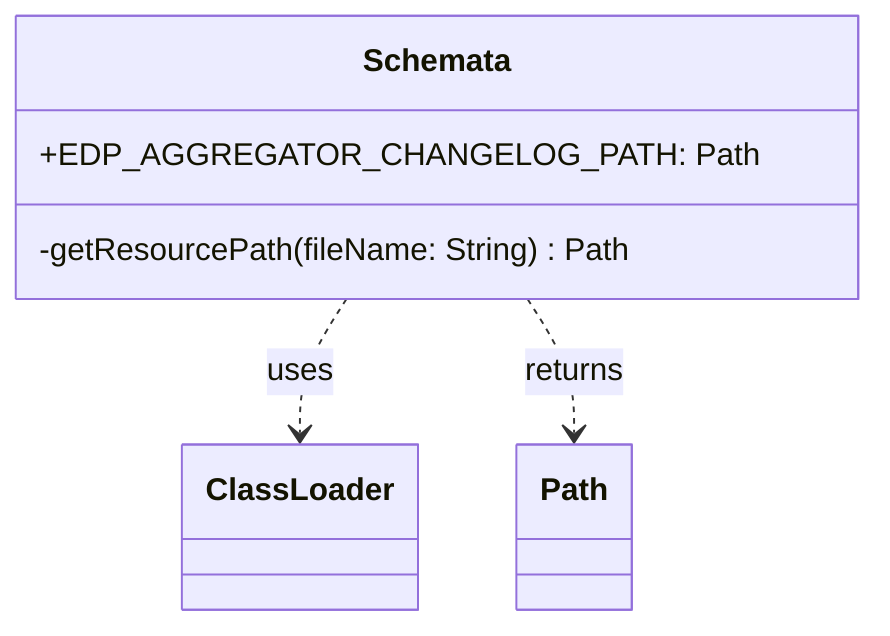

# org.wfanet.measurement.edpaggregator.deploy.gcloud.spanner.testing

## Overview
This package provides testing utilities for the EDP Aggregator's Google Cloud Spanner database schema. It offers resource path resolution for Spanner schema changelog files used in test environments and database initialization.

## Components

### Schemata
Object that provides access to EDP Aggregator Spanner schema resources for testing purposes.

| Method | Parameters | Returns | Description |
|--------|------------|---------|-------------|
| getResourcePath | `fileName: String` | `Path` | Resolves resource file path from JAR or classpath |

| Property | Type | Description |
|----------|------|-------------|
| EDP_AGGREGATOR_CHANGELOG_PATH | `Path` | Path to the changelog.yaml schema file |

## Data Structures

### Constants
| Constant | Type | Value | Description |
|----------|------|-------|-------------|
| RESOURCE_PREFIX | `String` | "edpaggregator/spanner" | Base path for Spanner resources |

## Dependencies
- `java.nio.file.Path` - File system path representation
- `org.wfanet.measurement.common.getJarResourcePath` - Extension function for ClassLoader resource resolution

## Usage Example
```kotlin
import org.wfanet.measurement.edpaggregator.deploy.gcloud.spanner.testing.Schemata

// Access the changelog path for test database initialization
val changelogPath = Schemata.EDP_AGGREGATOR_CHANGELOG_PATH

// Use with Liquibase or other schema migration tools
val database = Database.fromChangelog(changelogPath)
```

## Class Diagram

