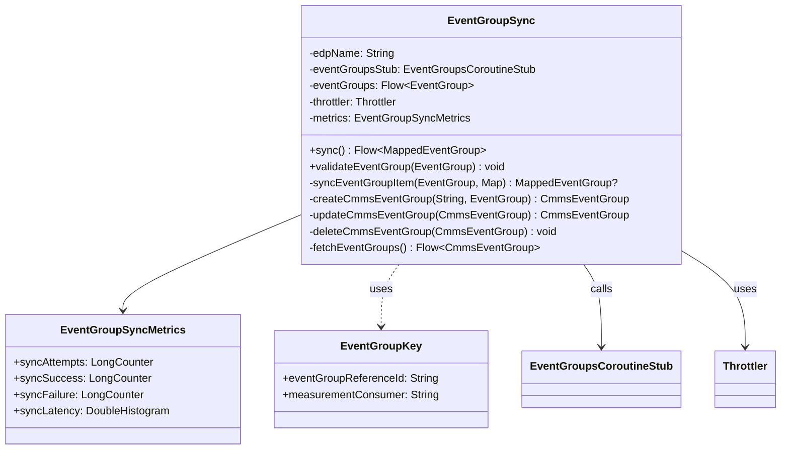

# org.wfanet.measurement.edpaggregator.eventgroups

## Overview
This package provides event group synchronization functionality for the EDP Aggregator, managing bidirectional sync between local event groups and the CMMS (Cross-Media Measurement System) Kingdom API. It handles create, update, and delete operations while tracking metrics and performance telemetry for all synchronization activities.

## Components

### EventGroupSync
Orchestrates event group synchronization with the CMMS Public API, performing create, update, and delete operations based on input flow differences.

| Method | Parameters | Returns | Description |
|--------|------------|---------|-------------|
| sync | - | `Flow<MappedEventGroup>` | Synchronizes event groups with CMMS, returning mapped results |
| validateEventGroup | `eventGroup: EventGroup` | `Unit` | Validates event group fields are properly populated |

**Constructor Parameters:**
| Parameter | Type | Description |
|-----------|------|-------------|
| edpName | `String` | Data provider resource name |
| eventGroupsStub | `EventGroupsCoroutineStub` | gRPC stub for CMMS event groups API |
| eventGroups | `Flow<EventGroup>` | Flow of event groups to synchronize |
| throttler | `Throttler` | Rate limiter for API calls |
| listEventGroupPageSize | `Int` | Page size for listing operations |
| tracer | `Tracer` | OpenTelemetry tracer (defaults to global) |

**Private Methods:**
| Method | Parameters | Returns | Description |
|--------|------------|---------|-------------|
| syncEventGroupItem | `eventGroup: EventGroup`, `syncedEventGroups: Map<EventGroupKey, CmmsEventGroup>` | `MappedEventGroup?` | Synchronizes single event group, returns null on failure |
| updateCmmsEventGroup | `eventGroup: CmmsEventGroup` | `CmmsEventGroup` | Updates existing event group in CMMS |
| deleteCmmsEventGroup | `eventGroup: CmmsEventGroup` | `Unit` | Deletes event group from CMMS |
| createCmmsEventGroup | `edpName: String`, `eventGroup: EventGroup` | `CmmsEventGroup` | Creates new event group in CMMS |
| updateEventGroup | `existingEventGroup: CmmsEventGroup`, `eventGroup: EventGroup` | `CmmsEventGroup` | Creates updated copy for comparison |
| fetchEventGroups | - | `Flow<CmmsEventGroup>` | Fetches all event groups from CMMS with pagination |
| toCmmsMediaType | - | `CmmsMediaType` | Converts MediaType enum to CMMS format |
| metricAttributes | - | `Attributes` | Creates OpenTelemetry attributes with provider name |

### EventGroupSyncMetrics
Provides OpenTelemetry metrics instrumentation for event group synchronization operations.

**Properties:**
| Property | Type | Description |
|----------|------|-------------|
| syncAttempts | `LongCounter` | Counts total event group sync attempts |
| syncSuccess | `LongCounter` | Counts successful event group syncs |
| syncFailure | `LongCounter` | Counts failed event group syncs |
| syncLatency | `DoubleHistogram` | Records sync operation duration in seconds |

**Constructor Parameters:**
| Parameter | Type | Description |
|-----------|------|-------------|
| meter | `Meter` | OpenTelemetry meter for creating metrics |

**Metric Attributes:**
- `data_provider_name`: The data provider performing the sync

## Data Structures

### EventGroupKey
Uniquely identifies an event group by combining reference ID and measurement consumer.

| Property | Type | Description |
|----------|------|-------------|
| eventGroupReferenceId | `String` | Identifier of the EventGroup resource |
| measurementConsumer | `String` | Owner/consumer of the measurement |

## Dependencies
- `org.wfanet.measurement.api.v2alpha` - CMMS Kingdom API protobuf types and gRPC stubs
- `org.wfanet.measurement.edpaggregator.eventgroups.v1alpha` - EDP event group protobuf types
- `org.wfanet.measurement.common.api.grpc` - gRPC utilities for resource listing
- `org.wfanet.measurement.common.throttler` - Rate limiting functionality
- `org.wfanet.measurement.common` - Instrumentation and telemetry
- `org.wfanet.measurement.edpaggregator.telemetry` - Tracing utilities
- `io.opentelemetry.api` - OpenTelemetry metrics and tracing APIs
- `kotlinx.coroutines` - Coroutine and Flow support for async operations

## Usage Example
```kotlin
// Create synchronization instance
val eventGroupSync = EventGroupSync(
  edpName = "dataProviders/123",
  eventGroupsStub = eventGroupsStub,
  eventGroups = localEventGroupsFlow,
  throttler = apiThrottler,
  listEventGroupPageSize = 100
)

// Perform synchronization
val mappedEventGroups: Flow<MappedEventGroup> = eventGroupSync.sync()

// Collect results
mappedEventGroups.collect { mapped ->
  println("Synced: ${mapped.eventGroupReferenceId} -> ${mapped.eventGroupResource}")
}

// Validate event group before sync
EventGroupSync.validateEventGroup(eventGroup)
```

## Synchronization Behavior

The `EventGroupSync.sync()` method performs a three-way merge:

1. **Create**: Event groups in input flow but not in CMMS are created
2. **Update**: Event groups in both locations are updated if content differs
3. **Delete**: Event groups in CMMS but not in input flow are removed

Each operation is tracked with OpenTelemetry metrics including attempt counts, success/failure rates, and latency histograms.

## Class Diagram

