# org.wfanet.measurement.edpaggregator

## Overview

The EDP Aggregator (Event Data Provider Aggregator) package provides infrastructure for event-level measurement in privacy-preserving advertising measurement systems. It orchestrates the collection, validation, processing, and fulfillment of measurement requisitions using encrypted impression data. The package coordinates synchronization with the CMMS (Cross-Media Measurement System) Kingdom, manages impression and requisition metadata, and executes cryptographic measurement protocols including Direct and HonestMajority Shuffle (HMShuffle) approaches.

## Core Components

### EncryptedStorage

Utility object for encrypted storage operations using Google Tink.

| Method | Parameters | Returns | Description |
|--------|------------|---------|-------------|
| generateSerializedEncryptionKey | `kmsClient: KmsClient`, `kekUri: String`, `tinkKeyTemplateType: String`, `associatedData: ByteArray` | `ByteString` | Generates serialized encrypted keyset using KMS client |
| buildEncryptedMesosStorageClient | `storageClient: StorageClient`, `kmsClient: KmsClient`, `kekUri: String`, `encryptedDek: EncryptedDek` | `MesosRecordIoStorageClient` | Builds envelope encryption storage client wrapped by Mesos Record IO |
| writeDek | `storageClient: StorageClient`, `kekUri: String`, `serializedEncryptionKey: ByteString`, `impressionsFileUri: String`, `dekBlobKey: String` | `Unit` (suspend) | Writes data encryption key to storage |

## Requisition Fetching

### RequisitionFetcher

Fetches requisitions from the Kingdom and persists them to storage.

| Method | Parameters | Returns | Description |
|--------|------------|---------|-------------|
| fetchAndStoreRequisitions | None | `Unit` (suspend) | Fetches unfulfilled requisitions and stores them in persistent storage |

**Constructor Parameters:**
- `requisitionsStub: RequisitionsCoroutineStub` - gRPC stub for Kingdom API
- `storageClient: StorageClient` - Client for blob storage
- `dataProviderName: String` - EDP resource name
- `storagePathPrefix: String` - Blob key prefix for storage
- `requisitionGrouper: RequisitionGrouper` - Grouping strategy implementation
- `responsePageSize: Int?` - Optional page size for API requests
- `metrics: RequisitionFetcherMetrics` - Telemetry metrics

### RequisitionGrouper

Abstract base class for grouping and validating requisitions.

| Method | Parameters | Returns | Description |
|--------|------------|---------|-------------|
| groupRequisitions | `requisitions: List<Requisition>` | `List<GroupedRequisitions>` (suspend) | Groups requisitions into execution-ready structures |

**Abstract Methods:**
| Method | Parameters | Returns | Description |
|--------|------------|---------|-------------|
| createGroupedRequisitions | `requisitions: List<Requisition>` | `List<GroupedRequisitions>` (suspend) | Implements specific grouping strategy |

**Protected Methods:**
| Method | Parameters | Returns | Description |
|--------|------------|---------|-------------|
| getEventGroupMapEntries | `requisitionSpec: RequisitionSpec` | `Map<String, EventGroupDetails>` (suspend) | Builds event group details map from requisition spec |
| refuseRequisitionToCmms | `requisition: Requisition`, `refusal: Requisition.Refusal` | `Unit` (suspend) | Sends refusal notification to Kingdom |

## Results Fulfillment

### ResultsFulfiller

Orchestrates event-level measurement requisition fulfillment.

| Method | Parameters | Returns | Description |
|--------|------------|---------|-------------|
| fulfillRequisitions | `parallelism: Int` | `Unit` (suspend) | Processes and fulfills all requisitions in the group |

**Constructor Parameters:**
- `dataProvider: String` - Data provider resource name
- `requisitionMetadataStub: RequisitionMetadataServiceCoroutineStub` - Metadata service stub
- `requisitionsStub: RequisitionsCoroutineStub` - Kingdom requisitions stub
- `privateEncryptionKey: PrivateKeyHandle` - Key for decrypting requisition specs
- `groupedRequisitions: GroupedRequisitions` - Requisitions to fulfill
- `modelLineInfoMap: Map<String, ModelLineInfo>` - Model line configurations
- `pipelineConfiguration: PipelineConfiguration` - Event processing config
- `impressionDataSourceProvider: ImpressionDataSourceProvider` - Impression data resolver
- `kmsClient: KmsClient?` - Optional KMS client for encrypted storage
- `impressionsStorageConfig: StorageConfig` - Storage configuration
- `fulfillerSelector: FulfillerSelector` - Protocol implementation selector
- `responsePageSize: Int?` - Optional page size
- `metrics: ResultsFulfillerMetrics` - Telemetry metrics

### EventProcessingOrchestrator

Coordinates storage-backed event processing for requisition fulfillment.

| Method | Parameters | Returns | Description |
|--------|------------|---------|-------------|
| run | `eventSource: EventSource<T>`, `vidIndexMap: VidIndexMap`, `populationSpec: PopulationSpec`, `requisitions: List<Requisition>`, `eventGroupReferenceIdMap: Map<String, String>`, `config: PipelineConfiguration`, `eventDescriptor: Descriptor` | `Map<String, StripedByteFrequencyVector>` (suspend) | Runs event processing pipeline and returns frequency vectors |
| createSinksFromFilterSpecs | `filterSpecs: Collection<FilterSpec>`, `vidIndexMap: VidIndexMap`, `populationSpec: PopulationSpec`, `eventDescriptor: Descriptor` | `Map<FilterSpec, FrequencyVectorSink<T>>` | Creates one sink per unique filter specification |

**Type Parameters:**
- `T : Message` - Event message type

### EventProcessingPipeline

Interface for event processing pipeline implementations.

| Method | Parameters | Returns | Description |
|--------|------------|---------|-------------|
| processEventBatches | `eventSource: EventSource<T>`, `sinks: List<FrequencyVectorSink<T>>` | `Unit` (suspend) | Processes event batches through filter sinks |

### EventSource

Interface abstracting event batch sources.

| Method | Parameters | Returns | Description |
|--------|------------|---------|-------------|
| generateEventBatches | None | `Flow<EventBatch<T>>` | Generates flow of event batches |

### MeasurementFulfiller

Interface for protocol-specific requisition fulfillment.

| Method | Parameters | Returns | Description |
|--------|------------|---------|-------------|
| fulfillRequisition | None | `Unit` (suspend) | Fulfills a single requisition using protocol-specific logic |

## Synchronization Components

### EventGroupSync

Synchronizes event groups with the CMMS Kingdom.

| Method | Parameters | Returns | Description |
|--------|------------|---------|-------------|
| sync | None | `Flow<MappedEventGroup>` (suspend) | Creates, updates, and deletes event groups to match local state |

**Constructor Parameters:**
- `edpName: String` - Data provider name
- `eventGroupsStub: EventGroupsCoroutineStub` - Kingdom event groups stub
- `eventGroups: Flow<EventGroup>` - Local event groups to sync
- `throttler: Throttler` - Request throttling
- `listEventGroupPageSize: Int` - Page size for listing
- `tracer: Tracer` - OpenTelemetry tracer

### DataAvailabilitySync

Synchronizes impression data availability between storage and Kingdom.

| Method | Parameters | Returns | Description |
|--------|------------|---------|-------------|
| sync | `doneBlobPath: String` | `Unit` (suspend) | Processes impression metadata and updates Kingdom availability intervals |

**Constructor Parameters:**
- `edpImpressionPath: String` - EDP impression path prefix
- `storageClient: StorageClient` - Cloud storage client
- `dataProvidersStub: DataProvidersCoroutineStub` - Kingdom data providers stub
- `impressionMetadataServiceStub: ImpressionMetadataServiceCoroutineStub` - Metadata service stub
- `dataProviderName: String` - Data provider resource name
- `throttler: Throttler` - Request throttling
- `impressionMetadataBatchSize: Int` - Batch size for metadata creation
- `metrics: DataAvailabilitySyncMetrics` - Telemetry metrics

## Metadata Services

### ImpressionMetadataService

gRPC service for managing impression metadata records.

| Method | Parameters | Returns | Description |
|--------|------------|---------|-------------|
| getImpressionMetadata | `request: GetImpressionMetadataRequest` | `ImpressionMetadata` (suspend) | Retrieves single impression metadata by name |
| createImpressionMetadata | `request: CreateImpressionMetadataRequest` | `ImpressionMetadata` (suspend) | Creates new impression metadata record |
| batchCreateImpressionMetadata | `request: BatchCreateImpressionMetadataRequest` | `BatchCreateImpressionMetadataResponse` (suspend) | Creates multiple impression metadata records |
| deleteImpressionMetadata | `request: DeleteImpressionMetadataRequest` | `ImpressionMetadata` (suspend) | Deletes impression metadata record |
| batchDeleteImpressionMetadata | `request: BatchDeleteImpressionMetadataRequest` | `BatchDeleteImpressionMetadataResponse` (suspend) | Deletes multiple impression metadata records |
| listImpressionMetadata | `request: ListImpressionMetadataRequest` | `ListImpressionMetadataResponse` (suspend) | Lists impression metadata with filtering and pagination |
| computeModelLineBounds | `request: ComputeModelLineBoundsRequest` | `ComputeModelLineBoundsResponse` (suspend) | Computes availability intervals per model line |

**Constructor Parameters:**
- `internalImpressionMetadataStub: InternalImpressionMetadataServiceCoroutineStub` - Internal service stub
- `coroutineContext: CoroutineContext` - Coroutine execution context

### RequisitionMetadataService

gRPC service for managing requisition metadata lifecycle.

| Method | Parameters | Returns | Description |
|--------|------------|---------|-------------|
| createRequisitionMetadata | `request: CreateRequisitionMetadataRequest` | `RequisitionMetadata` (suspend) | Creates new requisition metadata record |
| batchCreateRequisitionMetadata | `request: BatchCreateRequisitionMetadataRequest` | `BatchCreateRequisitionMetadataResponse` (suspend) | Creates multiple requisition metadata records |
| getRequisitionMetadata | `request: GetRequisitionMetadataRequest` | `RequisitionMetadata` (suspend) | Retrieves requisition metadata by resource name |
| listRequisitionMetadata | `request: ListRequisitionMetadataRequest` | `ListRequisitionMetadataResponse` (suspend) | Lists requisition metadata with filtering |
| lookupRequisitionMetadata | `request: LookupRequisitionMetadataRequest` | `RequisitionMetadata` (suspend) | Looks up requisition metadata by CMMS requisition name |
| fetchLatestCmmsCreateTime | `request: FetchLatestCmmsCreateTimeRequest` | `Timestamp` (suspend) | Fetches latest CMMS create timestamp |
| queueRequisitionMetadata | `request: QueueRequisitionMetadataRequest` | `RequisitionMetadata` (suspend) | Transitions requisition metadata to QUEUED state |
| startProcessingRequisitionMetadata | `request: StartProcessingRequisitionMetadataRequest` | `RequisitionMetadata` (suspend) | Transitions requisition metadata to PROCESSING state |
| fulfillRequisitionMetadata | `request: FulfillRequisitionMetadataRequest` | `RequisitionMetadata` (suspend) | Transitions requisition metadata to FULFILLED state |
| refuseRequisitionMetadata | `request: RefuseRequisitionMetadataRequest` | `RequisitionMetadata` (suspend) | Transitions requisition metadata to REFUSED state |
| markWithdrawnRequisitionMetadata | `request: MarkWithdrawnRequisitionMetadataRequest` | `RequisitionMetadata` (suspend) | Transitions requisition metadata to WITHDRAWN state |

**Constructor Parameters:**
- `internalClient: InternalRequisitionMetadataServiceCoroutineStub` - Internal service stub
- `coroutineContext: CoroutineContext` - Coroutine execution context

## Data Structures

### StorageConfig

Configuration for storage clients.

| Property | Type | Description |
|----------|------|-------------|
| rootDirectory | `File?` | Root directory for file-based storage |
| projectId | `String?` | GCP project ID for cloud storage |

### FilterSpec

Immutable specification for event filtering and deduplication.

| Property | Type | Description |
|----------|------|-------------|
| celExpression | `String` | CEL expression for filtering events |
| collectionInterval | `Interval` | Time interval for event collection |
| eventGroupReferenceIds | `List<String>` | Sorted reference IDs of event groups |

### ModelLineInfo

Information required to fulfill requisitions for a specific model line.

| Property | Type | Description |
|----------|------|-------------|
| populationSpec | `PopulationSpec` | Population specification for the model line |
| eventDescriptor | `Descriptor` | Protobuf descriptor for event messages |
| vidIndexMap | `VidIndexMap` | VID to frequency vector index mapping |

### StripedByteFrequencyVector

Thread-safe frequency vector using striped byte arrays.

| Method | Parameters | Returns | Description |
|--------|------------|---------|-------------|
| increment | `index: Int` | `Unit` | Increments frequency count at index |
| getByteArray | None | `ByteArray` | Returns cloned byte array |
| getTotalUncappedImpressions | None | `Long` | Returns total uncapped impression count |
| merge | `other: StripedByteFrequencyVector` | `StripedByteFrequencyVector` | Merges another frequency vector into this one |

| Property | Type | Description |
|----------|------|-------------|
| size | `Int` | Number of entries in the vector |
| stripeCount | `Int` | Number of lock stripes (default 1024) |

### EventGroupKey

Unique identifier for event groups across measurement consumers.

| Property | Type | Description |
|----------|------|-------------|
| eventGroupReferenceId | `String` | Event group reference identifier |
| measurementConsumer | `String` | Measurement consumer owner |

### FilterSpecIndex

Index for requisition-to-filter mappings enabling deduplication.

| Property | Type | Description |
|----------|------|-------------|
| filterSpecToRequisitionNames | `Map<FilterSpec, List<String>>` | Maps filter specs to requisition names |
| requisitionNameToFilterSpec | `Map<String, FilterSpec>` | Maps requisition names to filter specs |

**Companion Methods:**
| Method | Parameters | Returns | Description |
|--------|------------|---------|-------------|
| fromRequisitions | `requisitions: List<Requisition>`, `eventGroupReferenceIdMap: Map<String, String>`, `privateEncryptionKey: PrivateKeyHandle` | `FilterSpecIndex` | Builds index from requisitions with canonicalized filter specs |

## Dependencies

- `org.wfanet.measurement.api.v2alpha` - CMMS Kingdom API client definitions
- `org.wfanet.measurement.storage` - Storage abstraction layer
- `org.wfanet.measurement.common.crypto` - Cryptographic primitives and key handling
- `com.google.crypto.tink` - Google Tink cryptography library
- `org.wfanet.measurement.consent.client.dataprovider` - Consent and encryption utilities
- `org.wfanet.measurement.eventdataprovider.requisition.v2alpha.common` - VID indexing utilities
- `io.grpc` - gRPC framework for service communication
- `io.opentelemetry.api` - OpenTelemetry observability
- `kotlinx.coroutines` - Kotlin coroutines for async/concurrent operations
- `com.google.protobuf` - Protocol Buffers message serialization

## Key Workflows

### Requisition Fetching Workflow

1. `RequisitionFetcher` lists unfulfilled requisitions from Kingdom
2. `RequisitionGrouper` validates and groups requisitions by strategy (e.g., report ID)
3. Invalid requisitions are refused to Kingdom
4. Valid grouped requisitions are serialized and stored in Cloud Storage
5. Metrics and telemetry events are recorded

### Results Fulfillment Workflow

1. `ResultsFulfiller` loads grouped requisitions from storage
2. `EventProcessingOrchestrator` deduplicates filter specifications across requisitions
3. `EventSource` streams encrypted impression data from storage
4. `EventProcessingPipeline` processes event batches through `FrequencyVectorSink` instances
5. Each sink maintains a `StripedByteFrequencyVector` counting matching events
6. `FulfillerSelector` chooses protocol implementation (Direct or HMShuffle)
7. `MeasurementFulfiller` submits computed results to Kingdom
8. `RequisitionMetadataService` updates metadata states through lifecycle transitions

### Data Availability Sync Workflow

1. Impression upload completes with a "done" blob signal
2. `DataAvailabilitySync` crawls folder for metadata files (`.binpb` or `.json`)
3. Metadata is parsed and validated
4. `ImpressionMetadataService` persists metadata records in batches
5. Model line availability intervals are computed from metadata
6. Kingdom data provider availability is updated via `replaceDataAvailabilityIntervals`

### Event Group Sync Workflow

1. `EventGroupSync` fetches existing event groups from Kingdom
2. Local event groups are compared with Kingdom state
3. Missing event groups are created in Kingdom
4. Changed event groups are updated in Kingdom
5. Orphaned event groups are deleted from Kingdom
6. `MappedEventGroup` results are emitted for successfully synced groups

## Usage Example

```kotlin
// Configure storage and cryptography
val storageClient = /* initialize storage client */
val kmsClient = /* initialize KMS client */
val kekUri = "gcp-kms://projects/my-project/locations/us/keyRings/my-ring/cryptoKeys/my-key"

// Generate encryption key
val encryptedKey = EncryptedStorage.generateSerializedEncryptionKey(
    kmsClient = kmsClient,
    kekUri = kekUri,
    tinkKeyTemplateType = "AES128_GCM"
)

// Build encrypted storage client
val encryptedStorage = EncryptedStorage.buildEncryptedMesosStorageClient(
    storageClient = storageClient,
    kmsClient = kmsClient,
    kekUri = kekUri,
    encryptedDek = encryptedDek
)

// Set up requisition fetcher
val requisitionFetcher = RequisitionFetcher(
    requisitionsStub = requisitionsStub,
    storageClient = storageClient,
    dataProviderName = "dataProviders/my-edp",
    storagePathPrefix = "requisitions",
    requisitionGrouper = grouper,
    metrics = metrics
)

// Fetch and store requisitions
requisitionFetcher.fetchAndStoreRequisitions()

// Configure results fulfiller
val resultsFulfiller = ResultsFulfiller(
    dataProvider = "dataProviders/my-edp",
    requisitionMetadataStub = metadataStub,
    requisitionsStub = requisitionsStub,
    privateEncryptionKey = privateKey,
    groupedRequisitions = groupedReqs,
    modelLineInfoMap = modelLineInfoMap,
    pipelineConfiguration = pipelineConfig,
    impressionDataSourceProvider = dataSourceProvider,
    kmsClient = kmsClient,
    impressionsStorageConfig = storageConfig,
    fulfillerSelector = fulfillerSelector,
    metrics = metrics
)

// Fulfill requisitions with parallelism
resultsFulfiller.fulfillRequisitions(parallelism = 8)
```

## Class Diagram

```mermaid
classDiagram
    class RequisitionFetcher {
        +fetchAndStoreRequisitions() Unit
    }
    class RequisitionGrouper {
        <<abstract>>
        +groupRequisitions(requisitions) List~GroupedRequisitions~
        #createGroupedRequisitions(requisitions)* List~GroupedRequisitions~
        #refuseRequisitionToCmms(requisition, refusal) Unit
    }
    class ResultsFulfiller {
        +fulfillRequisitions(parallelism) Unit
    }
    class EventProcessingOrchestrator {
        +run(eventSource, vidIndexMap, populationSpec, requisitions, eventGroupReferenceIdMap, config, eventDescriptor) Map~String, StripedByteFrequencyVector~
        +createSinksFromFilterSpecs(filterSpecs, vidIndexMap, populationSpec, eventDescriptor) Map~FilterSpec, FrequencyVectorSink~
    }
    class EventProcessingPipeline {
        <<interface>>
        +processEventBatches(eventSource, sinks) Unit
    }
    class EventSource {
        <<interface>>
        +generateEventBatches() Flow~EventBatch~
    }
    class MeasurementFulfiller {
        <<interface>>
        +fulfillRequisition() Unit
    }
    class EventGroupSync {
        +sync() Flow~MappedEventGroup~
    }
    class DataAvailabilitySync {
        +sync(doneBlobPath) Unit
    }
    class ImpressionMetadataService {
        +createImpressionMetadata(request) ImpressionMetadata
        +batchCreateImpressionMetadata(request) BatchCreateImpressionMetadataResponse
        +listImpressionMetadata(request) ListImpressionMetadataResponse
        +computeModelLineBounds(request) ComputeModelLineBoundsResponse
    }
    class RequisitionMetadataService {
        +createRequisitionMetadata(request) RequisitionMetadata
        +listRequisitionMetadata(request) ListRequisitionMetadataResponse
        +queueRequisitionMetadata(request) RequisitionMetadata
        +startProcessingRequisitionMetadata(request) RequisitionMetadata
        +fulfillRequisitionMetadata(request) RequisitionMetadata
    }
    class StripedByteFrequencyVector {
        +increment(index) Unit
        +getByteArray() ByteArray
        +getTotalUncappedImpressions() Long
        +merge(other) StripedByteFrequencyVector
    }
    class FilterSpec {
        +celExpression String
        +collectionInterval Interval
        +eventGroupReferenceIds List~String~
    }
    class ModelLineInfo {
        +populationSpec PopulationSpec
        +eventDescriptor Descriptor
        +vidIndexMap VidIndexMap
    }
    class StorageConfig {
        +rootDirectory File?
        +projectId String?
    }

    RequisitionFetcher --> RequisitionGrouper
    ResultsFulfiller --> EventProcessingOrchestrator
    ResultsFulfiller --> MeasurementFulfiller
    ResultsFulfiller --> RequisitionMetadataService
    EventProcessingOrchestrator --> EventProcessingPipeline
    EventProcessingOrchestrator --> EventSource
    EventProcessingOrchestrator --> StripedByteFrequencyVector
    EventProcessingOrchestrator --> FilterSpec
    ResultsFulfiller --> ModelLineInfo
    DataAvailabilitySync --> ImpressionMetadataService
```


