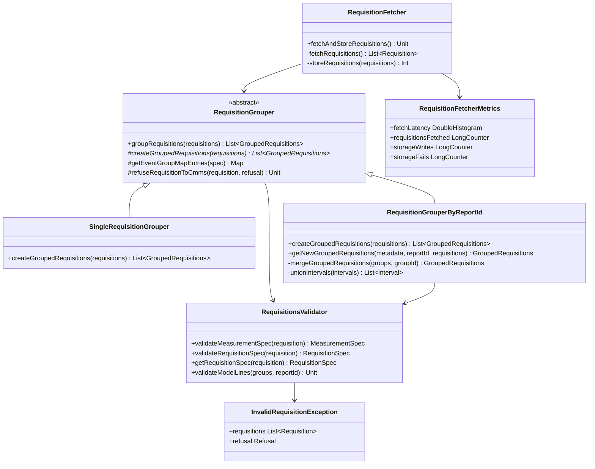

# org.wfanet.measurement.edpaggregator.requisitionfetcher

## Overview
This package provides components for fetching, validating, grouping, and persisting requisitions from the Kingdom to persistent storage. It handles the complete lifecycle of requisition management including validation, grouping strategies, metadata tracking, and telemetry.

## Components

### RequisitionFetcher
Orchestrates the complete workflow of fetching unfulfilled requisitions from the Kingdom and persisting them to Google Cloud Storage.

| Method | Parameters | Returns | Description |
|--------|------------|---------|-------------|
| fetchAndStoreRequisitions | - | `Unit` (suspend) | Fetches unfulfilled requisitions and stores grouped requisitions to storage |
| fetchRequisitions | - | `List<Requisition>` (private suspend) | Retrieves unfulfilled requisitions from the Kingdom |
| storeRequisitions | `requisitions: List<Requisition>` | `Int` (private suspend) | Groups requisitions and persists them to storage |
| storeGroupedRequisition | `groupedRequisition: GroupedRequisitions` | `Unit` (private suspend) | Stores a single grouped requisition blob |
| extractReportId | `groupedRequisitions: GroupedRequisitions` | `String?` (private) | Extracts report_id from grouped requisitions |

**Constructor Parameters:**
- `requisitionsStub: RequisitionsCoroutineStub` - gRPC client for Kingdom requisition operations
- `storageClient: StorageClient` - Client for blob storage operations
- `dataProviderName: String` - Resource name of the data provider
- `storagePathPrefix: String` - Blob key prefix for storage
- `requisitionGrouper: RequisitionGrouper` - Strategy for grouping requisitions
- `responsePageSize: Int?` - Optional page size for listing operations
- `metrics: RequisitionFetcherMetrics` - OpenTelemetry metrics instance

### RequisitionGrouper
Abstract base class defining the core workflow for transforming raw requisitions into grouped forms ready for execution.

| Method | Parameters | Returns | Description |
|--------|------------|---------|-------------|
| groupRequisitions | `requisitions: List<Requisition>` | `List<GroupedRequisitions>` (suspend) | Validates and groups requisitions, refusing invalid ones |
| createGroupedRequisitions | `requisitions: List<Requisition>` | `List<GroupedRequisitions>` (abstract suspend) | Combines validated requisitions using subclass-specific strategy |
| getEventGroupMapEntries | `requisitionSpec: RequisitionSpec` | `Map<String, EventGroupDetails>` (protected suspend) | Builds event group details with collection intervals |
| getEventGroup | `name: String` | `CmmsEventGroup` (private suspend) | Retrieves event group metadata with caching |
| refuseRequisitionToCmms | `requisition: Requisition, refusal: Refusal` | `Unit` (protected suspend) | Sends refusal to Kingdom for invalid requisitions |

**Constructor Parameters:**
- `requisitionValidator: RequisitionsValidator` - Validates requisitions and specs
- `requisitionsClient: RequisitionsCoroutineStub` - gRPC client for requisition updates
- `eventGroupsClient: EventGroupsCoroutineStub` - gRPC client for event group metadata
- `throttler: Throttler` - Controls concurrency for gRPC calls

### SingleRequisitionGrouper
Naive grouping strategy that creates one group per requisition without combining them.

| Method | Parameters | Returns | Description |
|--------|------------|---------|-------------|
| createGroupedRequisitions | `requisitions: List<Requisition>` | `List<GroupedRequisitions>` (suspend) | Creates individual groups for each valid requisition |

**Note:** Not recommended for production use cases.

### RequisitionGrouperByReportId
Production-ready grouping strategy that aggregates requisitions by Report ID with metadata persistence and recovery capabilities.

| Method | Parameters | Returns | Description |
|--------|------------|---------|-------------|
| createGroupedRequisitions | `requisitions: List<Requisition>` | `List<GroupedRequisitions>` (suspend) | Groups requisitions by report ID with metadata tracking |
| getNewGroupedRequisitions | `groupIdToRequisitionMetadata: Map, reportId: String, requisitionsByReportId: List<Requisition>` | `GroupedRequisitions?` (suspend) | Creates new groups for unregistered requisitions |
| recoverUnpersistedGroupedRequisitions | `groupIdToRequisitionMetadata: Map, requisitions: List<Requisition>` | `List<GroupedRequisitions>` (private suspend) | Reconstructs missing groups from metadata |
| mergeGroupedRequisitions | `groupedRequisitions: List<GroupedRequisitions>, groupId: String` | `GroupedRequisitions` (private) | Merges requisitions belonging to same group |
| unionIntervals | `intervals: List<Interval>` | `List<Interval>` (private) | Merges overlapping collection intervals |
| listRequisitionMetadataByReportId | `reportName: String` | `List<RequisitionMetadata>` (private suspend) | Fetches metadata for a report |
| createRequisitionMetadata | `requisition: Requisition, requisitionGroupId: String` | `RequisitionMetadata` (private suspend) | Persists metadata entry for requisition |
| refuseRequisitionMetadata | `requisitionMetadata: RequisitionMetadata, message: String` | `Unit` (private suspend) | Marks metadata as refused |

**Constructor Parameters:**
- `requisitionValidator: RequisitionsValidator` - Validates requisitions
- `dataProviderName: String` - Data provider resource name
- `blobUriPrefix: String` - URI prefix for blob storage
- `requisitionMetadataStub: RequisitionMetadataServiceCoroutineStub` - Metadata service client
- `storageClient: StorageClient` - Blob storage client
- `responsePageSize: Int` - Page size for metadata listing
- `storagePathPrefix: String` - Storage path prefix
- `throttler: Throttler` - API call throttler
- `eventGroupsClient: EventGroupsCoroutineStub` - Event group service client
- `requisitionsClient: RequisitionsCoroutineStub` - Requisition service client

### RequisitionsValidator
Validates requisitions ensuring they are well-formed and ready for processing.

| Method | Parameters | Returns | Description |
|--------|------------|---------|-------------|
| validateMeasurementSpec | `requisition: Requisition` | `MeasurementSpec` | Validates and unpacks MeasurementSpec, checking for report ID |
| getRequisitionSpec | `requisition: Requisition` | `RequisitionSpec` | Decrypts and unpacks RequisitionSpec |
| validateRequisitionSpec | `requisition: Requisition` | `RequisitionSpec` | Validates RequisitionSpec decryption and parsing |
| validateModelLines | `groupedRequisitions: List<GroupedRequisitions>, reportId: String` | `Unit` | Ensures all requisitions have consistent model lines |

**Constructor Parameters:**
- `privateEncryptionKey: PrivateKeyHandle` - Data provider's private decryption key

### RequisitionFetcherMetrics
OpenTelemetry metrics for tracking requisition fetching operations.

**Metrics:**
- `fetchLatency: DoubleHistogram` - Latency from fetch start to storage completion (seconds)
- `requisitionsFetched: LongCounter` - Number of requisitions fetched from Kingdom
- `storageWrites: LongCounter` - Number of grouped requisitions written to storage
- `storageFails: LongCounter` - Number of failed storage writes

## Data Structures

### InvalidRequisitionException
| Property | Type | Description |
|----------|------|-------------|
| requisitions | `List<Requisition>` | Requisitions that failed validation |
| refusal | `Refusal` | Reason and message for refusal |

## Dependencies
- `org.wfanet.measurement.api.v2alpha` - Kingdom API proto definitions for Requisition, MeasurementSpec, RequisitionSpec
- `org.wfanet.measurement.common.crypto` - Cryptographic operations for decryption and signing
- `org.wfanet.measurement.consent.client.dataprovider` - Requisition spec decryption utilities
- `org.wfanet.measurement.storage` - Storage client abstraction for blob operations
- `org.wfanet.measurement.common.throttler` - Throttling for gRPC request concurrency control
- `org.wfanet.measurement.edpaggregator.v1alpha` - Aggregator-specific proto definitions for GroupedRequisitions and RequisitionMetadata
- `io.opentelemetry.api` - OpenTelemetry tracing and metrics instrumentation
- `com.google.protobuf` - Protocol buffer serialization and Any type handling
- `kotlinx.coroutines.flow` - Asynchronous data streaming for paginated results

## Usage Example
```kotlin
// Initialize components
val requisitionValidator = RequisitionsValidator(privateEncryptionKey)
val requisitionGrouper = RequisitionGrouperByReportId(
    requisitionValidator = requisitionValidator,
    dataProviderName = "dataProviders/123",
    blobUriPrefix = "gs://bucket/requisitions",
    requisitionMetadataStub = metadataStub,
    storageClient = storageClient,
    responsePageSize = 100,
    storagePathPrefix = "grouped",
    throttler = throttler,
    eventGroupsClient = eventGroupsStub,
    requisitionsClient = requisitionsStub
)

val fetcher = RequisitionFetcher(
    requisitionsStub = requisitionsStub,
    storageClient = storageClient,
    dataProviderName = "dataProviders/123",
    storagePathPrefix = "grouped",
    requisitionGrouper = requisitionGrouper,
    metrics = RequisitionFetcherMetrics.Default
)

// Fetch and store requisitions
fetcher.fetchAndStoreRequisitions()
```

## Class Diagram

