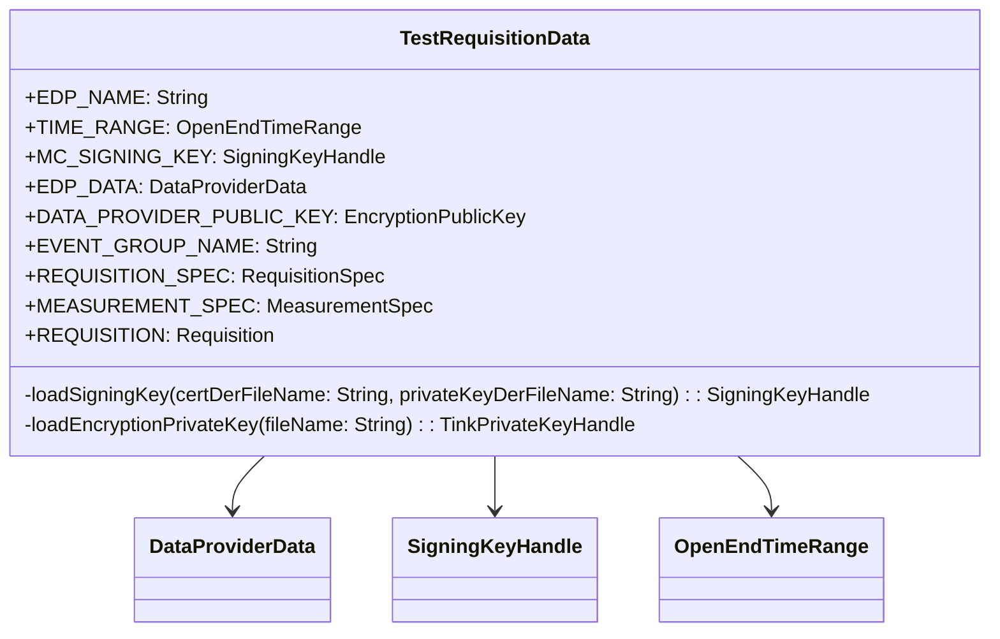

# org.wfanet.measurement.edpaggregator.requisitionfetcher.testing

## Overview
This package provides test fixtures and data builders for testing the EDP (Event Data Provider) aggregator requisition fetcher functionality. It contains pre-configured test data including cryptographic keys, certificates, requisition specifications, and measurement configurations used across various testing scenarios.

## Components

### TestRequisitionData
Singleton object providing comprehensive test data for requisition processing tests.

| Property | Type | Description |
|----------|------|-------------|
| EDP_NAME | `String` | Constant name identifier for test data provider |
| TIME_RANGE | `OpenEndTimeRange` | Date range spanning two days for event collection |
| MC_SIGNING_KEY | `SigningKeyHandle` | Measurement consumer's signing key for spec signatures |
| EDP_DATA | `DataProviderData` | Complete data provider configuration with keys and certificates |
| DATA_PROVIDER_PUBLIC_KEY | `EncryptionPublicKey` | EDP's public encryption key |
| EVENT_GROUP_NAME | `String` | Constant name for test event group |
| REQUISITION_SPEC | `RequisitionSpec` | Specification for requisition with event filters and collection interval |
| MEASUREMENT_SPEC | `MeasurementSpec` | Reach and frequency measurement specification with differential privacy parameters |
| REQUISITION | `Requisition` | Complete unfulfilled requisition with encrypted specs and certificates |

## Data Structures

### Cryptographic Components
| Component | Purpose |
|-----------|---------|
| MC_SIGNING_KEY | Signs measurement and requisition specifications for the measurement consumer |
| EDP_SIGNING_KEY | Data provider's certificate signing key |
| EDP_RESULT_SIGNING_KEY | Signs computation results returned by the data provider |
| Encryption Keys | Public/private key pairs for encrypting requisition specifications |

### Measurement Configuration
| Property | Value | Purpose |
|----------|-------|---------|
| OUTPUT_DP_PARAMS | epsilon=1.0, delta=1E-12 | Differential privacy parameters for reach and frequency |
| maximumFrequency | 10 | Maximum frequency cap for measurement |
| vidSamplingInterval | start=0.0, width=1.0 | Full sampling range for virtual IDs |

### Event Filtering
The REQUISITION_SPEC includes a CEL filter expression targeting:
- Age group: 18-34 years
- Gender: Female

## Dependencies
- `org.wfanet.measurement.api.v2alpha` - Requisition and measurement proto definitions
- `org.wfanet.measurement.common.crypto` - Cryptographic operations and key handling
- `org.wfanet.measurement.common.crypto.tink` - Tink-based encryption key management
- `org.wfanet.measurement.consent.client.measurementconsumer` - Encryption and signing utilities for specs
- `org.wfanet.measurement.dataprovider` - Data provider configuration structures
- `com.google.protobuf` - Protocol buffer utilities
- `java.nio.file` - File system access for loading secret files

## Usage Example
```kotlin
import org.wfanet.measurement.edpaggregator.requisitionfetcher.testing.TestRequisitionData

// Use pre-built requisition in tests
val testRequisition = TestRequisitionData.REQUISITION

// Access EDP configuration
val edpData = TestRequisitionData.EDP_DATA
val edpName = TestRequisitionData.EDP_NAME

// Use measurement specification
val measurementSpec = TestRequisitionData.MEASUREMENT_SPEC

// Access time range for event collection
val collectionPeriod = TestRequisitionData.TIME_RANGE
```

## Class Diagram


## File Structure
- **TestRequisitionData.kt** - Single file containing all test data fixtures

## Security Considerations
This package loads cryptographic keys from the `wfa_measurement_system/src/main/k8s/testing/secretfiles` directory. These are test-only keys and should never be used in production environments. The package includes:
- X.509 certificates in DER format
- Private signing keys
- Tink encryption keysets
