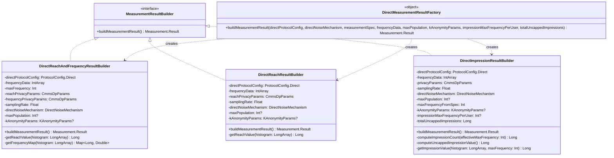

# org.wfanet.measurement.edpaggregator.resultsfulfiller.compute

## Overview

The `compute` package provides the measurement result building infrastructure for the EDP Aggregator's results fulfiller component. It implements the builder pattern for constructing various types of measurement results (reach, impression, frequency) using direct protocol computations with differential privacy and k-anonymity support.

## Components

### MeasurementResultBuilder
Interface defining the contract for building measurement results.

| Method | Parameters | Returns | Description |
|--------|------------|---------|-------------|
| buildMeasurementResult | None | `Measurement.Result` | Builds and returns a measurement result |

## Subpackages

### protocols.direct

Contains implementations of measurement result builders using the direct protocol methodology.

## protocols.direct Components

### DirectMeasurementResultFactory
Factory object for creating appropriate measurement result builders based on measurement type.

| Method | Parameters | Returns | Description |
|--------|------------|---------|-------------|
| buildMeasurementResult | `directProtocolConfig: ProtocolConfig.Direct`, `directNoiseMechanism: DirectNoiseMechanism`, `measurementSpec: MeasurementSpec`, `frequencyData: IntArray`, `maxPopulation: Int?`, `kAnonymityParams: KAnonymityParams?`, `impressionMaxFrequencyPerUser: Int?`, `totalUncappedImpressions: Long` | `Measurement.Result` | Routes to appropriate builder based on measurement type |

**Supported Measurement Types:**
- REACH_AND_FREQUENCY: Delegates to `DirectReachAndFrequencyResultBuilder`
- IMPRESSION: Delegates to `DirectImpressionResultBuilder`
- REACH: Delegates to `DirectReachResultBuilder`
- DURATION: Not yet implemented
- POPULATION: Not yet implemented

### DirectReachAndFrequencyResultBuilder
Builds measurement results for combined reach and frequency metrics with differential privacy.

| Method | Parameters | Returns | Description |
|--------|------------|---------|-------------|
| buildMeasurementResult | None | `Measurement.Result` | Computes reach and frequency distribution from histogram data |
| getReachValue | `histogram: LongArray` | `Long` | Computes reach value with optional DP noise |
| getFrequencyMap | `histogram: LongArray` | `Map<Long, Double>` | Computes relative frequency distribution with optional DP noise |

**Constructor Parameters:**
- `directProtocolConfig`: Protocol configuration for deterministic count distinct and distribution
- `frequencyData`: Integer array representing frequency histogram
- `maxFrequency`: Maximum frequency value to consider
- `reachPrivacyParams`: Differential privacy parameters for reach computation
- `frequencyPrivacyParams`: Differential privacy parameters for frequency computation
- `samplingRate`: VID sampling interval width
- `directNoiseMechanism`: Noise mechanism (NONE, CONTINUOUS_LAPLACE, CONTINUOUS_GAUSSIAN)
- `maxPopulation`: Optional maximum population constraint
- `kAnonymityParams`: Optional k-anonymity threshold parameters

**Validation:**
- Requires `DeterministicCountDistinct` methodology in protocol config
- Requires `DeterministicDistribution` methodology in protocol config
- Only Continuous Gaussian noise is supported for DP noise addition

### DirectReachResultBuilder
Builds measurement results for reach-only metrics with differential privacy and k-anonymity.

| Method | Parameters | Returns | Description |
|--------|------------|---------|-------------|
| buildMeasurementResult | None | `Measurement.Result` | Computes reach value from frequency data |
| getReachValue | `histogram: LongArray` | `Long` | Computes reach with optional DP noise and k-anonymity |

**Constructor Parameters:**
- `directProtocolConfig`: Protocol configuration for deterministic count distinct
- `frequencyData`: Integer array representing frequency histogram
- `reachPrivacyParams`: Differential privacy parameters
- `samplingRate`: VID sampling interval width
- `directNoiseMechanism`: Noise mechanism to apply
- `maxPopulation`: Optional maximum population constraint
- `kAnonymityParams`: Optional k-anonymity parameters including `reachMaxFrequencyPerUser`

**Features:**
- Uses `reachMaxFrequencyPerUser` from k-anonymity params for histogram construction (defaults to 1)
- Applies differential privacy noise when mechanism is not NONE
- Enforces Continuous Gaussian as the only supported DP mechanism

### DirectImpressionResultBuilder
Builds measurement results for impression counts with support for capped and uncapped frequencies.

| Method | Parameters | Returns | Description |
|--------|------------|---------|-------------|
| buildMeasurementResult | None | `Measurement.Result` | Computes impression count with frequency capping |
| computeImpressionCount | `effectiveMaxFrequency: Int` | `Long` | Routes to capped or uncapped computation |
| computeUncappedImpressionValue | None | `Long` | Returns uncapped impressions with k-anonymity checks |
| getImpressionValue | `histogram: LongArray`, `maxFrequency: Int` | `Long` | Computes capped impressions with DP noise |

**Constructor Parameters:**
- `directProtocolConfig`: Protocol configuration for deterministic count
- `frequencyData`: Integer array representing frequency histogram
- `privacyParams`: Differential privacy parameters
- `samplingRate`: VID sampling interval width
- `directNoiseMechanism`: Noise mechanism to apply
- `maxPopulation`: Optional maximum population constraint
- `maxFrequencyFromSpec`: Maximum frequency per user from measurement spec
- `kAnonymityParams`: Optional k-anonymity parameters with `minImpressions` and `minUsers` thresholds
- `impressionMaxFrequencyPerUser`: Override for max frequency; -1 indicates no capping
- `totalUncappedImpressions`: Raw impression count without frequency cap

**Frequency Capping Logic:**
- When `impressionMaxFrequencyPerUser == -1`: Uses uncapped impressions directly
- Otherwise: Builds histogram and applies frequency cap
- Uncapped mode applies k-anonymity thresholds if configured (returns 0 if not met)

## Dependencies

### Internal Dependencies
- `org.wfanet.measurement.api.v2alpha` - CMMS API measurement and protocol definitions
- `org.wfanet.measurement.computation` - Core computation utilities for histograms, reach, frequency, and impressions
- `org.wfanet.measurement.dataprovider` - Requisition refusal exception handling
- `org.wfanet.measurement.eventdataprovider.noiser` - Direct noise mechanism definitions

### Key External Types
- `Measurement.Result` - Result wrapper for measurement computations
- `ProtocolConfig.Direct` - Direct protocol configuration specifying methodologies
- `DifferentialPrivacyParams` - Privacy parameters (epsilon, delta)
- `KAnonymityParams` - K-anonymity thresholds and constraints
- `DirectNoiseMechanism` - Noise mechanism enumeration

## Usage Example

```kotlin
// Create factory result for reach and frequency measurement
val result = DirectMeasurementResultFactory.buildMeasurementResult(
  directProtocolConfig = protocolConfig,
  directNoiseMechanism = DirectNoiseMechanism.CONTINUOUS_GAUSSIAN,
  measurementSpec = measurementSpec,
  frequencyData = frequencyHistogram,
  maxPopulation = 1000000,
  kAnonymityParams = KAnonymityParams(
    minUsers = 100,
    minImpressions = 1000,
    reachMaxFrequencyPerUser = 5
  ),
  impressionMaxFrequencyPerUser = null,
  totalUncappedImpressions = 0L
)

// Or use a specific builder directly
val reachBuilder = DirectReachResultBuilder(
  directProtocolConfig = protocolConfig,
  frequencyData = intArrayOf(1, 2, 3, 1, 2),
  reachPrivacyParams = dpParams,
  samplingRate = 0.1f,
  directNoiseMechanism = DirectNoiseMechanism.CONTINUOUS_GAUSSIAN,
  maxPopulation = null,
  kAnonymityParams = kParams
)
val reachResult = reachBuilder.buildMeasurementResult()
```

## Class Diagram



## Privacy and Security Features

### Differential Privacy
All builder implementations support optional differential privacy noise addition:
- Noise mechanisms: NONE, CONTINUOUS_LAPLACE, CONTINUOUS_GAUSSIAN
- Current implementation enforces Continuous Gaussian for DP operations
- Privacy budgets controlled via epsilon and delta parameters
- Separate privacy parameters for reach and frequency in combined measurements

### K-Anonymity
Optional k-anonymity thresholds protect against low-count disclosure:
- `minUsers`: Minimum user count threshold
- `minImpressions`: Minimum impression count threshold
- `reachMaxFrequencyPerUser`: Maximum frequency per user for reach calculations
- Returns zero values when thresholds are not met

### Validation
- Protocol configuration validation ensures required methodologies are present
- Throws `RequisitionRefusalException` when configuration is invalid
- Logs noise addition operations for audit trail
