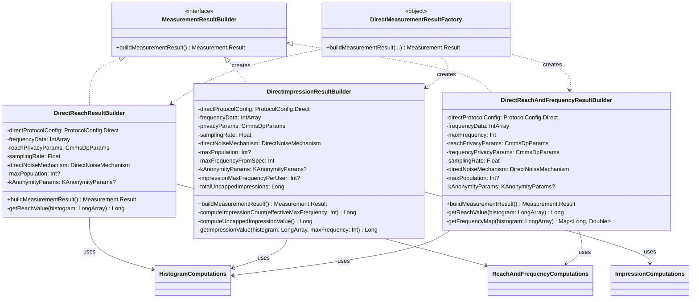

# org.wfanet.measurement.edpaggregator.resultsfulfiller.compute.protocols.direct

## Overview
This package provides direct measurement protocol implementation for computing reach, frequency, and impression metrics in the EDP (Event Data Provider) aggregator. It contains specialized result builders that process frequency data, apply differential privacy noise, implement k-anonymity guarantees, and construct measurement results conforming to the deterministic computation methodologies specified in the protocol configuration.

## Components

### DirectMeasurementResultFactory
Factory object that orchestrates the creation of measurement results based on measurement type specification.

| Method | Parameters | Returns | Description |
|--------|------------|---------|-------------|
| buildMeasurementResult | `directProtocolConfig: ProtocolConfig.Direct`, `directNoiseMechanism: DirectNoiseMechanism`, `measurementSpec: MeasurementSpec`, `frequencyData: IntArray`, `maxPopulation: Int?`, `kAnonymityParams: KAnonymityParams?`, `impressionMaxFrequencyPerUser: Int?`, `totalUncappedImpressions: Long` | `Measurement.Result` | Routes to appropriate builder based on measurement type |

### DirectReachAndFrequencyResultBuilder
Builds measurement results containing both reach and frequency distribution metrics.

| Method | Parameters | Returns | Description |
|--------|------------|---------|-------------|
| buildMeasurementResult | None (uses constructor params) | `suspend Measurement.Result` | Computes reach and frequency with privacy preservation |
| getReachValue | `histogram: LongArray` | `Long` | Calculates reach value with optional DP noise |
| getFrequencyMap | `histogram: LongArray` | `Map<Long, Double>` | Computes relative frequency distribution |

**Constructor Parameters:**
| Property | Type | Description |
|----------|------|-------------|
| directProtocolConfig | `ProtocolConfig.Direct` | Direct protocol configuration |
| frequencyData | `IntArray` | Frequency histogram input data |
| maxFrequency | `Int` | Maximum frequency to consider |
| reachPrivacyParams | `CmmsDpParams` | Differential privacy parameters for reach |
| frequencyPrivacyParams | `CmmsDpParams` | Differential privacy parameters for frequency |
| samplingRate | `Float` | VID sampling interval width |
| directNoiseMechanism | `DirectNoiseMechanism` | Noise mechanism (NONE, CONTINUOUS_LAPLACE, CONTINUOUS_GAUSSIAN) |
| maxPopulation | `Int?` | Optional maximum population cap |
| kAnonymityParams | `KAnonymityParams?` | Optional k-anonymity parameters |

### DirectReachResultBuilder
Builds measurement results containing only reach metrics.

| Method | Parameters | Returns | Description |
|--------|------------|---------|-------------|
| buildMeasurementResult | None (uses constructor params) | `suspend Measurement.Result` | Computes reach metric with privacy guarantees |
| getReachValue | `histogram: LongArray` | `Long` | Calculates reach value with optional DP noise |

**Constructor Parameters:**
| Property | Type | Description |
|----------|------|-------------|
| directProtocolConfig | `ProtocolConfig.Direct` | Direct protocol configuration |
| frequencyData | `IntArray` | Frequency histogram input data |
| reachPrivacyParams | `CmmsDpParams` | Differential privacy parameters |
| samplingRate | `Float` | VID sampling interval width |
| directNoiseMechanism | `DirectNoiseMechanism` | Noise mechanism type |
| maxPopulation | `Int?` | Optional maximum population cap |
| kAnonymityParams | `KAnonymityParams?` | Optional k-anonymity parameters |

### DirectImpressionResultBuilder
Builds measurement results for impression counts with configurable frequency capping.

| Method | Parameters | Returns | Description |
|--------|------------|---------|-------------|
| buildMeasurementResult | None (uses constructor params) | `suspend Measurement.Result` | Computes impression count with privacy preservation |
| computeImpressionCount | `effectiveMaxFrequency: Int` | `Long` | Routes to capped or uncapped computation |
| computeUncappedImpressionValue | None | `Long` | Computes impressions without frequency cap with k-anonymity checks |
| getImpressionValue | `histogram: LongArray`, `maxFrequency: Int` | `Long` | Computes capped impression count with DP noise |

**Constructor Parameters:**
| Property | Type | Description |
|----------|------|-------------|
| directProtocolConfig | `ProtocolConfig.Direct` | Direct protocol configuration |
| frequencyData | `IntArray` | Frequency histogram input data |
| privacyParams | `CmmsDpParams` | Differential privacy parameters |
| samplingRate | `Float` | VID sampling interval width |
| directNoiseMechanism | `DirectNoiseMechanism` | Noise mechanism type |
| maxPopulation | `Int?` | Optional maximum population cap |
| maxFrequencyFromSpec | `Int` | Maximum frequency per user from spec |
| kAnonymityParams | `KAnonymityParams?` | Optional k-anonymity parameters |
| impressionMaxFrequencyPerUser | `Int?` | Override for max frequency (-1 = no cap) |
| totalUncappedImpressions | `Long` | Total impressions without capping |

## Key Functionality

### Privacy Mechanisms
All builders support three noise mechanisms:
- **NONE**: No noise added to measurements
- **CONTINUOUS_LAPLACE**: Laplace noise (mapped to protocol config but only Gaussian implemented)
- **CONTINUOUS_GAUSSIAN**: Gaussian noise with configurable epsilon and delta parameters

### K-Anonymity Enforcement
When `kAnonymityParams` is provided, builders enforce:
- Minimum user thresholds (`minUsers`)
- Minimum impression thresholds (`minImpressions`)
- Maximum frequency per user constraints (`reachMaxFrequencyPerUser`)

### Protocol Validation
All builders validate protocol configuration requirements:
- Reach/frequency builders require `deterministicCountDistinct` methodology
- Frequency distribution requires `deterministicDistribution` methodology
- Impression builder requires `deterministicCount` methodology
- Throws `RequisitionRefusalException` with `DECLINED` justification if requirements not met

### Measurement Type Support
| Measurement Type | Status | Builder Used |
|------------------|--------|--------------|
| REACH | Implemented | DirectReachResultBuilder |
| IMPRESSION | Implemented | DirectImpressionResultBuilder |
| REACH_AND_FREQUENCY | Implemented | DirectReachAndFrequencyResultBuilder |
| DURATION | Not implemented | Throws TODO exception |
| POPULATION | Not implemented | Throws TODO exception |

## Dependencies

### Core Computation Libraries
- `org.wfanet.measurement.computation.HistogramComputations` - Histogram construction from frequency vectors
- `org.wfanet.measurement.computation.ReachAndFrequencyComputations` - Reach and frequency metric calculations
- `org.wfanet.measurement.computation.ImpressionComputations` - Impression count calculations
- `org.wfanet.measurement.computation.DifferentialPrivacyParams` - DP parameter modeling
- `org.wfanet.measurement.computation.KAnonymityParams` - K-anonymity parameter modeling

### API Model Classes
- `org.wfanet.measurement.api.v2alpha.Measurement` - Measurement result structures
- `org.wfanet.measurement.api.v2alpha.MeasurementSpec` - Measurement specification and parameters
- `org.wfanet.measurement.api.v2alpha.ProtocolConfig` - Protocol configuration and methodologies
- `org.wfanet.measurement.api.v2alpha.Requisition` - Requisition refusal modeling

### Privacy and Noise Components
- `org.wfanet.measurement.eventdataprovider.noiser.DirectNoiseMechanism` - Noise mechanism enumeration

### Exception Handling
- `org.wfanet.measurement.dataprovider.RequisitionRefusalException` - Protocol requirement validation failures

### Base Interfaces
- `org.wfanet.measurement.edpaggregator.resultsfulfiller.compute.MeasurementResultBuilder` - Result builder interface

## Usage Example

```kotlin
// Factory-based measurement result creation
val result = DirectMeasurementResultFactory.buildMeasurementResult(
  directProtocolConfig = protocolConfig.direct,
  directNoiseMechanism = DirectNoiseMechanism.CONTINUOUS_GAUSSIAN,
  measurementSpec = measurementSpec,
  frequencyData = vidFrequencyArray,
  maxPopulation = 1_000_000,
  kAnonymityParams = KAnonymityParams(
    minUsers = 100,
    minImpressions = 1000,
    reachMaxFrequencyPerUser = 10
  ),
  impressionMaxFrequencyPerUser = null,
  totalUncappedImpressions = 50_000L
)

// Direct builder instantiation for reach-only measurements
val reachBuilder = DirectReachResultBuilder(
  directProtocolConfig = protocolConfig.direct,
  frequencyData = frequencyHistogram,
  reachPrivacyParams = dpParams,
  samplingRate = 0.01f,
  directNoiseMechanism = DirectNoiseMechanism.CONTINUOUS_GAUSSIAN,
  maxPopulation = null,
  kAnonymityParams = kParams
)
val reachResult = reachBuilder.buildMeasurementResult()
```

## Class Diagram


