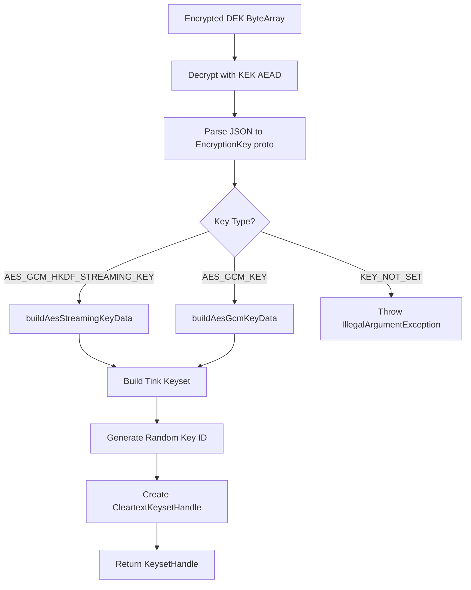

# org.wfanet.measurement.edpaggregator.resultsfulfiller.crypto

## Overview
This package provides cryptographic key handling utilities for the EDP Aggregator results fulfiller. It specializes in parsing and converting JSON-encoded encrypted keys into Tink KeysetHandle objects, supporting multiple AES encryption schemes. The primary responsibility is decrypting data encryption keys (DEK) using key encryption keys (KEK) and transforming them into usable Tink keyset formats.

## Components

### parseJsonEncryptedKey
Top-level function that decrypts and parses JSON-encoded encryption keys into Tink KeysetHandle objects.

| Function | Parameters | Returns | Description |
|----------|------------|---------|-------------|
| parseJsonEncryptedKey | `encryptedDek: ByteArray`, `kekAead: Aead`, `associatedData: ByteArray?` | `KeysetHandle` | Decrypts encrypted DEK using KEK AEAD, parses JSON to EncryptionKey proto, builds Tink keyset |

### buildAesStreamingKeyData
Private function that constructs Tink KeyData for AES-GCM-HKDF streaming encryption keys.

| Function | Parameters | Returns | Description |
|----------|------------|---------|-------------|
| buildAesStreamingKeyData | `aesStreamingKey: EdpAggregatorAesGcmHkdfStreamingKey` | `KeyData` | Converts EDP Aggregator streaming key proto to Tink AesGcmHkdfStreamingKey format |

### buildAesGcmKeyData
Private function that constructs Tink KeyData for standard AES-GCM encryption keys.

| Function | Parameters | Returns | Description |
|----------|------------|---------|-------------|
| buildAesGcmKeyData | `aesGcmKey: EdpAggregatorAesGcmKey` | `KeyData` | Converts EDP Aggregator AES-GCM key proto to Tink AesGcmKey format |

### mapHashTypeCloneToTink
Private extension function that maps EDP Aggregator hash type enums to Tink hash type enums.

| Function | Parameters | Returns | Description |
|----------|------------|---------|-------------|
| mapHashTypeCloneToTink | receiver: `EdpAggregatorHashType` | `HashType` | Converts SHA1/SHA256/SHA512 enum values between proto schemas |

## Data Structures

The package operates on the following key data structures:

### EncryptionKey (EDP Aggregator Proto)
| Property | Type | Description |
|----------|------|-------------|
| keyCase | `EncryptionKey.KeyCase` | Union field discriminator (AES_GCM_HKDF_STREAMING_KEY, AES_GCM_KEY, KEY_NOT_SET) |
| aesGcmHkdfStreamingKey | `EdpAggregatorAesGcmHkdfStreamingKey` | Streaming encryption key configuration |
| aesGcmKey | `EdpAggregatorAesGcmKey` | Standard AES-GCM key configuration |

### EdpAggregatorAesGcmHkdfStreamingKey
| Property | Type | Description |
|----------|------|-------------|
| params | `AesGcmHkdfStreamingParams` | Streaming encryption parameters (key size, hash type, segment size) |
| keyValue | `ByteString` | Raw key material |
| version | `Int` | Key version identifier |

### EdpAggregatorAesGcmKey
| Property | Type | Description |
|----------|------|-------------|
| keyValue | `ByteString` | Raw key material |
| version | `Int` | Key version identifier |

## Dependencies

- `com.google.crypto.tink` - Google Tink cryptographic library for key management and AEAD operations
- `com.google.protobuf.util.JsonFormat` - JSON serialization/deserialization for protobuf messages
- `org.wfanet.measurement.edpaggregator.v1alpha` - EDP Aggregator proto definitions for encryption keys

## Usage Example

```kotlin
import com.google.crypto.tink.Aead
import org.wfanet.measurement.edpaggregator.resultsfulfiller.crypto.parseJsonEncryptedKey

// Decrypt and parse an encrypted JSON key
val encryptedDekBytes: ByteArray = getEncryptedDek()
val kekAead: Aead = getKekAead()
val associatedData: ByteArray? = getAssociatedData()

val keysetHandle = parseJsonEncryptedKey(
  encryptedDek = encryptedDekBytes,
  kekAead = kekAead,
  associatedData = associatedData
)

// Use the keyset handle with Tink APIs
val aead = keysetHandle.getPrimitive(Aead::class.java)
val ciphertext = aead.encrypt(plaintext, additionalData)
```

## Key Processing Flow



## Error Handling

The package throws `IllegalArgumentException` in the following cases:
- **KEY_NOT_SET**: When EncryptionKey proto has no key_type specified
- **Unsupported hkdf_hash_type**: When hash type is not SHA1, SHA256, or SHA512

Decryption failures from the KEK AEAD will propagate as exceptions from the Tink library.
