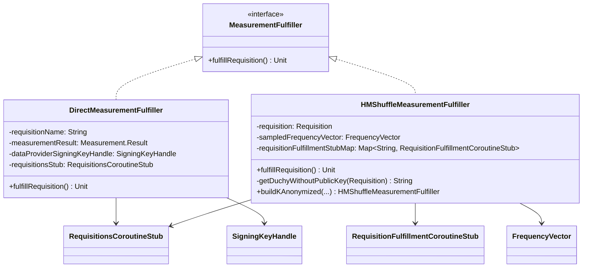

# org.wfanet.measurement.edpaggregator.resultsfulfiller.fulfillers

## Overview
This package provides fulfillment strategies for measurement requisitions in the EDP Aggregator system. It defines a common interface and two concrete implementations for direct measurements and Honest Majority Share Shuffle (HMSS) protocol measurements, handling encryption, signing, and submission of measurement results.

## Components

### MeasurementFulfiller
Interface defining the contract for fulfilling measurement requisitions.

| Method | Parameters | Returns | Description |
|--------|------------|---------|-------------|
| fulfillRequisition | None | `suspend Unit` | Fulfills a requisition |

### DirectMeasurementFulfiller
Fulfiller implementation for direct measurements with encryption and signing.

**Constructor Parameters:**
| Parameter | Type | Description |
|-----------|------|-------------|
| requisitionName | `String` | Name of the requisition to fulfill |
| requisitionDataProviderCertificateName | `String` | Name of the data provider certificate |
| measurementResult | `Measurement.Result` | Measurement result to fulfill the requisition with |
| requisitionNonce | `Long` | Nonce for the fulfillment |
| measurementEncryptionPublicKey | `EncryptionPublicKey` | Encryption public key for the fulfillment |
| directProtocolConfig | `ProtocolConfig.Direct` | Direct protocol configuration |
| directNoiseMechanism | `DirectNoiseMechanism` | Direct noise mechanism to use |
| dataProviderSigningKeyHandle | `SigningKeyHandle` | Signing key handle for the data provider |
| dataProviderCertificateKey | `DataProviderCertificateKey` | Certificate key for the data provider |
| requisitionsStub | `RequisitionsCoroutineStub` | Stub for the Requisitions service |

| Method | Parameters | Returns | Description |
|--------|------------|---------|-------------|
| fulfillRequisition | None | `suspend Unit` | Signs, encrypts, and submits direct measurement result |

### HMShuffleMeasurementFulfiller
Fulfiller implementation for Honest Majority Share Shuffle protocol measurements with k-anonymization support.

**Constructor Parameters:**
| Parameter | Type | Description |
|-----------|------|-------------|
| requisition | `Requisition` | Requisition to fulfill |
| requisitionNonce | `Long` | Nonce for the fulfillment |
| sampledFrequencyVector | `FrequencyVector` | Sampled frequency vector data |
| dataProviderSigningKeyHandle | `SigningKeyHandle` | Signing key handle for the data provider |
| dataProviderCertificateKey | `DataProviderCertificateKey` | Certificate key for the data provider |
| requisitionFulfillmentStubMap | `Map<String, RequisitionFulfillmentCoroutineStub>` | Map of duchy IDs to fulfillment stubs |
| requisitionsStub | `RequisitionsCoroutineStub` | Stub for the Requisitions service |
| generateSecretShares | `(ByteArray) -> ByteArray` | Function to generate secret shares |

| Method | Parameters | Returns | Description |
|--------|------------|---------|-------------|
| fulfillRequisition | None | `suspend Unit` | Generates secret shares and streams fulfillment requests to duchy |
| getDuchyWithoutPublicKey | `requisition: Requisition` | `String` | Identifies duchy without HMSS public key |
| buildKAnonymized | See companion object parameters | `HMShuffleMeasurementFulfiller` | Constructs fulfiller with k-anonymized frequency vector |
| kAnonymize | See companion object parameters | `FrequencyVector` | Applies k-anonymity threshold to frequency vector |

**Companion Object - buildKAnonymized:**
| Parameter | Type | Description |
|-----------|------|-------------|
| requisition | `Requisition` | Requisition to fulfill |
| requisitionNonce | `Long` | Nonce for the fulfillment |
| measurementSpec | `MeasurementSpec` | Specification for the measurement |
| populationSpec | `PopulationSpec` | Specification for the population |
| frequencyVectorBuilder | `FrequencyVectorBuilder` | Builder for constructing frequency vectors |
| dataProviderSigningKeyHandle | `SigningKeyHandle` | Signing key handle for the data provider |
| dataProviderCertificateKey | `DataProviderCertificateKey` | Certificate key for the data provider |
| requisitionFulfillmentStubMap | `Map<String, RequisitionFulfillmentCoroutineStub>` | Map of duchy IDs to fulfillment stubs |
| requisitionsStub | `RequisitionsCoroutineStub` | Stub for the Requisitions service |
| kAnonymityParams | `KAnonymityParams` | Parameters for k-anonymity computation |
| maxPopulation | `Int?` | Maximum population size (nullable) |
| generateSecretShares | `(ByteArray) -> ByteArray` | Function to generate secret shares |

## Dependencies
- `org.wfanet.measurement.api.v2alpha` - API protocol definitions and gRPC stubs for requisitions and measurements
- `org.wfanet.measurement.common.crypto` - Cryptographic signing key handling
- `org.wfanet.measurement.consent.client.dataprovider` - Result encryption and signing utilities
- `org.wfanet.measurement.eventdataprovider.noiser` - Noise mechanisms for privacy protection
- `org.wfanet.measurement.eventdataprovider.requisition.v2alpha` - Frequency vector building and requisition request construction
- `org.wfanet.measurement.computation` - Histogram and reach/frequency computations with k-anonymity support
- `org.wfanet.frequencycount` - Frequency vector data structures and secret share generation
- `io.grpc` - gRPC status exception handling
- `kotlinx.coroutines.flow` - Flow-based streaming for HMSS fulfillment

## Usage Example
```kotlin
// Direct Measurement Fulfillment
val directFulfiller = DirectMeasurementFulfiller(
  requisitionName = "dataProviders/123/requisitions/456",
  requisitionDataProviderCertificateName = "dataProviders/123/certificates/789",
  measurementResult = measurementResult,
  requisitionNonce = 12345L,
  measurementEncryptionPublicKey = encryptionPublicKey,
  directProtocolConfig = protocolConfig,
  directNoiseMechanism = noiseMechanism,
  dataProviderSigningKeyHandle = signingKeyHandle,
  dataProviderCertificateKey = certificateKey,
  requisitionsStub = requisitionsStub
)
directFulfiller.fulfillRequisition()

// HMSS Measurement Fulfillment with K-Anonymization
val hmssFulfiller = HMShuffleMeasurementFulfiller.buildKAnonymized(
  requisition = requisition,
  requisitionNonce = 12345L,
  measurementSpec = measurementSpec,
  populationSpec = populationSpec,
  frequencyVectorBuilder = frequencyVectorBuilder,
  dataProviderSigningKeyHandle = signingKeyHandle,
  dataProviderCertificateKey = certificateKey,
  requisitionFulfillmentStubMap = mapOf("duchy1" to fulfillmentStub),
  requisitionsStub = requisitionsStub,
  kAnonymityParams = kAnonymityParams,
  maxPopulation = 100000
)
hmssFulfiller.fulfillRequisition()
```

## Class Diagram

