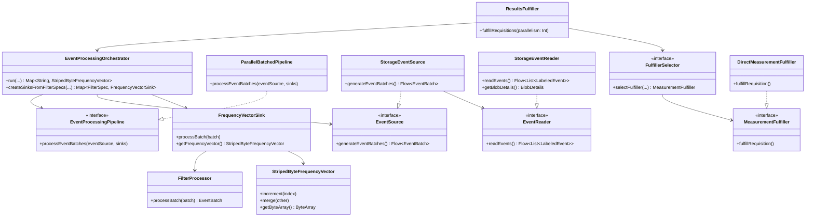

# org.wfanet.measurement.edpaggregator.resultsfulfiller

## Overview

The results fulfiller package provides event-level measurement requisition processing infrastructure for the Event Data Provider Aggregator (EDPA). It orchestrates parallel event processing pipelines that read events from storage, apply CEL-based filters, build frequency vectors, and fulfill measurement requisitions using protocol-specific implementations. The system supports deduplication of identical filter specifications across multiple requisitions to minimize redundant computation.

## Components

### ResultsFulfiller
Main orchestrator that manages the lifecycle of grouped requisitions from decryption through fulfillment.

| Method | Parameters | Returns | Description |
|--------|------------|---------|-------------|
| fulfillRequisitions | `parallelism: Int` | `Unit` | Processes requisitions in batches with concurrent fulfillment |

### EventProcessingOrchestrator
Coordinates storage-backed event processing to fulfill requisitions by deduplicating filters and executing a parallel pipeline.

| Method | Parameters | Returns | Description |
|--------|------------|---------|-------------|
| run | `eventSource: EventSource<T>`, `vidIndexMap: VidIndexMap`, `populationSpec: PopulationSpec`, `requisitions: List<Requisition>`, `eventGroupReferenceIdMap: Map<String, String>`, `config: PipelineConfiguration`, `eventDescriptor: Descriptor` | `Map<String, StripedByteFrequencyVector>` | Runs pipeline and returns frequency vectors by requisition name |
| createSinksFromFilterSpecs | `filterSpecs: Collection<FilterSpec>`, `vidIndexMap: VidIndexMap`, `populationSpec: PopulationSpec`, `eventDescriptor: Descriptor` | `Map<FilterSpec, FrequencyVectorSink<T>>` | Creates one sink per unique filter specification |

### FilterSpecIndex
Index mapping requisitions to canonical filter specifications for deduplication.

| Method | Parameters | Returns | Description |
|--------|------------|---------|-------------|
| fromRequisitions | `requisitions: List<Requisition>`, `eventGroupReferenceIdMap: Map<String, String>`, `privateEncryptionKey: PrivateKeyHandle` | `FilterSpecIndex` | Builds canonical filter specs from requisitions |

### EventProcessingPipeline
Interface defining event batch processing strategy.

| Method | Parameters | Returns | Description |
|--------|------------|---------|-------------|
| processEventBatches | `eventSource: EventSource<T>`, `sinks: List<FrequencyVectorSink<T>>` | `Unit` | Processes event batches through all sinks |

### ParallelBatchedPipeline
Parallel implementation using structured concurrency with round-robin batch distribution to workers.

| Method | Parameters | Returns | Description |
|--------|------------|---------|-------------|
| processEventBatches | `eventSource: EventSource<T>`, `sinks: List<FrequencyVectorSink<T>>` | `Unit` | Processes batches with parallel workers and bounded backpressure |

### EventSource
Interface for providing event batches to the pipeline.

| Method | Parameters | Returns | Description |
|--------|------------|---------|-------------|
| generateEventBatches | - | `Flow<EventBatch<T>>` | Generates flow of event batches |

### StorageEventSource
Reads events from cloud storage blobs via impression metadata service.

| Method | Parameters | Returns | Description |
|--------|------------|---------|-------------|
| generateEventBatches | - | `Flow<EventBatch<Message>>` | Generates batches by reading from storage in parallel |

### EventReader
Interface for reading labeled events from data sources.

| Method | Parameters | Returns | Description |
|--------|------------|---------|-------------|
| readEvents | - | `Flow<List<LabeledEvent<T>>>` | Reads events and emits batched flows |

### StorageEventReader
Reads labeled events from encrypted impression blobs in storage.

| Method | Parameters | Returns | Description |
|--------|------------|---------|-------------|
| readEvents | - | `Flow<List<LabeledEvent<Message>>>` | Streams events from blob with decryption support |
| getBlobDetails | - | `BlobDetails` | Returns underlying blob metadata |

### FilterProcessor
Applies CEL expressions, time ranges, and event group filters to event batches.

| Method | Parameters | Returns | Description |
|--------|------------|---------|-------------|
| processBatch | `batch: EventBatch<T>` | `EventBatch<T>` | Filters batch returning matching events |

### FrequencyVectorSink
Receives filtered events and updates frequency vectors for specific filter specifications.

| Method | Parameters | Returns | Description |
|--------|------------|---------|-------------|
| processBatch | `batch: EventBatch<T>` | `Unit` | Processes batch and updates frequency vector |
| getFilterSpec | - | `FilterSpec` | Returns filter specification |
| getFrequencyVector | - | `StripedByteFrequencyVector` | Returns computed frequency vector |
| getTotalUncappedImpressions | - | `Long` | Returns total impression count without capping |

### StripedByteFrequencyVector
Thread-safe frequency vector using lock striping for concurrent access.

| Method | Parameters | Returns | Description |
|--------|------------|---------|-------------|
| increment | `index: Int` | `Unit` | Increments frequency count at index |
| getByteArray | - | `ByteArray` | Returns cloned byte array |
| getTotalUncappedImpressions | - | `Long` | Returns total uncapped impression count |
| merge | `other: StripedByteFrequencyVector` | `StripedByteFrequencyVector` | Merges another vector into this one |

### FulfillerSelector
Interface for selecting protocol-specific measurement fulfillers.

| Method | Parameters | Returns | Description |
|--------|------------|---------|-------------|
| selectFulfiller | `requisition: Requisition`, `measurementSpec: MeasurementSpec`, `requisitionSpec: RequisitionSpec`, `frequencyVector: StripedByteFrequencyVector`, `populationSpec: PopulationSpec` | `MeasurementFulfiller` | Selects appropriate fulfiller implementation |

### MeasurementFulfiller
Interface for protocol-specific requisition fulfillment.

| Method | Parameters | Returns | Description |
|--------|------------|---------|-------------|
| fulfillRequisition | - | `Unit` | Fulfills requisition via protocol-specific logic |

### DirectMeasurementFulfiller
Fulfiller for direct measurement protocol.

| Method | Parameters | Returns | Description |
|--------|------------|---------|-------------|
| fulfillRequisition | - | `Unit` | Signs, encrypts, and submits direct measurement result |

### ImpressionDataSourceProvider
Resolves impression metadata and data sources for event groups.

| Method | Parameters | Returns | Description |
|--------|------------|---------|-------------|
| listImpressionDataSources | `modelLine: String`, `eventGroupReferenceId: String`, `period: Interval` | `List<ImpressionDataSource>` | Lists data sources for event group within period |

### NoiserSelector
Interface for selecting noise mechanisms for direct measurements.

| Method | Parameters | Returns | Description |
|--------|------------|---------|-------------|
| selectNoiseMechanism | `options: List<NoiseMechanism>` | `DirectNoiseMechanism` | Selects preferred noise mechanism from options |

### ContinuousGaussianNoiseSelector
Implementation that only selects continuous Gaussian noise.

| Method | Parameters | Returns | Description |
|--------|------------|---------|-------------|
| selectNoiseMechanism | `options: List<NoiseMechanism>` | `DirectNoiseMechanism` | Returns CONTINUOUS_GAUSSIAN or throws exception |

### NoNoiserSelector
Implementation that only selects no noise.

| Method | Parameters | Returns | Description |
|--------|------------|---------|-------------|
| selectNoiseMechanism | `options: List<NoiseMechanism>` | `DirectNoiseMechanism` | Returns NONE or throws exception |

### MeasurementResultBuilder
Interface for building measurement results.

| Method | Parameters | Returns | Description |
|--------|------------|---------|-------------|
| buildMeasurementResult | - | `Measurement.Result` | Builds protocol-specific measurement result |

## Data Structures

### EventBatch
| Property | Type | Description |
|----------|------|-------------|
| events | `List<LabeledEvent<T>>` | Batch of parsed events |
| minTime | `Instant` | Earliest event time in batch |
| maxTime | `Instant` | Latest event time in batch |
| eventGroupReferenceId | `String` | Event group identifier for filtering |
| size | `Int` | Number of events in batch |

### LabeledEvent
| Property | Type | Description |
|----------|------|-------------|
| timestamp | `Instant` | Event occurrence time |
| vid | `Long` | Virtual Person ID |
| message | `T: Message` | Event data as Protocol Buffer |

### FilterSpec
| Property | Type | Description |
|----------|------|-------------|
| celExpression | `String` | CEL expression for filtering |
| collectionInterval | `Interval` | Time interval for event collection |
| eventGroupReferenceIds | `List<String>` | Event group reference IDs to filter |

### PipelineConfiguration
| Property | Type | Description |
|----------|------|-------------|
| batchSize | `Int` | Events per batch |
| channelCapacity | `Int` | Per-worker channel capacity in batches |
| threadPoolSize | `Int` | Thread pool size for dispatcher |
| workers | `Int` | Parallel worker coroutines |

### ModelLineInfo
| Property | Type | Description |
|----------|------|-------------|
| populationSpec | `PopulationSpec` | Population specification |
| eventDescriptor | `Descriptor` | Event protobuf descriptor |
| vidIndexMap | `VidIndexMap` | VID to frequency vector index mapping |

### ImpressionDataSource
| Property | Type | Description |
|----------|------|-------------|
| modelLine | `String` | Model line identifier |
| eventGroupReferenceId | `String` | Event group reference ID |
| interval | `Interval` | Time interval for data source |
| blobDetails | `BlobDetails` | Blob access and decryption details |

### ImpressionReadException
| Property | Type | Description |
|----------|------|-------------|
| blobKey | `String` | Storage key or URI of failed blob |
| code | `Code` | Error code (BLOB_NOT_FOUND or INVALID_FORMAT) |
| message | `String?` | Human-readable error description |

## Dependencies

- `org.wfanet.measurement.api.v2alpha` - Cross-Media Measurement API protobuf definitions for requisitions, measurements, and specs
- `org.wfanet.measurement.edpaggregator.v1alpha` - EDPA internal protobuf definitions for grouped requisitions and metadata
- `org.wfanet.measurement.eventdataprovider` - Event filtering, VID indexing, and noise mechanism support
- `org.wfanet.measurement.common.crypto` - Encryption and signing key handling
- `org.wfanet.measurement.consent.client.dataprovider` - Requisition spec decryption and result encryption
- `org.wfanet.measurement.storage` - Cloud storage client abstraction for blob access
- `org.wfanet.measurement.edpaggregator` - Storage configuration and encrypted storage utilities
- `com.google.crypto.tink` - KMS client for data encryption key decryption
- `com.google.protobuf` - Protocol Buffer message handling and dynamic parsing
- `org.projectnessie.cel` - Common Expression Language (CEL) program compilation and execution
- `kotlinx.coroutines` - Structured concurrency, flows, and channels for parallel processing
- `io.opentelemetry.api` - Observability metrics and distributed tracing

## Usage Example

```kotlin
// Configure pipeline
val config = PipelineConfiguration(
    batchSize = 256,
    channelCapacity = 128,
    threadPoolSize = 8,
    workers = 8
)

// Create orchestrator
val orchestrator = EventProcessingOrchestrator<Message>(privateEncryptionKey)

// Create event source
val eventSource = StorageEventSource(
    impressionDataSourceProvider = impressionDataSourceProvider,
    eventGroupDetailsList = eventGroupDetails,
    modelLine = "model_line_id",
    kmsClient = kmsClient,
    impressionsStorageConfig = storageConfig,
    descriptor = eventDescriptor,
    batchSize = config.batchSize
)

// Run pipeline
val frequencyVectors = orchestrator.run(
    eventSource = eventSource,
    vidIndexMap = vidIndexMap,
    populationSpec = populationSpec,
    requisitions = requisitions,
    eventGroupReferenceIdMap = eventGroupMap,
    config = config,
    eventDescriptor = eventDescriptor
)

// Fulfill requisitions
val fulfiller = ResultsFulfiller(
    dataProvider = dataProviderName,
    requisitionMetadataStub = metadataStub,
    requisitionsStub = requisitionsStub,
    privateEncryptionKey = privateKey,
    groupedRequisitions = groupedReqs,
    modelLineInfoMap = modelLineMap,
    pipelineConfiguration = config,
    impressionDataSourceProvider = dataSourceProvider,
    kmsClient = kmsClient,
    impressionsStorageConfig = storageConfig,
    fulfillerSelector = fulfillerSelector,
    metrics = metrics
)

fulfiller.fulfillRequisitions(parallelism = 15)
```

## Class Diagram


