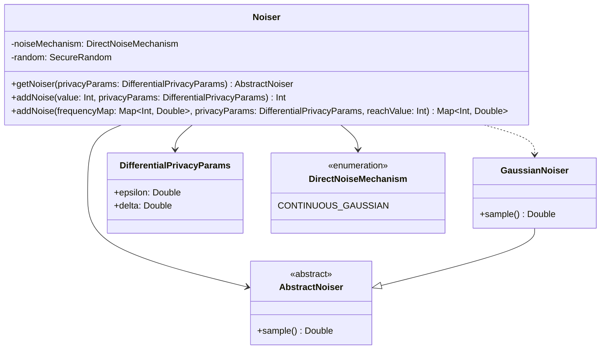

# org.wfanet.measurement.edpaggregator.resultsfulfiller.noise

## Overview
Provides differential privacy noise generation capabilities for EDP (Event Data Provider) aggregator result fulfillment. This package implements noise addition mechanisms that support Gaussian noise distribution to ensure measurement results meet differential privacy guarantees while maintaining statistical utility.

## Components

### Noiser
Adds differential privacy noise to measurement results using configurable noise mechanisms. Supports both scalar integer values and frequency distribution maps.

| Method | Parameters | Returns | Description |
|--------|------------|---------|-------------|
| getNoiser | `privacyParams: DifferentialPrivacyParams` | `AbstractNoiser` | Creates a noiser instance configured with specified privacy parameters |
| addNoise | `value: Int, privacyParams: DifferentialPrivacyParams` | `Int` | Adds noise to an integer value and clamps to non-negative range |
| addNoise | `frequencyMap: Map<Int, Double>, privacyParams: DifferentialPrivacyParams, reachValue: Int` | `Map<Int, Double>` | Adds noise to frequency distribution, scales by reach, and renormalizes |

**Constructor Parameters:**
| Parameter | Type | Description |
|-----------|------|-------------|
| noiseMechanism | `DirectNoiseMechanism` | The noise mechanism to use (must be CONTINUOUS_GAUSSIAN) |
| random | `SecureRandom` | Cryptographically secure random number generator for noise sampling |

**Key Behavior:**
- Validates noise mechanism is supported during initialization (only CONTINUOUS_GAUSSIAN)
- Throws `RequisitionRefusalException` with SPEC_INVALID justification for unsupported mechanisms
- Clamps all noised values to non-negative range using `max(0, noisedValue)`
- Normalizes frequency distributions after noise addition to maintain probability distribution properties

## Dependencies
- `org.wfanet.measurement.api.v2alpha` - Provides DifferentialPrivacyParams and Requisition types
- `org.wfanet.measurement.dataprovider` - RequisitionRefusalException for error handling
- `org.wfanet.measurement.eventdataprovider.noiser` - Core noiser abstractions (AbstractNoiser, GaussianNoiser, DirectNoiseMechanism, DpParams)
- `java.security.SecureRandom` - Cryptographic random number generation
- `kotlin.math` - Mathematical operations (max, roundToInt)

## Usage Example
```kotlin
import java.security.SecureRandom
import org.wfanet.measurement.api.v2alpha.DifferentialPrivacyParams
import org.wfanet.measurement.eventdataprovider.noiser.DirectNoiseMechanism

// Initialize noiser with Gaussian mechanism
val noiser = Noiser(
  noiseMechanism = DirectNoiseMechanism.CONTINUOUS_GAUSSIAN,
  random = SecureRandom()
)

// Add noise to scalar value
val privacyParams = DifferentialPrivacyParams.newBuilder()
  .setEpsilon(0.1)
  .setDelta(1e-9)
  .build()
val originalValue = 1000
val noisedValue = noiser.addNoise(originalValue, privacyParams)

// Add noise to frequency distribution
val frequencyMap = mapOf(1 to 0.5, 2 to 0.3, 3 to 0.2)
val reachValue = 10000
val noisedFrequencyMap = noiser.addNoise(frequencyMap, privacyParams, reachValue)
```

## Class Diagram

