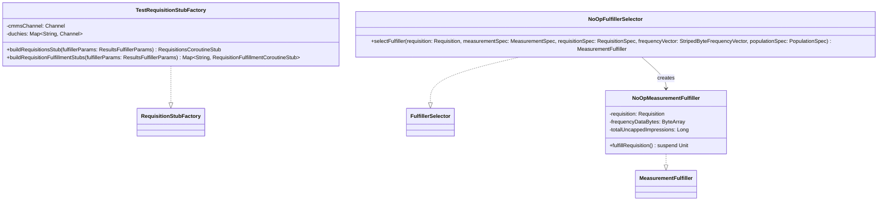

# org.wfanet.measurement.edpaggregator.resultsfulfiller.testing

## Overview
This package provides testing utilities for the EDP Aggregator results fulfiller pipeline. It contains mock implementations and test factories that enable testing of requisition fulfillment workflows without making actual RPC calls or requiring live service dependencies.

## Components

### TestRequisitionStubFactory
Test implementation of `RequisitionStubFactory` that uses pre-configured gRPC channels for testing purposes, ignoring the actual fulfiller parameters.

| Method | Parameters | Returns | Description |
|--------|------------|---------|-------------|
| buildRequisitionsStub | `fulfillerParams: ResultsFulfillerParams` | `RequisitionsCoroutineStub` | Creates a requisitions stub with the CMMS channel and data provider principal |
| buildRequisitionFulfillmentStubs | `fulfillerParams: ResultsFulfillerParams` | `Map<String, RequisitionFulfillmentCoroutineStub>` | Creates fulfillment stubs for all configured duchies with data provider principal |

**Constructor Parameters:**
| Parameter | Type | Description |
|-----------|------|-------------|
| cmmsChannel | `Channel` | gRPC channel for CMMS communication |
| duchies | `Map<String, Channel>` | Map of duchy IDs to their gRPC channels |

### NoOpFulfillerSelector
No-op implementation of `FulfillerSelector` that creates mock fulfillers for testing the results fulfiller pipeline without performing actual measurement fulfillment.

| Method | Parameters | Returns | Description |
|--------|------------|---------|-------------|
| selectFulfiller | `requisition: Requisition, measurementSpec: MeasurementSpec, requisitionSpec: RequisitionSpec, frequencyVector: StripedByteFrequencyVector, populationSpec: PopulationSpec` | `MeasurementFulfiller` | Returns a no-op fulfiller that logs requisition details |

### NoOpMeasurementFulfiller
Private inner class implementing `MeasurementFulfiller` that logs detailed frequency vector analytics and requisition metadata without performing actual fulfillment operations.

| Method | Parameters | Returns | Description |
|--------|------------|---------|-------------|
| fulfillRequisition | None | `suspend Unit` | Logs comprehensive requisition and frequency data analytics with simulated processing delay |

**Constructor Parameters:**
| Parameter | Type | Description |
|-----------|------|-------------|
| requisition | `Requisition` | The requisition to mock-fulfill |
| frequencyDataBytes | `ByteArray` | Frequency vector data for analytics |
| totalUncappedImpressions | `Long` | Total impressions count |

## Dependencies
- `io.grpc.Channel` - gRPC channel abstraction for service communication
- `org.wfanet.measurement.api.v2alpha` - CMMS API protocol definitions (Requisition, MeasurementSpec, PopulationSpec, RequisitionSpec, stub classes)
- `org.wfanet.measurement.common.identity` - Principal identity management for authentication
- `org.wfanet.measurement.edpaggregator.resultsfulfiller` - Core fulfiller interfaces (RequisitionStubFactory, FulfillerSelector, StripedByteFrequencyVector)
- `org.wfanet.measurement.edpaggregator.resultsfulfiller.fulfillers` - MeasurementFulfiller interface
- `org.wfanet.measurement.edpaggregator.v1alpha` - ResultsFulfillerParams configuration
- `java.util.logging.Logger` - Logging framework
- `kotlinx.coroutines` - Coroutine support for async operations

## Usage Example
```kotlin
import io.grpc.Channel
import org.wfanet.measurement.edpaggregator.resultsfulfiller.testing.TestRequisitionStubFactory
import org.wfanet.measurement.edpaggregator.resultsfulfiller.testing.NoOpFulfillerSelector

// Setup test stub factory
val cmmsChannel: Channel = createTestChannel()
val duchyChannels = mapOf(
  "duchy1" to createTestChannel(),
  "duchy2" to createTestChannel()
)
val stubFactory = TestRequisitionStubFactory(cmmsChannel, duchyChannels)

// Use no-op fulfiller selector for testing
val selector = NoOpFulfillerSelector()
val fulfiller = selector.selectFulfiller(
  requisition = testRequisition,
  measurementSpec = testMeasurementSpec,
  requisitionSpec = testRequisitionSpec,
  frequencyVector = testFrequencyVector,
  populationSpec = testPopulationSpec
)
fulfiller.fulfillRequisition() // Logs analytics without actual fulfillment
```

## Class Diagram

