# org.wfanet.measurement.edpaggregator.service.internal

## Overview
This package provides internal gRPC service implementations for the EDP (Event Data Provider) Aggregator system, managing metadata for impressions and requisitions. It includes service container classes, comprehensive error handling with domain-specific exceptions, and testing infrastructure for service implementations.

## Components

### Services
Container for EDP Aggregator internal API services

| Method | Parameters | Returns | Description |
|--------|------------|---------|-------------|
| toList | - | `List<BindableService>` | Converts services to bindable list |

**Properties:**
| Property | Type | Description |
|----------|------|-------------|
| requisitionMetadata | `RequisitionMetadataServiceCoroutineImplBase` | Service for requisition metadata operations |
| impressionMetadata | `ImpressionMetadataServiceCoroutineImplBase` | Service for impression metadata operations |

### Errors
Singleton object for error domain and metadata management

**Constants:**
- `DOMAIN`: `"internal.edpaggregator.halo-cmm.org"` - Error domain identifier

**Methods:**
| Method | Parameters | Returns | Description |
|--------|------------|---------|-------------|
| getReason | `exception: StatusException` | `Reason?` | Extracts error reason from exception |
| getReason | `errorInfo: ErrorInfo` | `Reason?` | Extracts error reason from error info |
| parseMetadata | `errorInfo: ErrorInfo` | `Map<Metadata, String>` | Parses metadata from error info |

### Errors.Reason
Enumeration of error reasons

| Value | Description |
|-------|-------------|
| DATA_PROVIDER_MISMATCH | Data provider identifier mismatch |
| IMPRESSION_METADATA_NOT_FOUND | Impression metadata not found |
| IMPRESSION_METADATA_ALREADY_EXISTS | Impression metadata already exists |
| IMPRESSION_METADATA_STATE_INVALID | Invalid impression metadata state |
| REQUISITION_METADATA_NOT_FOUND | Requisition metadata not found |
| REQUISITION_METADATA_NOT_FOUND_BY_CMMS_REQUISITION | Requisition not found by CMMS requisition |
| REQUISITION_METADATA_ALREADY_EXISTS | Requisition metadata already exists |
| REQUISITION_METADATA_ALREADY_EXISTS_BY_BLOB_URI | Requisition exists with blob URI |
| REQUISITION_METADATA_ALREADY_EXISTS_BY_CMMS_REQUISITION | Requisition exists with CMMS requisition |
| REQUISITION_METADATA_STATE_INVALID | Invalid requisition metadata state |
| ETAG_MISMATCH | ETag value mismatch |
| REQUIRED_FIELD_NOT_SET | Required field missing |
| INVALID_FIELD_VALUE | Invalid field value |

### Errors.Metadata
Enumeration of error metadata keys

| Key | Description |
|-----|-------------|
| expectedDataProviderResourceId | Expected data provider ID |
| dataProviderResourceId | Actual data provider ID |
| impressionMetadataResourceId | Impression metadata ID |
| requisitionMetadataResourceId | Requisition metadata ID |
| cmmsRequisition | CMMS requisition identifier |
| blobUri | Blob storage URI |
| impressionMetadataState | Impression metadata state |
| requisitionMetadataState | Requisition metadata state |
| expectedRequisitionMetadataStates | Expected requisition states |
| requestEtag | Request ETag value |
| etag | Actual ETag value |
| fieldName | Field name reference |

## Exception Hierarchy

### ServiceException
Abstract base exception for service errors

| Method | Parameters | Returns | Description |
|--------|------------|---------|-------------|
| asStatusRuntimeException | `code: Status.Code` | `StatusRuntimeException` | Converts to gRPC status exception |

**Properties:**
- `reason`: Error reason enumeration
- `message`: Error message string
- `metadata`: Error metadata map

### DataProviderMismatchException
Thrown when data provider identifiers mismatch

**Constructor Parameters:**
- `expectedDataProviderResourceId: String`
- `actualDataProviderResourceId: String`
- `cause: Throwable?`

### ImpressionMetadataNotFoundException
Thrown when impression metadata not found

**Constructor Parameters:**
- `dataProviderResourceId: String`
- `impressionMetadataResourceId: String`
- `cause: Throwable?`

### ImpressionMetadataAlreadyExistsException
Thrown when impression metadata already exists

**Constructor Parameters:**
- `blobUri: String`
- `cause: Throwable?`

### ImpressionMetadataStateInvalidException
Thrown when impression metadata state invalid

**Constructor Parameters:**
- `dataProviderResourceId: String`
- `impressionMetadataResourceId: String`
- `actualState: ImpressionMetadataState`
- `expectedStates: Set<ImpressionMetadataState>`
- `cause: Throwable?`

### RequisitionMetadataNotFoundException
Thrown when requisition metadata not found

**Constructor Parameters:**
- `dataProviderResourceId: String`
- `requisitionMetadataResourceId: String`
- `cause: Throwable?`

### RequisitionMetadataNotFoundByCmmsRequisitionException
Thrown when requisition not found by CMMS requisition

**Constructor Parameters:**
- `dataProviderResourceId: String`
- `cmmsRequisition: String`
- `cause: Throwable?`

### RequisitionMetadataAlreadyExistsException
Thrown when requisition metadata already exists

**Constructor Parameters:**
- `cause: Throwable?`

### RequisitionMetadataAlreadyExistsByCmmsRequisitionException
Thrown when requisition exists by CMMS requisition

**Constructor Parameters:**
- `dataProviderResourceId: String`
- `cmmsRequisition: String`
- `cause: Throwable?`

### RequisitionMetadataAlreadyExistsByBlobUriException
Thrown when requisition exists by blob URI

**Constructor Parameters:**
- `dataProviderResourceId: String`
- `blobUri: String`
- `cause: Throwable?`

### RequisitionMetadataInvalidStateException
Thrown when requisition metadata state invalid

**Constructor Parameters:**
- `dataProviderResourceId: String`
- `requisitionMetadataResourceId: String`
- `actualState: RequisitionMetadataState`
- `expectedStates: Set<RequisitionMetadataState>`
- `cause: Throwable?`

### EtagMismatchException
Thrown when ETag values mismatch

**Constructor Parameters:**
- `requestEtag: String`
- `etag: String`
- `cause: Throwable?`

| Method | Parameters | Returns | Description |
|--------|------------|---------|-------------|
| check | `requestEtag: String, etag: String` | `Unit` | Validates ETag match or throws |

### RequiredFieldNotSetException
Thrown when required field not set

**Constructor Parameters:**
- `fieldName: String`
- `cause: Throwable?`

### InvalidFieldValueException
Thrown when field value invalid

**Constructor Parameters:**
- `fieldName: String`
- `cause: Throwable?`
- `buildMessage: (String) -> String`

## Testing Infrastructure

### ImpressionMetadataServiceTest
Abstract test suite for impression metadata service implementations

| Method | Parameters | Returns | Description |
|--------|------------|---------|-------------|
| newService | `idGenerator: IdGenerator` | `ImpressionMetadataServiceCoroutineImplBase` | Creates service instance for testing |

**Test Coverage:**
- CRUD operations (create, get, delete)
- Batch operations (batchCreate, batchDelete)
- List operations with pagination and filtering
- State transitions and soft deletion
- Request idempotency
- Model line bounds computation
- Validation and error handling

### RequisitionMetadataServiceTest
Abstract test suite for requisition metadata service implementations

| Method | Parameters | Returns | Description |
|--------|------------|---------|-------------|
| newService | `idGenerator: IdGenerator` | `RequisitionMetadataServiceCoroutineImplBase` | Creates service instance for testing |

**Test Coverage:**
- CRUD operations (create, get, lookup)
- Batch create operations
- State transitions (queue, startProcessing, fulfill, markWithdrawn, refuse)
- List operations with pagination and filtering
- CMMS create time tracking
- Request idempotency
- Validation and error handling

## Dependencies
- `io.grpc` - gRPC framework for service bindings
- `com.google.rpc` - Google RPC error handling
- `org.wfanet.measurement.common.grpc` - Common gRPC utilities
- `org.wfanet.measurement.internal.edpaggregator` - Protocol buffer definitions

## Usage Example
```kotlin
// Create service container
val services = Services(
    requisitionMetadata = requisitionMetadataService,
    impressionMetadata = impressionMetadataService
)

// Bind services to gRPC server
val server = ServerBuilder.forPort(port)
    .apply { services.toList().forEach { addService(it) } }
    .build()

// Error handling pattern
try {
    service.getImpressionMetadata(request)
} catch (e: StatusRuntimeException) {
    when (Errors.getReason(e)) {
        Errors.Reason.IMPRESSION_METADATA_NOT_FOUND -> handleNotFound()
        Errors.Reason.ETAG_MISMATCH -> handleConcurrency()
        else -> throw e
    }
}

// Validate ETag
EtagMismatchException.check(requestEtag, currentEtag)
```

## Class Diagram

```mermaid
classDiagram
    class Services {
        +requisitionMetadata: RequisitionMetadataServiceCoroutineImplBase
        +impressionMetadata: ImpressionMetadataServiceCoroutineImplBase
        +toList() List~BindableService~
    }

    class Errors {
        +DOMAIN: String
        +getReason(exception: StatusException) Reason?
        +getReason(errorInfo: ErrorInfo) Reason?
        +parseMetadata(errorInfo: ErrorInfo) Map~Metadata, String~
    }

    class ServiceException {
        #reason: Reason
        #message: String
        #metadata: Map~Metadata, String~
        +asStatusRuntimeException(code: Status.Code) StatusRuntimeException
    }

    class DataProviderMismatchException
    class ImpressionMetadataNotFoundException
    class ImpressionMetadataAlreadyExistsException
    class ImpressionMetadataStateInvalidException
    class RequisitionMetadataNotFoundException
    class RequisitionMetadataNotFoundByCmmsRequisitionException
    class RequisitionMetadataAlreadyExistsException
    class RequisitionMetadataAlreadyExistsByCmmsRequisitionException
    class RequisitionMetadataAlreadyExistsByBlobUriException
    class RequisitionMetadataInvalidStateException
    class EtagMismatchException
    class RequiredFieldNotSetException
    class InvalidFieldValueException

    class ImpressionMetadataServiceTest {
        #newService(idGenerator: IdGenerator) ImpressionMetadataServiceCoroutineImplBase
    }

    class RequisitionMetadataServiceTest {
        #newService(idGenerator: IdGenerator) RequisitionMetadataServiceCoroutineImplBase
    }

    ServiceException <|-- DataProviderMismatchException
    ServiceException <|-- ImpressionMetadataNotFoundException
    ServiceException <|-- ImpressionMetadataAlreadyExistsException
    ServiceException <|-- ImpressionMetadataStateInvalidException
    ServiceException <|-- RequisitionMetadataNotFoundException
    ServiceException <|-- RequisitionMetadataNotFoundByCmmsRequisitionException
    ServiceException <|-- RequisitionMetadataAlreadyExistsException
    ServiceException <|-- RequisitionMetadataAlreadyExistsByCmmsRequisitionException
    ServiceException <|-- RequisitionMetadataAlreadyExistsByBlobUriException
    ServiceException <|-- RequisitionMetadataInvalidStateException
    ServiceException <|-- EtagMismatchException
    ServiceException <|-- RequiredFieldNotSetException
    ServiceException <|-- InvalidFieldValueException

    Errors ..> ServiceException
    Services ..> ImpressionMetadataServiceCoroutineImplBase
    Services ..> RequisitionMetadataServiceCoroutineImplBase
```

