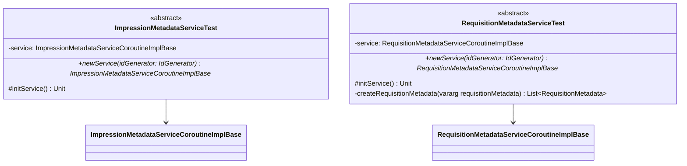

# org.wfanet.measurement.edpaggregator.service.internal.testing

## Overview
Testing framework package providing abstract test suites for EDP Aggregator internal services. Defines comprehensive test specifications for ImpressionMetadata and RequisitionMetadata service implementations, ensuring consistent behavior across different storage backends.

## Components

### ImpressionMetadataServiceTest
Abstract test suite validating ImpressionMetadata service contract compliance.

| Method | Parameters | Returns | Description |
|--------|------------|---------|-------------|
| newService | `idGenerator: IdGenerator` | `ImpressionMetadataServiceCoroutineImplBase` | Creates service instance for testing |
| initService | - | `Unit` | Initializes service before each test |

**Test Coverage:**
- CRUD operations (create, get, delete, list)
- Batch operations (batchCreate, batchDelete)
- Request idempotency with request_id
- Field validation and error handling
- State transitions (ACTIVE, DELETED)
- Model line bounds computation
- Pagination and filtering (by cmmsModelLine, eventGroupReferenceId, intervalOverlaps, state)

### RequisitionMetadataServiceTest
Abstract test suite validating RequisitionMetadata service contract compliance.

| Method | Parameters | Returns | Description |
|--------|------------|---------|-------------|
| newService | `idGenerator: IdGenerator` | `RequisitionMetadataServiceCoroutineImplBase` | Creates service instance for testing |
| initService | - | `Unit` | Initializes service before each test |
| createRequisitionMetadata | `vararg requisitionMetadata: RequisitionMetadata` | `List<RequisitionMetadata>` | Helper to create multiple metadata entries |

**Test Coverage:**
- CRUD operations (create, get, lookup, list)
- Batch creation operations
- State transitions (STORED, QUEUED, PROCESSING, FULFILLED, WITHDRAWN, REFUSED)
- Lookup by CMMS requisition
- Fetch latest CMMS create time
- Request idempotency with request_id
- ETag-based optimistic concurrency control
- Field validation and error handling
- Pagination and filtering (by groupId, report, state)

## Data Structures

### ImpressionMetadataServiceTest Test Constants
| Property | Type | Description |
|----------|------|-------------|
| DATA_PROVIDER_RESOURCE_ID | `String` | Test data provider identifier |
| IMPRESSION_METADATA_RESOURCE_ID | `String` | Test impression metadata identifier |
| MODEL_LINE_1, MODEL_LINE_2, MODEL_LINE_3 | `String` | Test model line resource names |
| BLOB_URI | `String` | Test blob storage URI |
| BLOB_TYPE_URL | `String` | Test blob type URL |
| EVENT_GROUP_REFERENCE_ID | `String` | Test event group reference |
| CREATE_REQUEST_ID | `String` | UUID for idempotency testing |
| IMPRESSION_METADATA | `ImpressionMetadata` | Primary test fixture |
| IMPRESSION_METADATA_2, _3, _4 | `ImpressionMetadata` | Additional test fixtures |

### RequisitionMetadataServiceTest Test Constants
| Property | Type | Description |
|----------|------|-------------|
| DATA_PROVIDER_RESOURCE_ID | `String` | Test data provider identifier |
| REQUISITION_METADATA_RESOURCE_ID | `String` | Test requisition metadata identifier |
| CMMS_REQUISITION | `String` | CMMS requisition resource name |
| BLOB_URI | `String` | Test blob storage URI |
| BLOB_TYPE_URL | `String` | Test blob type URL |
| GROUP_ID | `String` | Test group identifier |
| CMMS_CREATE_TIME | `Timestamp` | Test creation timestamp |
| REPORT | `String` | Test report resource name |
| WORK_ITEM | `String` | Test work item identifier |
| REFUSAL_MESSAGE | `String` | Test refusal message |
| CREATE_REQUEST_ID | `String` | UUID for idempotency testing |
| REQUISITION_METADATA | `RequisitionMetadata` | Primary test fixture |
| REQUISITION_METADATA_2, _3, _4 | `RequisitionMetadata` | Additional test fixtures |

## Dependencies
- `org.junit` - JUnit4 test framework
- `com.google.common.truth` - Fluent assertion library
- `com.google.common.truth.extensions.proto` - Protocol buffer assertions
- `io.grpc` - gRPC status and exception handling
- `kotlinx.coroutines` - Coroutine support for async testing
- `org.wfanet.measurement.common` - Common utilities (IdGenerator, time conversion)
- `org.wfanet.measurement.edpaggregator.service.internal` - Error definitions
- `org.wfanet.measurement.internal.edpaggregator` - Proto definitions and service interfaces

## Usage Example
```kotlin
@RunWith(JUnit4::class)
class PostgresImpressionMetadataServiceTest : ImpressionMetadataServiceTest() {
  override fun newService(idGenerator: IdGenerator): ImpressionMetadataServiceCoroutineImplBase {
    return PostgresImpressionMetadataService(database, idGenerator)
  }
}

@RunWith(JUnit4::class)
class InMemoryRequisitionMetadataServiceTest : RequisitionMetadataServiceTest() {
  override fun newService(idGenerator: IdGenerator): RequisitionMetadataServiceCoroutineImplBase {
    return InMemoryRequisitionMetadataService(idGenerator)
  }
}
```

## Class Diagram

