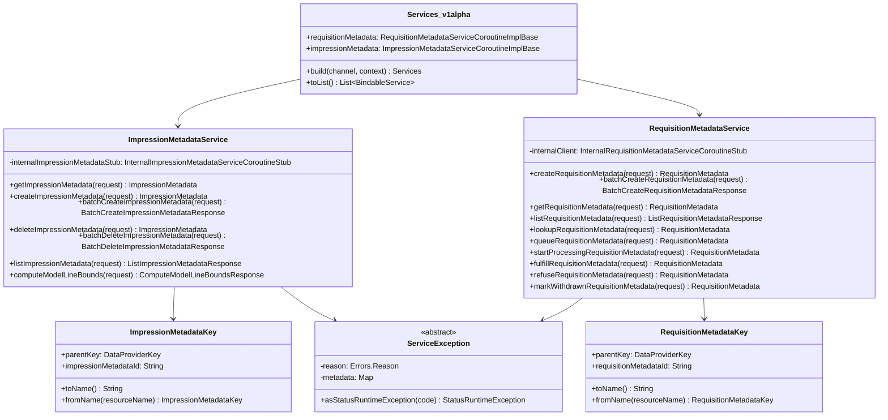

# org.wfanet.measurement.edpaggregator.service

## Overview
The EDP Aggregator service package provides gRPC service implementations for managing requisition and impression metadata in the Cross-Media Measurement system. It includes both internal and public v1alpha API implementations, resource key management, error handling, and utilities for resource name parsing.

## Components

### IdVariable
Internal enum defining resource identifier variables for resource name parsing.

| Enum Value | Description |
|------------|-------------|
| REQUISITION | Requisition resource identifier |
| REQUISITION_METADATA | Requisition metadata resource identifier |
| REQUISITION_METADATA_ACTION | Requisition metadata action identifier |
| IMPRESSION_METADATA | Impression metadata resource identifier |
| DATA_PROVIDER | Data provider resource identifier |
| MODEL_LINE | Model line resource identifier |
| REPORT | Report resource identifier |
| WORK_ITEM | Work item resource identifier |

### IdVariable Extensions

| Method | Parameters | Returns | Description |
|--------|------------|---------|-------------|
| assembleName | `idMap: Map<IdVariable, String>` | `String` | Assembles resource name from ID variable map |
| parseIdVars | `resourceName: String` | `Map<IdVariable, String>?` | Parses resource name into ID variable map |

### ImpressionMetadataKey
Resource key for ImpressionMetadata resources with DataProvider parent.

| Property | Type | Description |
|----------|------|-------------|
| parentKey | `DataProviderKey` | Parent data provider key |
| impressionMetadataId | `String` | Unique impression metadata identifier |
| dataProviderId | `String` | Data provider identifier from parent |

| Method | Parameters | Returns | Description |
|--------|------------|---------|-------------|
| toName | - | `String` | Converts key to resource name string |
| fromName | `resourceName: String` | `ImpressionMetadataKey?` | Parses resource name to key |

### RequisitionMetadataKey
Resource key for RequisitionMetadata resources with DataProvider parent.

| Property | Type | Description |
|----------|------|-------------|
| parentKey | `DataProviderKey` | Parent data provider key |
| requisitionMetadataId | `String` | Unique requisition metadata identifier |
| dataProviderId | `String` | Data provider identifier from parent |

| Method | Parameters | Returns | Description |
|--------|------------|---------|-------------|
| toName | - | `String` | Converts key to resource name string |
| fromName | `resourceName: String` | `RequisitionMetadataKey?` | Parses resource name to key |

## Data Structures

### Errors (Public API)

| Enum | Values | Description |
|------|--------|-------------|
| Reason | IMPRESSION_METADATA_NOT_FOUND, IMPRESSION_METADATA_ALREADY_EXISTS, REQUISITION_METADATA_NOT_FOUND, REQUISITION_METADATA_NOT_FOUND_BY_CMMS_REQUISITION, REQUISITION_METADATA_ALREADY_EXISTS, REQUISITION_METADATA_ALREADY_EXISTS_BY_BLOB_URI, REQUISITION_METADATA_ALREADY_EXISTS_BY_CMMS_REQUISITION, REQUISITION_METADATA_STATE_INVALID, DATA_PROVIDER_MISMATCH, ETAG_MISMATCH, REQUIRED_FIELD_NOT_SET, INVALID_FIELD_VALUE | Error reason codes |
| Metadata | PARENT, DATA_PROVIDER, REQUISITION_METADATA, CMMS_REQUISITION, BLOB_URI, REQUISITION_METADATA_STATE, EXPECTED_REQUISITION_METADATA_STATES, REQUEST_ETAG, ETAG, IMPRESSION_METADATA, FIELD_NAME | Error metadata keys |

### ServiceException (Public API)
Base sealed class for service exceptions with gRPC error info.

| Method | Parameters | Returns | Description |
|--------|------------|---------|-------------|
| asStatusRuntimeException | `code: Status.Code` | `StatusRuntimeException` | Converts to gRPC status exception |

### Exception Classes

| Exception | Description |
|-----------|-------------|
| RequisitionMetadataNotFoundException | Requisition metadata not found by resource ID |
| RequisitionMetadataNotFoundByCmmsRequisitionException | Requisition metadata not found by CMMS requisition |
| RequisitionMetadataAlreadyExistsException | Requisition metadata already exists |
| RequisitionMetadataAlreadyExistsByBlobUriException | Requisition metadata exists with blob URI |
| RequisitionMetadataAlreadyExistsByCmmsRequisitionException | Requisition metadata exists with CMMS requisition |
| RequisitionMetadataInvalidStateException | Requisition metadata in invalid state |
| DataProviderMismatchException | Data provider mismatch error |
| EtagMismatchException | ETag mismatch for optimistic concurrency |
| RequiredFieldNotSetException | Required field missing |
| InvalidFieldValueException | Invalid field value provided |
| ImpressionMetadataNotFoundException | Impression metadata not found |
| ImpressionMetadataAlreadyExistsException | Impression metadata already exists |

## v1alpha Services

### ImpressionMetadataService
Public API service for managing impression metadata operations.

| Method | Parameters | Returns | Description |
|--------|------------|---------|-------------|
| getImpressionMetadata | `request: GetImpressionMetadataRequest` | `ImpressionMetadata` | Retrieves impression metadata by name |
| createImpressionMetadata | `request: CreateImpressionMetadataRequest` | `ImpressionMetadata` | Creates new impression metadata |
| batchCreateImpressionMetadata | `request: BatchCreateImpressionMetadataRequest` | `BatchCreateImpressionMetadataResponse` | Creates multiple impression metadata entries |
| deleteImpressionMetadata | `request: DeleteImpressionMetadataRequest` | `ImpressionMetadata` | Deletes impression metadata |
| batchDeleteImpressionMetadata | `request: BatchDeleteImpressionMetadataRequest` | `BatchDeleteImpressionMetadataResponse` | Deletes multiple impression metadata entries |
| listImpressionMetadata | `request: ListImpressionMetadataRequest` | `ListImpressionMetadataResponse` | Lists impression metadata with pagination |
| computeModelLineBounds | `request: ComputeModelLineBoundsRequest` | `ComputeModelLineBoundsResponse` | Computes model line bounds |

### RequisitionMetadataService
Public API service for managing requisition metadata lifecycle.

| Method | Parameters | Returns | Description |
|--------|------------|---------|-------------|
| createRequisitionMetadata | `request: CreateRequisitionMetadataRequest` | `RequisitionMetadata` | Creates new requisition metadata |
| batchCreateRequisitionMetadata | `request: BatchCreateRequisitionMetadataRequest` | `BatchCreateRequisitionMetadataResponse` | Creates multiple requisition metadata entries |
| getRequisitionMetadata | `request: GetRequisitionMetadataRequest` | `RequisitionMetadata` | Retrieves requisition metadata by name |
| listRequisitionMetadata | `request: ListRequisitionMetadataRequest` | `ListRequisitionMetadataResponse` | Lists requisition metadata with filtering |
| lookupRequisitionMetadata | `request: LookupRequisitionMetadataRequest` | `RequisitionMetadata` | Looks up requisition by CMMS requisition |
| fetchLatestCmmsCreateTime | `request: FetchLatestCmmsCreateTimeRequest` | `Timestamp` | Fetches latest CMMS creation timestamp |
| queueRequisitionMetadata | `request: QueueRequisitionMetadataRequest` | `RequisitionMetadata` | Queues requisition for processing |
| startProcessingRequisitionMetadata | `request: StartProcessingRequisitionMetadataRequest` | `RequisitionMetadata` | Starts processing requisition |
| fulfillRequisitionMetadata | `request: FulfillRequisitionMetadataRequest` | `RequisitionMetadata` | Marks requisition as fulfilled |
| refuseRequisitionMetadata | `request: RefuseRequisitionMetadataRequest` | `RequisitionMetadata` | Refuses requisition with message |
| markWithdrawnRequisitionMetadata | `request: MarkWithdrawnRequisitionMetadataRequest` | `RequisitionMetadata` | Marks requisition as withdrawn |

### Services (v1alpha)
Container for v1alpha public API services.

| Property | Type | Description |
|----------|------|-------------|
| requisitionMetadata | `RequisitionMetadataServiceCoroutineImplBase` | Requisition metadata service implementation |
| impressionMetadata | `ImpressionMetadataServiceCoroutineImplBase` | Impression metadata service implementation |

| Method | Parameters | Returns | Description |
|--------|------------|---------|-------------|
| toList | - | `List<BindableService>` | Converts services to bindable list |
| build | `internalApiChannel: Channel, coroutineContext: CoroutineContext` | `Services` | Builds services from internal channel |

## Internal Services

### Services (internal)
Container for internal API service implementations.

| Property | Type | Description |
|----------|------|-------------|
| requisitionMetadata | `RequisitionMetadataServiceCoroutineImplBase` | Internal requisition metadata service |
| impressionMetadata | `ImpressionMetadataServiceCoroutineImplBase` | Internal impression metadata service |

| Method | Parameters | Returns | Description |
|--------|------------|---------|-------------|
| toList | - | `List<BindableService>` | Converts services to bindable list |

### Errors (Internal API)

| Constant | Value | Description |
|----------|-------|-------------|
| DOMAIN | "internal.edpaggregator.halo-cmm.org" | Error domain for internal API |

| Method | Parameters | Returns | Description |
|--------|------------|---------|-------------|
| getReason | `exception: StatusException` | `Reason?` | Extracts reason from exception |
| getReason | `errorInfo: ErrorInfo` | `Reason?` | Extracts reason from error info |
| parseMetadata | `errorInfo: ErrorInfo` | `Map<Metadata, String>` | Parses error metadata |

## Extension Functions

### ImpressionMetadata Conversions

| Function | Parameters | Returns | Description |
|----------|------------|---------|-------------|
| toImpressionMetadata | `this: InternalImpressionMetadata` | `ImpressionMetadata` | Converts internal to public model |
| toInternal | `this: ImpressionMetadata, dataProviderKey: DataProviderKey, impressionMetadataKey: ImpressionMetadataKey?` | `InternalImpressionMetadata` | Converts public to internal model |
| toState | `this: InternalImpressionMetadataState` | `ImpressionMetadata.State` | Converts internal state to public |
| toInternal | `this: ImpressionMetadata.State` | `InternalImpressionMetadataState` | Converts public state to internal |

### RequisitionMetadata Conversions

| Function | Parameters | Returns | Description |
|----------|------------|---------|-------------|
| toRequisitionMetadata | `this: InternalRequisitionMetadata` | `RequisitionMetadata` | Converts internal to public model |
| toInternal | `this: RequisitionMetadata, dataProviderKey: DataProviderKey, requisitionMetadataKey: RequisitionMetadataKey?` | `InternalRequisitionMetadata` | Converts public to internal model |
| toState | `this: InternalState` | `RequisitionMetadata.State` | Converts internal state to public |
| toInternalState | `this: RequisitionMetadata.State` | `InternalState` | Converts public state to internal |

## Dependencies

- `org.wfanet.measurement.common` - Resource name parsing and base64 utilities
- `org.wfanet.measurement.common.api` - Resource key interfaces
- `org.wfanet.measurement.common.grpc` - gRPC error handling utilities
- `org.wfanet.measurement.api.v2alpha` - Data provider and model line keys
- `org.wfanet.measurement.edpaggregator.v1alpha` - Public API protocol definitions
- `org.wfanet.measurement.internal.edpaggregator` - Internal API protocol definitions
- `org.wfanet.measurement.reporting.service.api.v2alpha` - Report key definitions
- `org.wfanet.measurement.securecomputation.service` - Work item key definitions
- `io.grpc` - gRPC framework
- `com.google.protobuf` - Protocol buffer support
- `com.google.rpc` - Google RPC error model

## Usage Example

```kotlin
// Build v1alpha services
val internalChannel: Channel = // ... internal API channel
val services = Services.build(internalChannel)

// Create impression metadata
val createRequest = CreateImpressionMetadataRequest.newBuilder()
  .setParent("dataProviders/123")
  .setImpressionMetadata(
    ImpressionMetadata.newBuilder()
      .setBlobUri("gs://bucket/impression-data")
      .setBlobTypeUrl("type.googleapis.com/ImpressionData")
      .setEventGroupReferenceId("event-group-1")
      .setModelLine("modelLines/ml-1")
      .setInterval(Interval.newBuilder().setStartTime(timestamp).setEndTime(timestamp))
  )
  .setRequestId(UUID.randomUUID().toString())
  .build()

val impressionMetadata = services.impressionMetadata.createImpressionMetadata(createRequest)

// Lookup requisition metadata
val lookupRequest = LookupRequisitionMetadataRequest.newBuilder()
  .setParent("dataProviders/123")
  .setCmmsRequisition("dataProviders/123/requisitions/456")
  .build()

val requisitionMetadata = services.requisitionMetadata.lookupRequisitionMetadata(lookupRequest)

// Queue requisition for processing
val queueRequest = QueueRequisitionMetadataRequest.newBuilder()
  .setName(requisitionMetadata.name)
  .setEtag(requisitionMetadata.etag)
  .setWorkItem("workItems/789")
  .build()

val queuedMetadata = services.requisitionMetadata.queueRequisitionMetadata(queueRequest)
```

## Class Diagram


