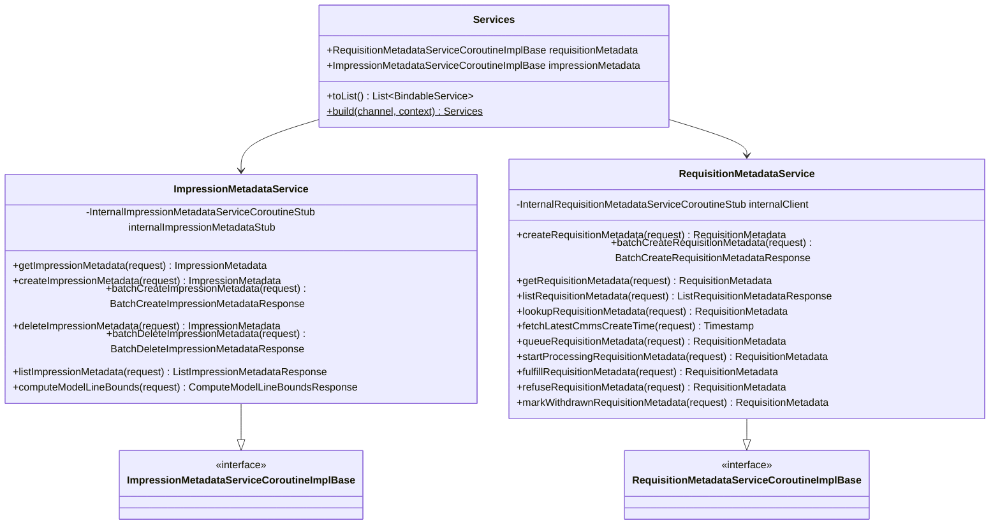

# org.wfanet.measurement.edpaggregator.service.v1alpha

## Overview
This package provides public gRPC service implementations for managing impression metadata and requisition metadata in the EDP Aggregator system. The services act as translation layers between the public v1alpha API and internal storage layer, handling request validation, key parsing, error mapping, and state conversions.

## Components

### ImpressionMetadataService
Public gRPC service for managing impression metadata resources with CRUD operations and batch processing capabilities.

| Method | Parameters | Returns | Description |
|--------|------------|---------|-------------|
| getImpressionMetadata | `request: GetImpressionMetadataRequest` | `ImpressionMetadata` | Retrieves impression metadata by name |
| createImpressionMetadata | `request: CreateImpressionMetadataRequest` | `ImpressionMetadata` | Creates new impression metadata with deduplication via requestId |
| batchCreateImpressionMetadata | `request: BatchCreateImpressionMetadataRequest` | `BatchCreateImpressionMetadataResponse` | Creates multiple impression metadata in single transaction |
| deleteImpressionMetadata | `request: DeleteImpressionMetadataRequest` | `ImpressionMetadata` | Soft-deletes impression metadata by name |
| batchDeleteImpressionMetadata | `request: BatchDeleteImpressionMetadataRequest` | `BatchDeleteImpressionMetadataResponse` | Deletes multiple impression metadata in single transaction |
| listImpressionMetadata | `request: ListImpressionMetadataRequest` | `ListImpressionMetadataResponse` | Lists impression metadata with filtering and pagination |
| computeModelLineBounds | `request: ComputeModelLineBoundsRequest` | `ComputeModelLineBoundsResponse` | Computes time bounds for specified model lines |
| validateImpressionMetadataRequest | `request: CreateImpressionMetadataRequest, fieldPathPrefix: String` | `Unit` | Validates create request fields |

**Constructor Parameters:**
- `internalImpressionMetadataStub: InternalImpressionMetadataServiceCoroutineStub` - Internal service client
- `coroutineContext: CoroutineContext` - Context for coroutine execution (defaults to EmptyCoroutineContext)

**Key Features:**
- Request ID validation with UUID format enforcement
- Deduplication via request IDs in batch operations
- Blob URI uniqueness enforcement within batches
- Page token encoding/decoding with Base64URL
- State filtering (ACTIVE/DELETED)
- Model line and event group reference ID filtering
- Default page size: 50, max page size: 100

### RequisitionMetadataService
Public gRPC service for managing requisition metadata with state machine transitions and workflow operations.

| Method | Parameters | Returns | Description |
|--------|------------|---------|-------------|
| createRequisitionMetadata | `request: CreateRequisitionMetadataRequest` | `RequisitionMetadata` | Creates new requisition metadata |
| batchCreateRequisitionMetadata | `request: BatchCreateRequisitionMetadataRequest` | `BatchCreateRequisitionMetadataResponse` | Creates multiple requisition metadata in batch |
| getRequisitionMetadata | `request: GetRequisitionMetadataRequest` | `RequisitionMetadata` | Retrieves requisition metadata by resource name |
| listRequisitionMetadata | `request: ListRequisitionMetadataRequest` | `ListRequisitionMetadataResponse` | Lists requisition metadata with filtering and pagination |
| lookupRequisitionMetadata | `request: LookupRequisitionMetadataRequest` | `RequisitionMetadata` | Looks up by CMMS requisition key |
| fetchLatestCmmsCreateTime | `request: FetchLatestCmmsCreateTimeRequest` | `Timestamp` | Retrieves latest CMMS creation timestamp |
| queueRequisitionMetadata | `request: QueueRequisitionMetadataRequest` | `RequisitionMetadata` | Transitions to QUEUED state with etag validation |
| startProcessingRequisitionMetadata | `request: StartProcessingRequisitionMetadataRequest` | `RequisitionMetadata` | Transitions to PROCESSING state |
| fulfillRequisitionMetadata | `request: FulfillRequisitionMetadataRequest` | `RequisitionMetadata` | Transitions to FULFILLED state |
| refuseRequisitionMetadata | `request: RefuseRequisitionMetadataRequest` | `RequisitionMetadata` | Transitions to REFUSED state with message |
| markWithdrawnRequisitionMetadata | `request: MarkWithdrawnRequisitionMetadataRequest` | `RequisitionMetadata` | Transitions to WITHDRAWN state |
| validateRequisitionMetadataRequest | `request: CreateRequisitionMetadataRequest, fieldPathPrefix: String` | `Unit` | Validates create request fields |

**Constructor Parameters:**
- `internalClient: InternalRequisitionMetadataServiceCoroutineStub` - Internal service client
- `coroutineContext: CoroutineContext` - Context for coroutine execution (defaults to EmptyCoroutineContext)

**State Machine:**
- STORED → QUEUED → PROCESSING → FULFILLED
- STORED → REFUSED
- STORED → WITHDRAWN

**Key Features:**
- Etag-based optimistic concurrency control for state transitions
- Data provider mismatch validation
- Duplicate detection in batches (blob URI and CMMS requisition)
- Work item association for queued requisitions
- Refusal message capture
- Default page size: 50, max page size: 100

### Services
Factory data class for constructing and managing service instances.

| Method | Parameters | Returns | Description |
|--------|------------|---------|-------------|
| toList | - | `List<BindableService>` | Converts services to bindable list for gRPC server |
| build | `internalApiChannel: Channel, coroutineContext: CoroutineContext` | `Services` | Creates service instances with internal stubs |

**Properties:**
- `requisitionMetadata: RequisitionMetadataServiceCoroutineImplBase`
- `impressionMetadata: ImpressionMetadataServiceCoroutineImplBase`

## Extension Functions

### ImpressionMetadata Conversions

| Function | Parameters | Returns | Description |
|----------|------------|---------|-------------|
| InternalImpressionMetadata.toImpressionMetadata | - | `ImpressionMetadata` | Converts internal to public representation |
| ImpressionMetadata.toInternal | `dataProviderKey: DataProviderKey, impressionMetadataKey: ImpressionMetadataKey?` | `InternalImpressionMetadata` | Converts public to internal representation |
| InternalImpressionMetadataState.toState | - | `ImpressionMetadata.State` | Converts internal state enum to public |
| ImpressionMetadata.State.toInternal | - | `InternalImpressionMetadataState` | Converts public state enum to internal |

### RequisitionMetadata Conversions

| Function | Parameters | Returns | Description |
|----------|------------|---------|-------------|
| InternalRequisitionMetadata.toRequisitionMetadata | - | `RequisitionMetadata` | Converts internal to public representation |
| RequisitionMetadata.toInternal | `dataProviderKey: DataProviderKey, requisitionMetadataKey: RequisitionMetadataKey?` | `InternalRequisitionMetadata` | Converts public to internal representation |
| InternalState.toState | - | `RequisitionMetadata.State` | Converts internal state enum to public |
| RequisitionMetadata.State.toInternalState | - | `InternalState` | Converts public state enum to internal |

## Data Structures

### ImpressionMetadata
| Property | Type | Description |
|----------|------|-------------|
| name | `String` | Resource name in format dataProviders/{dp}/impressionMetadata/{im} |
| blobUri | `String` | URI to stored impression data blob |
| blobTypeUrl | `String` | Type URL identifying blob schema |
| eventGroupReferenceId | `String` | Reference to associated event group |
| modelLine | `String` | CMMS model line resource name |
| interval | `Interval` | Time interval for impressions |
| state | `State` | Current state (ACTIVE/DELETED) |
| createTime | `Timestamp` | Creation timestamp |
| updateTime | `Timestamp` | Last update timestamp |

### RequisitionMetadata
| Property | Type | Description |
|----------|------|-------------|
| name | `String` | Resource name in format dataProviders/{dp}/requisitionMetadata/{rm} |
| cmmsRequisition | `String` | Canonical CMMS requisition resource name |
| blobUri | `String` | URI to stored requisition data blob |
| blobTypeUrl | `String` | Type URL identifying blob schema |
| groupId | `String` | Group identifier for related requisitions |
| cmmsCreateTime | `Timestamp` | Creation time from CMMS |
| report | `String` | Associated report resource name |
| workItem | `String` | Associated work item for processing |
| state | `State` | Current workflow state |
| createTime | `Timestamp` | Creation timestamp |
| updateTime | `Timestamp` | Last update timestamp |
| refusalMessage | `String` | Reason for refusal if refused |
| etag | `String` | Entity tag for optimistic locking |

## Dependencies
- `org.wfanet.measurement.edpaggregator.v1alpha` - Public API protobuf definitions
- `org.wfanet.measurement.internal.edpaggregator` - Internal API protobuf definitions
- `org.wfanet.measurement.edpaggregator.service` - Shared service exceptions and keys
- `org.wfanet.measurement.api.v2alpha` - CMMS API types (DataProviderKey, ModelLineKey, CanonicalRequisitionKey)
- `org.wfanet.measurement.reporting.service.api.v2alpha` - Reporting API types (ReportKey)
- `org.wfanet.measurement.securecomputation.service` - Work item management (WorkItemKey)
- `org.wfanet.measurement.common` - Base64URL encoding utilities
- `io.grpc` - gRPC framework for service implementation

## Error Handling

All service methods implement comprehensive error mapping from internal errors to appropriate gRPC status codes:

| Internal Error | gRPC Status Code | Exception Type |
|----------------|------------------|----------------|
| IMPRESSION_METADATA_NOT_FOUND | NOT_FOUND | ImpressionMetadataNotFoundException |
| IMPRESSION_METADATA_ALREADY_EXISTS | ALREADY_EXISTS | ImpressionMetadataAlreadyExistsException |
| REQUISITION_METADATA_NOT_FOUND | NOT_FOUND | RequisitionMetadataNotFoundException |
| REQUISITION_METADATA_ALREADY_EXISTS | ALREADY_EXISTS | RequisitionMetadataAlreadyExistsException |
| REQUISITION_METADATA_ALREADY_EXISTS_BY_BLOB_URI | ALREADY_EXISTS | RequisitionMetadataAlreadyExistsByBlobUriException |
| REQUISITION_METADATA_ALREADY_EXISTS_BY_CMMS_REQUISITION | ALREADY_EXISTS | RequisitionMetadataAlreadyExistsByCmmsRequisitionException |
| REQUISITION_METADATA_NOT_FOUND_BY_CMMS_REQUISITION | NOT_FOUND | RequisitionMetadataNotFoundByCmmsRequisitionException |
| DATA_PROVIDER_MISMATCH | INVALID_ARGUMENT | DataProviderMismatchException |
| ETAG_MISMATCH | FAILED_PRECONDITION | EtagMismatchException |
| REQUIRED_FIELD_NOT_SET | INVALID_ARGUMENT | RequiredFieldNotSetException |
| INVALID_FIELD_VALUE | INVALID_ARGUMENT | InvalidFieldValueException |
| Unknown errors | INTERNAL | RuntimeException |

## Usage Example
```kotlin
// Build services
val channel: Channel = ManagedChannelBuilder.forTarget("localhost:8080").build()
val services = Services.build(channel)

// Create impression metadata
val impressionMetadata = services.impressionMetadata.createImpressionMetadata(
  createImpressionMetadataRequest {
    parent = "dataProviders/123"
    requestId = UUID.randomUUID().toString()
    impressionMetadata = impressionMetadata {
      blobUri = "gs://bucket/impressions.avro"
      blobTypeUrl = "type.googleapis.com/wfa.measurement.ImpressionData"
      eventGroupReferenceId = "event-group-1"
      modelLine = "dataProviders/123/modelLines/456"
      interval = interval {
        startTime = timestamp { seconds = 1000 }
        endTime = timestamp { seconds = 2000 }
      }
    }
  }
)

// Create and queue requisition metadata
val requisitionMetadata = services.requisitionMetadata.createRequisitionMetadata(
  createRequisitionMetadataRequest {
    parent = "dataProviders/123"
    requestId = UUID.randomUUID().toString()
    requisitionMetadata = requisitionMetadata {
      cmmsRequisition = "dataProviders/123/requisitions/789"
      blobUri = "gs://bucket/requisition.avro"
      blobTypeUrl = "type.googleapis.com/wfa.measurement.RequisitionData"
      groupId = "group-1"
      cmmsCreateTime = timestamp { seconds = 1000 }
      report = "measurementConsumers/mc/reports/rpt"
    }
  }
)

val queued = services.requisitionMetadata.queueRequisitionMetadata(
  queueRequisitionMetadataRequest {
    name = requisitionMetadata.name
    etag = requisitionMetadata.etag
    workItem = "workItems/work-123"
  }
)

// List with filtering
val listResponse = services.impressionMetadata.listImpressionMetadata(
  listImpressionMetadataRequest {
    parent = "dataProviders/123"
    pageSize = 50
    filter = filter {
      modelLine = "dataProviders/123/modelLines/456"
      eventGroupReferenceId = "event-group-1"
    }
  }
)

// Bind to gRPC server
val server = ServerBuilder.forPort(8080)
  .addServices(services.toList())
  .build()
  .start()
```

## Class Diagram

