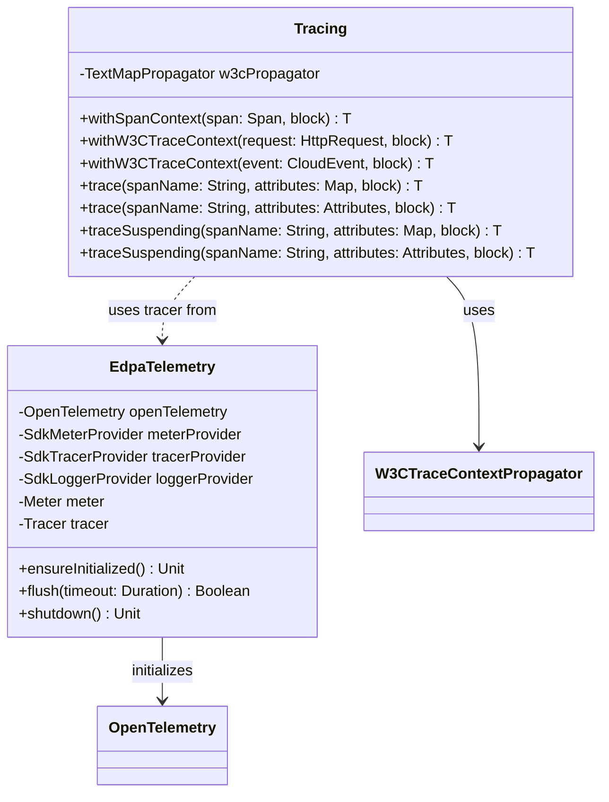

# org.wfanet.measurement.edpaggregator.telemetry

## Overview
Provides OpenTelemetry SDK initialization and distributed tracing utilities for EDP (Event Data Provider) Aggregator components. This package manages telemetry lifecycle including metrics, traces, and logs export to Google Cloud, with specialized support for Cloud Functions environments and W3C trace context propagation.

## Components

### EdpaTelemetry
Singleton object managing OpenTelemetry SDK initialization, JVM runtime metrics, and telemetry lifecycle.

| Method | Parameters | Returns | Description |
|--------|------------|---------|-------------|
| ensureInitialized | - | `Unit` | Triggers initialization of the object's init block |
| flush | `timeout: Duration` (default 5s) | `Boolean` | Forces parallel export of pending metrics, traces, and logs |
| shutdown | - | `Unit` | Shuts down SDK and flushes all telemetry |

**Initialization Behavior:**
- Auto-initializes on first access via object init block
- Configures SDK using environment variables (OTEL_SERVICE_NAME, OTEL_METRICS_EXPORTER, OTEL_TRACES_EXPORTER, OTEL_METRIC_EXPORT_INTERVAL)
- Registers JVM runtime metrics observers (Classes, CPU, GarbageCollector, MemoryPools, Threads)
- Creates global meter and tracer instances with instrumentation scope "edpa-instrumentation"

### Tracing
Singleton object providing distributed tracing helpers with W3C trace context propagation support.

| Method | Parameters | Returns | Description |
|--------|------------|---------|-------------|
| withSpanContext | `span: Span, block: () -> T` | `T` | Executes block with span set as current context |
| withW3CTraceContext | `request: HttpRequest, block: () -> T` | `T` | Extracts W3C context from HTTP request and executes block |
| withW3CTraceContext | `event: CloudEvent, block: () -> T` | `T` | Extracts W3C context from CloudEvent and executes block |
| trace | `spanName: String, attributes: Map<String, String>, block: () -> T` | `T` | Executes synchronous block within a new internal span |
| trace | `spanName: String, attributes: Attributes, block: () -> T` | `T` | Executes synchronous block with pre-built attributes |
| traceSuspending | `spanName: String, attributes: Map<String, String>, block: suspend () -> T` | `T` | Executes suspending block within a new span |
| traceSuspending | `spanName: String, attributes: Attributes, block: suspend () -> T` | `T` | Executes suspending block with coroutine context propagation |

**Internal Objects:**
- `CloudFunctionsHttpRequestGetter`: Extracts headers from Google Cloud Functions HttpRequest with case-insensitive lookup
- `CloudEventGetter`: Extracts traceparent/tracestate from CloudEvent extension attributes per CloudEvents Distributed Tracing Extension spec

## Top-Level Functions

### withSpan
Executes a block within a traced span with automatic lifecycle management and exception handling.

| Parameter | Type | Description |
|-----------|------|-------------|
| tracer | `Tracer` | OpenTelemetry tracer instance |
| spanName | `String` | Name of the span |
| attributes | `Attributes` | Initial span attributes (default: empty) |
| errorMessage | `String` | Fallback error message (default: "Operation failed") |
| block | `(Span) -> T` | Block to execute with span access |

**Returns:** `T` - Result of the block execution

**Behavior:**
- Starts span and makes it current before block execution
- Sets span status to OK on success
- Records exception and sets ERROR status on failure
- Re-throws CancellationException without recording as error
- Always ends span in finally block

### Map<String, String>.toAttributes
Converts a string map to OpenTelemetry Attributes.

| Parameter | Type | Description |
|-----------|------|-------------|
| receiver | `Map<String, String>` | Map of attribute key-value pairs |

**Returns:** `Attributes` - OpenTelemetry attributes object

## Dependencies
- `io.opentelemetry:opentelemetry-api` - Core OpenTelemetry API for spans, traces, and metrics
- `io.opentelemetry:opentelemetry-sdk` - SDK implementation with autoconfiguration support
- `io.opentelemetry:opentelemetry-instrumentation-runtimemetrics-java8` - JVM runtime metrics collection
- `com.google.cloud.functions:functions-framework-api` - Google Cloud Functions HttpRequest support
- `io.cloudevents:cloudevents-core` - CloudEvent model for event-driven architectures
- `org.wfanet.measurement.common.Instrumentation` - Shared OpenTelemetry singleton instance

## Usage Example
```kotlin
// Initialize telemetry (automatic on first access)
EdpaTelemetry.ensureInitialized()

// Cloud Function with W3C trace context propagation
fun handleHttpRequest(request: HttpRequest): HttpResponse {
  return Tracing.withW3CTraceContext(request) {
    Tracing.trace("ProcessRequest", mapOf("user_id" to userId)) {
      processRequest(request)
    }
  }.also {
    EdpaTelemetry.flush() // Critical for Cloud Functions
  }
}

// CloudEvent handler with suspending operations
suspend fun handleCloudEvent(event: CloudEvent) {
  Tracing.withW3CTraceContext(event) {
    Tracing.traceSuspending("ProcessEvent", mapOf("event_type" to event.type)) {
      processEventAsync(event)
    }
  }
  EdpaTelemetry.flush()
}

// Custom span with exception handling
val tracer = Instrumentation.openTelemetry.getTracer("my-service")
val result = withSpan(
  tracer,
  "DatabaseQuery",
  Attributes.of(stringKey("table"), "users"),
  errorMessage = "Database query failed"
) { span ->
  span.setAttribute("query_id", queryId)
  executeQuery()
}
```

## Class Diagram

