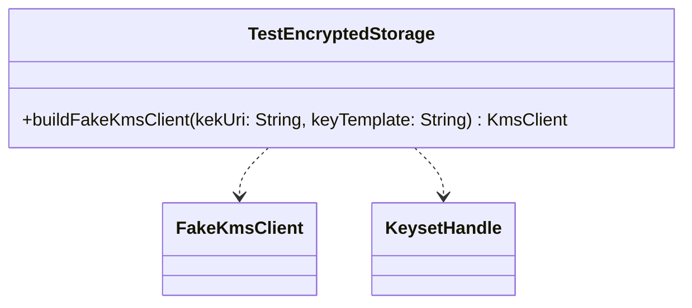

# org.wfanet.measurement.edpaggregator.testing

## Overview
Provides testing utilities for encrypted storage in the EDP Aggregator. This package contains helper functions for creating fake KMS clients configured with encryption keys for use in test scenarios.

## Components

### TestEncryptedStorage
Singleton object providing utility functions for test encrypted storage operations.

| Method | Parameters | Returns | Description |
|--------|------------|---------|-------------|
| buildFakeKmsClient | `kekUri: String`, `keyTemplate: String` | `KmsClient` | Creates a fake KMS client with generated key encryption key |

## Dependencies
- `com.google.crypto.tink` - Provides cryptographic primitives and key management
- `org.wfanet.measurement.common.crypto.tink.testing` - Supplies FakeKmsClient for testing

## Usage Example
```kotlin
val kekUri = "fake-kms://test-key"
val keyTemplate = "AES256_GCM"
val kmsClient = TestEncryptedStorage.buildFakeKmsClient(kekUri, keyTemplate)
// Use kmsClient in tests requiring encrypted storage
```

## Class Diagram

