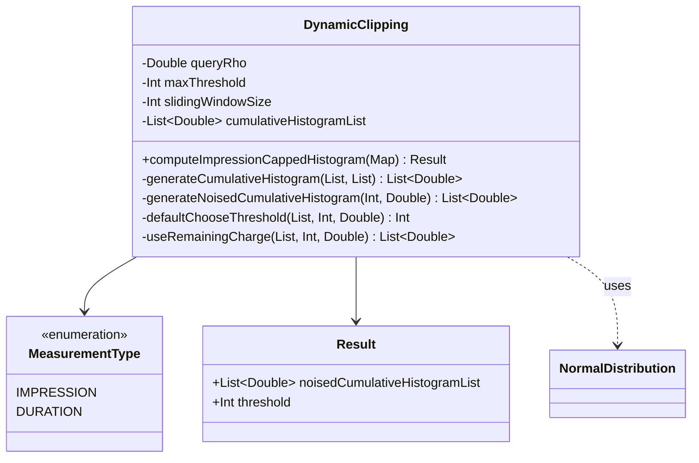

# org.wfanet.measurement.eventdataprovider.differentialprivacy

## Overview
This package implements differential privacy mechanisms for event data processing, specifically the Dynamic Clipping algorithm for impression and duration measurements. It provides ACDP (Approximate Concentrated Differential Privacy) composition with Gaussian noise to compute capped noised cumulative histograms and optimized dynamic thresholds.

## Components

### DynamicClipping
Computes impression or duration measurement's capped noised cumulative histogram and optimized dynamic threshold using the Dynamic Clipping algorithm with ACDP parameters and Gaussian noise composition.

**Constructor Parameters**
| Parameter | Type | Description |
|-----------|------|-------------|
| queryRho | `Double` | ACDP rho of the query converted from dpParams (epsilon, delta) |
| measurementType | `MeasurementType` | Impression or Duration measurement type |
| maxThreshold | `Int` | Maximum threshold in the cumulative histogram list (optional, defaults based on measurement type) |

**Public Methods**
| Method | Parameters | Returns | Description |
|--------|------------|---------|-------------|
| computeImpressionCappedHistogram | `frequencyMap: Map<Long, Long>` | `Result` | Computes impression's capped noised cumulative histogram and optimized dynamic threshold using iterative refinement |

**Private Methods**
| Method | Parameters | Returns | Description |
|--------|------------|---------|-------------|
| generateCumulativeHistogram | `histogramList: List<Long>`, `durationTruncatedList: List<Double>` | `List<Double>` | Converts a histogram list into a cumulative histogram list |
| generateNoisedCumulativeHistogram | `maxThreshold: Int`, `rho: Double` | `List<Double>` | Generates noised cumulative histogram using Gaussian noise based on privacy charge |
| defaultChooseThreshold | `noisedCumulativeHistogramList: List<Double>`, `maxThreshold: Int`, `rho: Double` | `Int` | Chooses clipping threshold based on sliding window stopping criterion |
| useRemainingCharge | `noisedCumulativeHistogramList1: List<Double>`, `maxThreshold: Int`, `rhoRemaining: Double` | `List<Double>` | Improves noised cumulative histogram estimates below threshold using remaining privacy charge |

### MeasurementType
Enum defining supported measurement types for Dynamic Clipping.

| Value | Description |
|-------|-------------|
| IMPRESSION | Impression-based measurements |
| DURATION | Duration-based measurements |

## Data Structures

### Result
Represents the Dynamic Clipping computation result for impression or duration measurements.

| Property | Type | Description |
|----------|------|-------------|
| noisedCumulativeHistogramList | `List<Double>` | Cumulative histogram with Gaussian noise added to each bar |
| threshold | `Int` | Optimized dynamic impression/duration cutoff threshold |

## Constants

| Constant | Value | Description |
|----------|-------|-------------|
| IMPRESSION_MAX_THRESHOLD | 200 | Default maximum threshold for impression measurements |
| DURATION_MAX_THRESHOLD | 1800 | Default maximum threshold for duration measurements |
| IMPRESSION_SLIDING_WINDOW_SIZE | 3 | Sliding window size for impression threshold selection |
| DURATION_SLIDING_WINDOW_SIZE | 30 | Sliding window size for duration threshold selection |
| BAR_SENSITIVITY | 1.0 | Sensitivity parameter for histogram bars |

## Dependencies
- `kotlin.math` - Mathematical operations (max, min, sqrt)
- `org.apache.commons.math3.distribution.NormalDistribution` - Gaussian noise generation
- `org.jetbrains.annotations.VisibleForTesting` - Testing visibility annotations

## Usage Example
```kotlin
import org.wfanet.measurement.eventdataprovider.differentialprivacy.DynamicClipping
import org.wfanet.measurement.eventdataprovider.differentialprivacy.DynamicClipping.MeasurementType

// Create Dynamic Clipping instance for impression measurements
val dynamicClipping = DynamicClipping(
    queryRho = 0.5,
    measurementType = MeasurementType.IMPRESSION
)

// Frequency map: key = impression count, value = number of users with that count
val frequencyMap = mapOf(
    1L to 100L,
    2L to 50L,
    3L to 25L,
    5L to 10L
)

// Compute capped noised histogram and optimal threshold
val result = dynamicClipping.computeImpressionCappedHistogram(frequencyMap)

println("Optimal threshold: ${result.threshold}")
println("Noised cumulative histogram: ${result.noisedCumulativeHistogramList}")
```

## Algorithm Details

### Dynamic Clipping Process
1. **Initial Histogram Generation**: Converts frequency map to cumulative histogram
2. **First Pass Noising**: Applies Gaussian noise with full privacy budget to estimate initial threshold
3. **Refinement**: Reduces maximum threshold to 1.5× initial threshold to improve accuracy
4. **Second Pass Noising**: Combines previous noised histogram with new estimate using variance-weighted averaging
5. **Final Adjustment**: Uses remaining privacy charge to further refine estimates below final threshold

### Privacy Composition
The algorithm uses ACDP composition, distributing the privacy budget (rho) across multiple histogram estimations and combining them optimally based on variance weights.

### Threshold Selection
Uses a sliding window stopping criterion: threshold is selected when the sum of consecutive bars in the sliding window falls below a termination sum based on bar sensitivity and privacy parameters.

## Class Diagram

