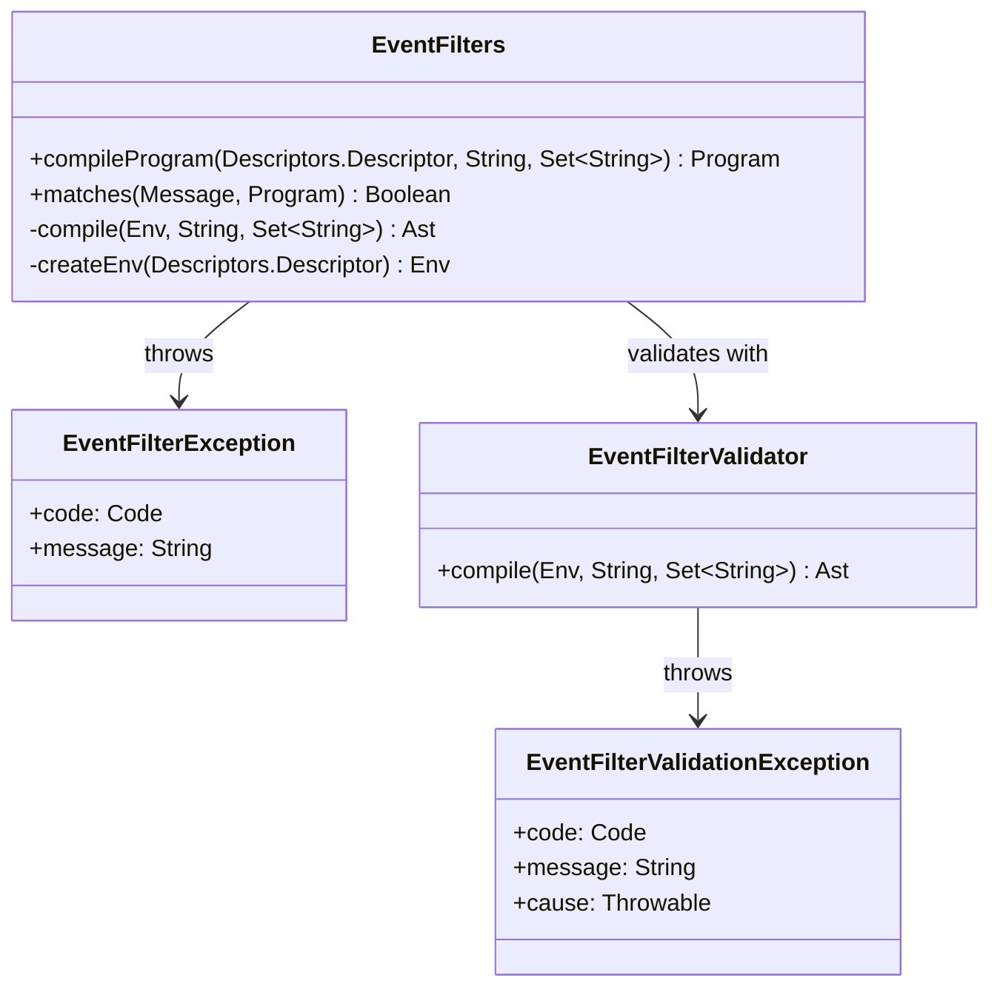

# org.wfanet.measurement.eventdataprovider.eventfiltration

## Overview
This package provides event filtering functionality using Common Expression Language (CEL) expressions to evaluate event messages against predicates. It compiles CEL expressions into executable programs, validates them according to Halo rules, and evaluates events to determine if they match specified filter criteria. The package handles normalization to operative negation normal form and enforces strict validation constraints for supported operations.

## Components

### EventFilters
Singleton object providing the primary API for compiling and executing event filter programs.

| Method | Parameters | Returns | Description |
|--------|------------|---------|-------------|
| compileProgram | `eventMessageDescriptor: Descriptors.Descriptor`, `celExpr: String`, `operativeFields: Set<String>` | `Program` | Compiles CEL expression into executable program |
| matches | `event: Message`, `program: Program` | `Boolean` | Evaluates event against compiled program |

### EventFilterException
Exception thrown during filter program evaluation when errors occur.

| Property | Type | Description |
|----------|------|-------------|
| code | `Code` | Error category for the exception |

#### Code Enum
| Value | Description |
|-------|-------------|
| EVALUATION_ERROR | Filter evaluation result is an error |
| INVALID_RESULT | Filter expression does not evaluate to a boolean |

### EventFilterValidator
Singleton validator object that compiles and validates CEL expressions according to Halo rules.

| Method | Parameters | Returns | Description |
|--------|------------|---------|-------------|
| compile | `env: Env`, `celExpression: String`, `operativeFields: Set<String>` | `Ast` | Validates and compiles CEL expression to AST |

### EventFilterValidationException
Exception thrown during CEL expression validation when the expression violates Halo rules.

| Property | Type | Description |
|----------|------|-------------|
| code | `Code` | Error category for validation failure |

#### Code Enum
| Value | Description |
|-------|-------------|
| INVALID_CEL_EXPRESSION | Expression cannot be interpreted as valid CEL |
| UNSUPPORTED_OPERATION | Expression uses unsupported CEL operation |
| INVALID_VALUE_TYPE | CEL value has invalid type for Halo |
| FIELD_COMPARISON_OUTSIDE_LEAF | Field comparison not done within leaf node |
| EXPRESSION_IS_NOT_CONDITIONAL | Expression is single value, not condition |
| INVALID_OPERATION_OUTSIDE_LEAF | Leaf-only operator used outside leaf |

## Dependencies
- `com.google.protobuf` - Protobuf message descriptors and messages
- `org.projectnessie.cel` - CEL compiler and runtime environment
- `org.wfanet.measurement.api.v2alpha` - Event annotation descriptors
- `org.wfanet.measurement.common.ProtoReflection` - Protobuf reflection utilities

## Usage Example
```kotlin
// Define event message descriptor
val eventDescriptor = MyEvent.getDescriptor()

// Compile filter program
val program = EventFilters.compileProgram(
    eventMessageDescriptor = eventDescriptor,
    celExpr = "event.age > 18 && event.country == 'US'",
    operativeFields = setOf("event.age", "event.country")
)

// Evaluate event
val event = MyEvent.newBuilder().build()
val matches = EventFilters.matches(event, program)
```

## Class Diagram

