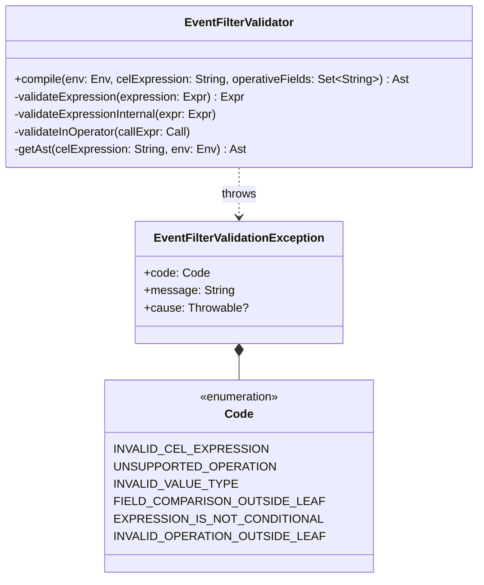

# org.wfanet.measurement.eventdataprovider.eventfiltration.validation

## Overview
This package provides validation capabilities for Common Expression Language (CEL) expressions used in event filtering within the Halo framework. It ensures that CEL expressions conform to specific structural and operational constraints required for event data provider filtration operations.

## Components

### EventFilterValidator
Validates Event Filtering CEL expressions according to Halo rules and transforms them into operative negation normal form.

| Method | Parameters | Returns | Description |
|--------|------------|---------|-------------|
| compile | `env: Env`, `celExpression: String`, `operativeFields: Set<String>` | `Ast` | Validates CEL expression and transforms to operative negation normal form |

**Validation Rules:**
- Expressions must be conditional (not single values)
- Only specific operators are allowed: boolean operators (`!_`, `_&&_`, `_||_`) and comparison operators (`_>_`, `_<_`, `_!=_`, `_==_`, `_<=_`, `@in`)
- Comparison operators can only be used in leaf expressions
- Field comparisons must occur only in leaf nodes
- Lists are only permitted on the right side of `@in` operators
- The `@in` operator requires a variable/field on the left and a list of constants on the right

**Allowed Operators:**
- Logical: `!_` (NOT), `_&&_` (AND), `_||_` (OR)
- Comparison: `_>_`, `_<_`, `_!=_`, `_==_`, `_<=_`, `@in`

### EventFilterValidationException
Custom exception thrown when CEL expression validation fails.

| Property | Type | Description |
|----------|------|-------------|
| code | `Code` | Error category indicating validation failure type |
| message | `String` | Detailed error message |
| cause | `Throwable?` | Optional underlying exception |

**Error Codes:**

| Code | Description |
|------|-------------|
| INVALID_CEL_EXPRESSION | Expression cannot be interpreted as valid CEL due to syntax or typing |
| UNSUPPORTED_OPERATION | Expression uses a CEL operation not supported for Halo |
| INVALID_VALUE_TYPE | CEL value has an invalid type for Halo |
| FIELD_COMPARISON_OUTSIDE_LEAF | Field comparison is not done within a leaf node |
| EXPRESSION_IS_NOT_CONDITIONAL | Expression is a single value rather than a condition |
| INVALID_OPERATION_OUTSIDE_LEAF | Leaf-only operator used outside leaf node |

## Key Functionality

### Expression Validation
The validator ensures CEL expressions meet Halo requirements by:
1. Parsing and compiling CEL expressions using the Nessie CEL library
2. Validating expression structure (must be conditional, not single values)
3. Checking operator usage (only allowed operators, proper nesting)
4. Verifying type constraints (lists only with `@in`, constants in list literals)
5. Enforcing leaf-node constraints for field comparisons

### Operative Negation Normal Form Transformation
The validator transforms validated expressions into operative negation normal form by:
1. Applying De Morgan's laws to distribute negations
2. Filtering out non-operative field comparisons (replacing with `true`)
3. Preserving operative field comparisons and presence tests
4. Maintaining logical equivalence while simplifying the expression tree

### Special Handling
- Empty expressions are treated as tautology (`true == true`)
- Presence test nodes (`has(field)`) are recognized and preserved
- Non-operative fields (not in the operative set) are replaced with `true` constants

## Dependencies
- `com.google.api.expr.v1alpha1` - Google CEL expression AST structures
- `org.projectnessie.cel` - CEL parsing and compilation environment

## Usage Example
```kotlin
import org.projectnessie.cel.tools.ScriptHost
import org.wfanet.measurement.eventdataprovider.eventfiltration.validation.EventFilterValidator
import org.wfanet.measurement.eventdataprovider.eventfiltration.validation.EventFilterValidationException

// Create CEL environment
val env = ScriptHost.newBuilder().build()

// Define operative fields
val operativeFields = setOf("person.age", "person.name")

// Validate and compile expression
try {
  val ast = EventFilterValidator.compile(
    env,
    "person.age > 18 && person.name == \"John\"",
    operativeFields
  )
  // Use the validated AST for event filtering
} catch (e: EventFilterValidationException) {
  when (e.code) {
    EventFilterValidationException.Code.INVALID_CEL_EXPRESSION ->
      println("Invalid CEL syntax: ${e.message}")
    EventFilterValidationException.Code.UNSUPPORTED_OPERATION ->
      println("Unsupported operator: ${e.message}")
    else -> println("Validation failed: ${e.message}")
  }
}
```

## Class Diagram

