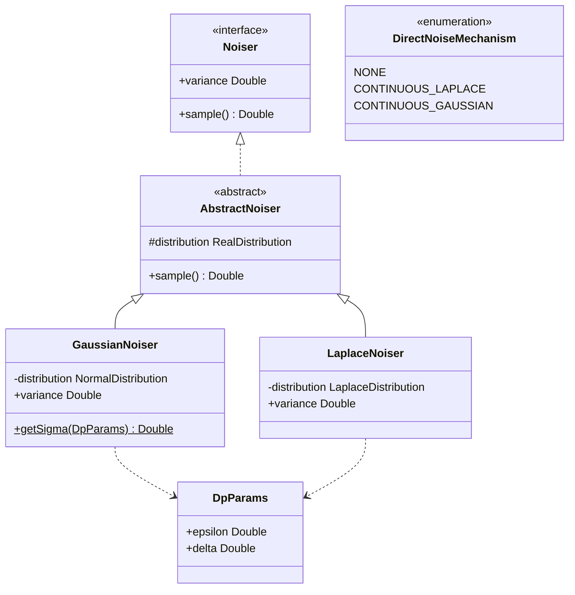

# org.wfanet.measurement.eventdataprovider.noiser

## Overview
This package provides differential privacy noise mechanisms for direct measurements in the Event Data Provider system. It implements Laplace and Gaussian noise generators that satisfy differential privacy guarantees (epsilon, delta) for protecting sensitive measurement data. The package follows a hierarchy pattern with an abstract base class and concrete implementations for different noise distributions.

## Components

### Noiser
Base interface defining the contract for noise generators used in differential privacy applications.

| Method | Parameters | Returns | Description |
|--------|------------|---------|-------------|
| sample | - | `Double` | Generates random noise value from the distribution |

| Property | Type | Description |
|----------|------|-------------|
| variance | `Double` | Variance of the noise distribution |

### AbstractNoiser
Abstract base class implementing common functionality for distribution-based noise generators.

| Method | Parameters | Returns | Description |
|--------|------------|---------|-------------|
| sample | - | `Double` | Samples from the underlying distribution |

| Property | Type | Description |
|----------|------|-------------|
| distribution | `RealDistribution` | Apache Commons Math distribution instance |

### GaussianNoiser
Implements Gaussian (normal) noise mechanism for differential privacy with (epsilon, delta) guarantees.

| Method | Parameters | Returns | Description |
|--------|------------|---------|-------------|
| getSigma | `privacyParams: DpParams` | `Double` | Computes standard deviation for privacy parameters |

| Property | Type | Description |
|----------|------|-------------|
| distribution | `NormalDistribution` | Gaussian distribution with computed sigma |
| variance | `Double` | Numerical variance of the Gaussian distribution |

**Constructor**: `GaussianNoiser(privacyParams: DpParams, random: Random)`

**Key Features**:
- Solves transcendental equation to determine sigma from epsilon and delta
- Uses bisection search with Apache Commons Math solver
- Memoizes sigma computation results in concurrent hash map
- Assumes sensitivity = 1 in privacy calculations

### LaplaceNoiser
Implements Laplace noise mechanism for differential privacy with epsilon guarantees.

| Method | Parameters | Returns | Description |
|--------|------------|---------|-------------|
| - | - | - | Inherits sample() from AbstractNoiser |

| Property | Type | Description |
|----------|------|-------------|
| distribution | `LaplaceDistribution` | Laplace distribution with scale 1/epsilon |
| variance | `Double` | Numerical variance of the Laplace distribution |

**Constructor**: `LaplaceNoiser(privacyParams: DpParams, random: Random)`

## Data Structures

### DpParams
| Property | Type | Description |
|----------|------|-------------|
| epsilon | `Double` | Privacy budget parameter controlling privacy loss |
| delta | `Double` | Probability parameter for approximate differential privacy |

### DirectNoiseMechanism
Enum defining available noise mechanisms for direct measurements.

| Value | Description |
|-------|-------------|
| NONE | Testing-only mechanism with no noise |
| CONTINUOUS_LAPLACE | Laplace distribution noise mechanism |
| CONTINUOUS_GAUSSIAN | Gaussian distribution noise mechanism |

## Dependencies
- `org.apache.commons.math3.distribution` - Provides RealDistribution, NormalDistribution, and LaplaceDistribution implementations
- `org.apache.commons.math3.random` - Random number generator factory for seeding distributions
- `org.apache.commons.math3.analysis.solvers` - BisectionSolver for solving transcendental equations in Gaussian sigma calculation
- `java.util.Random` - Source of randomness for noise generation
- `java.util.concurrent.ConcurrentHashMap` - Thread-safe memoization of Gaussian sigma computations

## Usage Example
```kotlin
import org.wfanet.measurement.eventdataprovider.noiser.*
import java.util.Random

// Configure differential privacy parameters
val dpParams = DpParams(epsilon = 1.0, delta = 1e-9)
val random = Random()

// Create Laplace noiser for pure epsilon-DP
val laplaceNoiser = LaplaceNoiser(dpParams, random)
val laplaceNoise = laplaceNoiser.sample()

// Create Gaussian noiser for (epsilon, delta)-DP
val gaussianNoiser = GaussianNoiser(dpParams, random)
val gaussianNoise = gaussianNoiser.sample()

// Access noise variance for downstream calculations
val noiseVariance = gaussianNoiser.variance
```

## Class Diagram


## Mathematical Background

### Gaussian Mechanism
The GaussianNoiser solves for standard deviation (sigma) that satisfies (epsilon, delta)-differential privacy. Given sensitivity = 1, it solves the equation:

```
delta = Φ(x - 1/σ) - exp(ε) × Φ(x)
```

where:
- `x = σε + 1/(2σ)`
- `Φ` is the standard normal CDF
- The solution uses bisection search as this is a transcendental equation

### Laplace Mechanism
The LaplaceNoiser uses scale parameter `b = 1/epsilon` for epsilon-differential privacy with sensitivity = 1.
