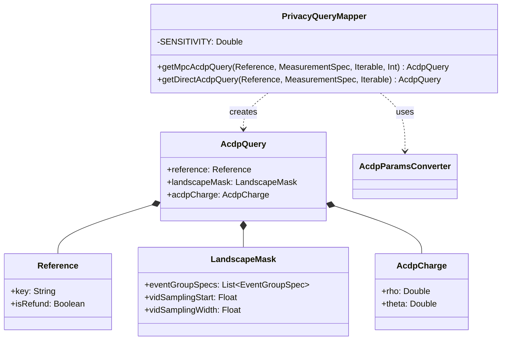

# org.wfanet.measurement.eventdataprovider.privacybudgetmanagement.api.v2alpha

## Overview
This package provides API mapping utilities for converting v2alpha protocol buffer measurement specifications into privacy budget management queries. It supports both MPC (Multi-Party Computation) and direct measurement protocols, transforming measurement specifications with differential privacy parameters into ACDP (Approximate Concentrated Differential Privacy) charges.

## Components

### PrivacyQueryMapper
Singleton object that transforms MeasurementSpec and RequisitionSpec proto messages into AcdpQuery objects for privacy budget management.

| Method | Parameters | Returns | Description |
|--------|------------|---------|-------------|
| getMpcAcdpQuery | `reference: Reference`, `measurementSpec: MeasurementSpec`, `eventSpecs: Iterable<RequisitionSpec.EventGroupEntry.Value>`, `contributorCount: Int` | `AcdpQuery` | Constructs ACDP query for MPC protocols from measurement specifications |
| getDirectAcdpQuery | `reference: Reference`, `measurementSpec: MeasurementSpec`, `eventSpecs: Iterable<RequisitionSpec.EventGroupEntry.Value>` | `AcdpQuery` | Constructs ACDP query for direct measurements from measurement specifications |

### Constants

| Constant | Value | Description |
|----------|-------|-------------|
| SENSITIVITY | 1.0 | Default sensitivity value for direct measurements |

## Functionality

### Measurement Type Support

**MPC Protocol (getMpcAcdpQuery)**
- REACH: Converts reach privacy parameters to ACDP charge using contributor count
- REACH_AND_FREQUENCY: Aggregates separate ACDP charges for reach and frequency components

**Direct Protocol (getDirectAcdpQuery)**
- REACH: Converts reach privacy parameters to ACDP charge with fixed sensitivity
- REACH_AND_FREQUENCY: Aggregates separate ACDP charges for reach and frequency components
- IMPRESSION: Converts impression privacy parameters to ACDP charge
- DURATION: Converts duration privacy parameters to ACDP charge

### Privacy Budget Calculation
Both methods extract differential privacy parameters (epsilon, delta) from the measurement specification and convert them to ACDP charges (rho, theta) using the AcdpParamsConverter. For reach-and-frequency measurements, charges are computed separately for reach and frequency components and then summed.

### Landscape Mask Construction
Both methods construct a LandscapeMask containing:
- Event group specifications with filter expressions and collection intervals
- VID sampling interval (start position and width)

## Dependencies
- `org.wfanet.measurement.api.v2alpha` - Measurement and requisition specification protocol buffers
- `org.wfanet.measurement.common` - Utility functions for range conversion
- `org.wfanet.measurement.eventdataprovider.noiser` - Differential privacy parameter definitions
- `org.wfanet.measurement.eventdataprovider.privacybudgetmanagement` - Core privacy budget management data structures (AcdpQuery, AcdpCharge, EventGroupSpec, LandscapeMask, Reference, AcdpParamsConverter)

## Usage Example
```kotlin
// MPC measurement query
val mpcQuery = PrivacyQueryMapper.getMpcAcdpQuery(
  reference = Reference(key = "measurement-123", isRefund = false),
  measurementSpec = measurementSpec,
  eventSpecs = requisitionSpec.eventGroupsList.flatMap { it.valueList },
  contributorCount = 3
)

// Direct measurement query
val directQuery = PrivacyQueryMapper.getDirectAcdpQuery(
  reference = Reference(key = "measurement-456", isRefund = false),
  measurementSpec = measurementSpec,
  eventSpecs = requisitionSpec.eventGroupsList.flatMap { it.valueList }
)
```

## Class Diagram

