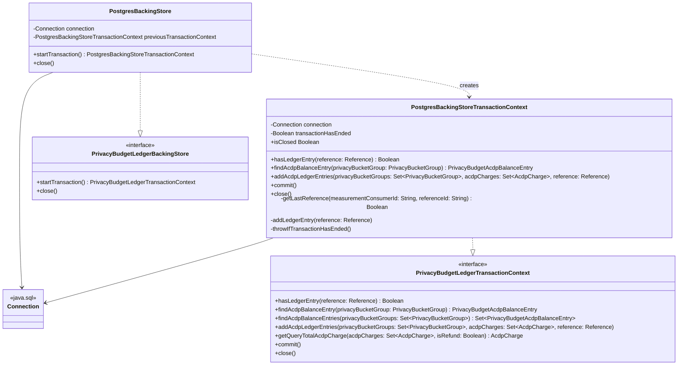

# org.wfanet.measurement.eventdataprovider.privacybudgetmanagement.deploy.common.postgres

## Overview
PostgreSQL-based implementation of the privacy budget ledger backing store for ACDP (Almost Concentrated Differential Privacy) budget management. This package provides JDBC-based persistence for tracking privacy budget charges across privacy bucket groups, with transactional support for atomic updates and replay prevention.

## Components

### PostgresBackingStore
JDBC-based implementation of PrivacyBudgetLedgerBackingStore using PostgreSQL-compatible SQL.

| Method | Parameters | Returns | Description |
|--------|------------|---------|-------------|
| startTransaction | - | `PostgresBackingStoreTransactionContext` | Initiates new database transaction for atomic operations |
| close | - | `Unit` | Closes underlying database connection |

**Constructor Parameters:**
- `createConnection: () -> Connection` - Factory function providing JDBC connection owned by backing store

**Behavior:**
- Disables auto-commit on initialization for manual transaction control
- Prevents nested transactions by tracking previous transaction state
- Throws `PrivacyBudgetManagerException` with type `NESTED_TRANSACTION` if previous transaction not closed
- Throws `PrivacyBudgetManagerException` with type `BACKING_STORE_CLOSED` if connection closed

### PostgresBackingStoreTransactionContext
Transaction context managing ACID properties for privacy budget ledger operations.

| Method | Parameters | Returns | Description |
|--------|------------|---------|-------------|
| hasLedgerEntry | `reference: Reference` | `Boolean` | Checks if ledger entry exists for given reference |
| findAcdpBalanceEntry | `privacyBucketGroup: PrivacyBucketGroup` | `PrivacyBudgetAcdpBalanceEntry` | Retrieves ACDP charge balance for privacy bucket group |
| addAcdpLedgerEntries | `privacyBucketGroups: Set<PrivacyBucketGroup>`, `acdpCharges: Set<AcdpCharge>`, `reference: Reference` | `Unit` | Inserts or updates ACDP charges with batch processing |
| commit | - | `Unit` | Commits transaction and marks context as ended |
| close | - | `Unit` | Rolls back transaction and marks context as ended |

**Properties:**
- `isClosed: Boolean` - Indicates whether transaction has ended (committed or rolled back)

**Private Methods:**
- `getLastReference` - Queries most recent ledger entry for measurement consumer and reference ID
- `addLedgerEntry` - Inserts new ledger entry with current timestamp
- `throwIfTransactionHasEnded` - Guards against operations after commit/rollback

**Batch Processing:**
- `addAcdpLedgerEntries` processes insertions in batches of 1000 rows (MAX_BATCH_INSERT)
- Uses UPSERT semantics (INSERT ON CONFLICT DO UPDATE) to aggregate charges
- Supports both charge and refund operations (negative charges for refunds)

**Replay Prevention:**
- `hasLedgerEntry` verifies if reference already processed by checking most recent entry with matching `isRefund` value
- Inaccurate results possible with multiple in-flight entries sharing (MeasurementConsumerId, ReferenceId)

## Data Structures

### Database Schema (ledger.sql)

| Table | Key Columns | Purpose |
|-------|-------------|---------|
| PrivacyBucketAcdpCharges | MeasurementConsumerId, Date, AgeGroup, Gender, VidStart | Stores aggregated Rho and Theta charges per privacy bucket |
| LedgerEntries | MeasurementConsumerId, ReferenceId, IsRefund, CreateTime | Tracks reference history for replay detection |

**Custom Types:**
- `Gender ENUM('M', 'F')` - Gender dimension for privacy buckets
- `AgeGroup ENUM('18_34', '35_54', '55+')` - Age range dimension for privacy buckets

**Indexes:**
- `LedgerEntriesByReferenceId` on (MeasurementConsumerId, ReferenceId) - Optimizes reference lookups

## Dependencies
- `java.sql.*` - JDBC API for database connectivity and operations
- `org.wfanet.measurement.eventdataprovider.privacybudgetmanagement.PrivacyBudgetLedgerBackingStore` - Interface implemented by PostgresBackingStore
- `org.wfanet.measurement.eventdataprovider.privacybudgetmanagement.PrivacyBudgetLedgerTransactionContext` - Interface implemented by PostgresBackingStoreTransactionContext
- `org.wfanet.measurement.eventdataprovider.privacybudgetmanagement.AcdpCharge` - Data class representing (rho, theta) privacy charge
- `org.wfanet.measurement.eventdataprovider.privacybudgetmanagement.PrivacyBucketGroup` - Data class defining privacy bucket dimensions (date, age, gender, VID range)
- `org.wfanet.measurement.eventdataprovider.privacybudgetmanagement.PrivacyBudgetAcdpBalanceEntry` - Aggregated balance for privacy bucket group
- `org.wfanet.measurement.eventdataprovider.privacybudgetmanagement.Reference` - Identifies charge source (measurementConsumerId, referenceId, isRefund)
- `org.wfanet.measurement.eventdataprovider.privacybudgetmanagement.PrivacyBudgetManagerException` - Exception types for error handling

## Testing Utilities

### Schemata.kt
Provides access to SQL schema file for test environments.

| Constant | Type | Purpose |
|----------|------|---------|
| POSTGRES_LEDGER_SCHEMA_FILE | `File` | Absolute path to ledger.sql schema file |

**Usage:**
- Enables test setup to initialize PostgreSQL schema from embedded SQL file
- Uses `getRuntimePath` to resolve schema location relative to runtime environment

## Usage Example
```kotlin
// Initialize backing store with connection factory
val backingStore = PostgresBackingStore {
  DriverManager.getConnection("jdbc:postgresql://localhost/ledger", "user", "pass")
}

// Start transaction for privacy budget operation
val txContext = backingStore.startTransaction()

try {
  // Check current balance for privacy bucket
  val bucketGroup = PrivacyBucketGroup(
    measurementConsumerId = "mc_123",
    startingDate = LocalDate.of(2024, 1, 15),
    endingDate = LocalDate.of(2024, 1, 15),
    ageGroup = AgeGroup.RANGE_18_34,
    gender = Gender.MALE,
    vidSampleStart = 0.0f,
    vidSampleWidth = 0.1f
  )

  val balanceEntry = txContext.findAcdpBalanceEntry(bucketGroup)

  // Add new charges if within budget
  val newCharges = setOf(AcdpCharge(rho = 0.01, theta = 0.001))
  val reference = Reference("mc_123", "requisition_456", isRefund = false)

  if (!txContext.hasLedgerEntry(reference)) {
    txContext.addAcdpLedgerEntries(setOf(bucketGroup), newCharges, reference)
  }

  // Commit transaction
  txContext.commit()
} catch (e: Exception) {
  txContext.close() // Rolls back on error
  throw e
}
```

## Class Diagram


## Known Limitations
- JDBC-based implementation (blocking I/O) instead of reactive R2DBC
- `hasLedgerEntry` may return inaccurate results with concurrent in-flight entries for same (MeasurementConsumerId, ReferenceId)
- Coroutine suspend functions perform blocking JDBC calls without dispatcher configuration
- Schema normalization opportunities noted for (Delta, Epsilon) pairs and LedgerEntries-to-BalanceEntries linkage
