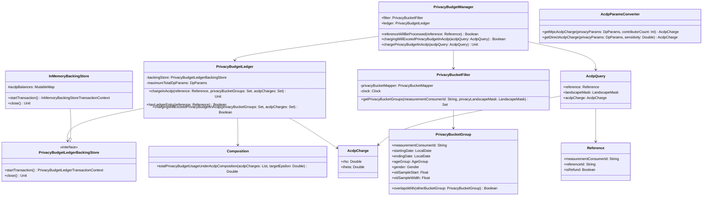

# org.wfanet.measurement.eventdataprovider.privacybudgetmanagement

## Overview
This package implements privacy budget management for Event Data Providers using Almost Concentrated Differential Privacy (ACDP) composition. It tracks and enforces privacy budget constraints across multiple measurements, converting per-query DP parameters (epsilon, delta) to ACDP parameters (rho, theta) for Gaussian noise mechanisms, and managing privacy consumption across privacy buckets segmented by demographics, time periods, and VID sampling intervals.

## Components

### PrivacyBudgetManager
Primary interface for privacy budget operations, coordinating filtering, charging, and budget validation.

| Method | Parameters | Returns | Description |
|--------|------------|---------|-------------|
| referenceWillBeProcessed | `reference: Reference` | `Boolean` | Checks if reference will result in ledger update |
| chargingWillExceedPrivacyBudgetInAcdp | `acdpQuery: AcdpQuery` | `Boolean` | Validates if charge would exceed budget limits |
| chargePrivacyBudgetInAcdp | `acdpQuery: AcdpQuery` | `Unit` | Charges privacy budget using ACDP composition |

### PrivacyBudgetLedger
Manages privacy budget updates and validates budget constraints using ACDP composition.

| Method | Parameters | Returns | Description |
|--------|------------|---------|-------------|
| chargeInAcdp | `reference: Reference`, `privacyBucketGroups: Set<PrivacyBucketGroup>`, `acdpCharges: Set<AcdpCharge>` | `suspend Unit` | Adds ACDP charges to buckets atomically |
| hasLedgerEntry | `reference: Reference` | `suspend Boolean` | Checks if reference exists in ledger |
| chargingWillExceedPrivacyBudgetInAcdp | `privacyBucketGroups: Set<PrivacyBucketGroup>`, `acdpCharges: Set<AcdpCharge>` | `suspend Boolean` | Validates charge without committing |

### PrivacyBucketFilter
Identifies privacy buckets affected by a query based on event filters, demographics, and sampling.

| Method | Parameters | Returns | Description |
|--------|------------|---------|-------------|
| getPrivacyBucketGroups | `measurementConsumerId: String`, `privacyLandscapeMask: LandscapeMask` | `Set<PrivacyBucketGroup>` | Returns all affected privacy bucket groups |

### AcdpParamsConverter
Converts DP parameters to ACDP parameters for MPC and direct measurements using Gaussian noise.

| Method | Parameters | Returns | Description |
|--------|------------|---------|-------------|
| getMpcAcdpCharge | `privacyParams: DpParams`, `contributorCount: Int` | `AcdpCharge` | Converts MPC DP params to ACDP (memoized) |
| getDirectAcdpCharge | `privacyParams: DpParams`, `sensitivity: Double` | `AcdpCharge` | Converts direct DP params to ACDP |
| computeMpcSigmaDistributedDiscreteGaussian | `privacyParams: DpParams`, `contributorCount: Int` | `Double` | Computes distributed sigma for MPC |

### Composition
Computes total delta after ACDP composition given target epsilon.

| Method | Parameters | Returns | Description |
|--------|------------|---------|-------------|
| totalPrivacyBudgetUsageUnderAcdpComposition | `acdpCharges: List<AcdpCharge>`, `targetEpsilon: Double` | `Double` | Calculates total delta via Brent optimization |

### InMemoryBackingStore
In-memory implementation of privacy budget ledger backing store for testing and small-scale use.

| Method | Parameters | Returns | Description |
|--------|------------|---------|-------------|
| startTransaction | - | `InMemoryBackingStoreTransactionContext` | Creates new transaction context |
| close | - | `Unit` | Closes the backing store |

### InMemoryBackingStoreTransactionContext
Transaction context for in-memory backing store operations.

| Method | Parameters | Returns | Description |
|--------|------------|---------|-------------|
| hasLedgerEntry | `reference: Reference` | `suspend Boolean` | Checks if reference exists in ledger |
| findAcdpBalanceEntry | `privacyBucketGroup: PrivacyBucketGroup` | `suspend PrivacyBudgetAcdpBalanceEntry` | Retrieves ACDP balance for bucket group |
| addAcdpLedgerEntries | `privacyBucketGroups: Set<PrivacyBucketGroup>`, `acdpCharges: Set<AcdpCharge>`, `reference: Reference` | `suspend Unit` | Adds entries and updates balances |
| commit | - | `suspend Unit` | Commits transaction to backing maps |
| close | - | `Unit` | Closes transaction context |

### PrivacyBucketMapper
Maps privacy bucket groups to event filter programs for matching.

| Method | Parameters | Returns | Description |
|--------|------------|---------|-------------|
| toPrivacyFilterProgram | `filterExpression: String` | `Program` | Converts filter expression to CEL program |
| toEventMessage | `privacyBucketGroup: PrivacyBucketGroup` | `Message` | Converts bucket group to event message |
| matches | `privacyBucketGroup: PrivacyBucketGroup`, `program: Program` | `Boolean` | Checks if bucket matches filter program |

### PrivacyBudgetLedgerBackingStore
Interface for persistent storage of privacy budget data with ACID guarantees.

| Method | Parameters | Returns | Description |
|--------|------------|---------|-------------|
| startTransaction | - | `PrivacyBudgetLedgerTransactionContext` | Initiates atomic transaction context |
| close | - | `Unit` | Closes backing store resources |

### PrivacyBudgetLedgerTransactionContext
Manages atomic privacy budget ledger operations within a transaction.

| Method | Parameters | Returns | Description |
|--------|------------|---------|-------------|
| findAcdpBalanceEntry | `privacyBucketGroup: PrivacyBucketGroup` | `suspend PrivacyBudgetAcdpBalanceEntry` | Retrieves single balance entry |
| findAcdpBalanceEntries | `privacyBucketGroup: Set<PrivacyBucketGroup>` | `suspend Set<PrivacyBudgetAcdpBalanceEntry>` | Retrieves multiple balance entries |
| addAcdpLedgerEntries | `privacyBucketGroups: Set<PrivacyBucketGroup>`, `acdpCharges: Set<AcdpCharge>`, `reference: Reference` | `suspend Unit` | Adds charges and reference entry |
| getQueryTotalAcdpCharge | `acdpCharges: Set<AcdpCharge>`, `isRefund: Boolean` | `AcdpCharge` | Computes total charge (negative if refund) |
| hasLedgerEntry | `reference: Reference` | `suspend Boolean` | Checks for existing reference entry |
| commit | - | `suspend Unit` | Commits transaction to persistent store |
| close | - | `Unit` | Closes transaction context |

### PrivacyLandscape
Defines privacy bucket dimensions including VID intervals, demographics, and time periods.

| Property | Type | Description |
|----------|------|-------------|
| PRIVACY_BUCKET_VID_SAMPLE_WIDTH | `Float` | VID sample width (1/300) |
| datePeriod | `ChronoPeriod` | One year lookback period |
| ageGroups | `Set<AgeGroup>` | All age group values |
| genders | `Set<Gender>` | All gender values |
| vidsIntervalStartPoints | `List<Float>` | 300 VID interval start points |

### PrivacyBudgetManagerException
Exception thrown for privacy budget management errors.

| Property | Type | Description |
|----------|------|-------------|
| errorType | `PrivacyBudgetManagerExceptionType` | Specific error category |
| cause | `Throwable?` | Optional underlying cause |

## Data Structures

### AcdpCharge
| Property | Type | Description |
|----------|------|-------------|
| rho | `Double` | ACDP rho parameter |
| theta | `Double` | ACDP theta parameter |

### Reference
| Property | Type | Description |
|----------|------|-------------|
| measurementConsumerId | `String` | Measurement consumer identifier |
| referenceId | `String` | Reference ID (typically requisition ID) |
| isRefund | `Boolean` | Whether charge is a refund |

### EventGroupSpec
| Property | Type | Description |
|----------|------|-------------|
| eventFilter | `String` | CEL event filter expression |
| timeRange | `OpenEndTimeRange` | Time range for events |

### LandscapeMask
| Property | Type | Description |
|----------|------|-------------|
| eventGroupSpecs | `List<EventGroupSpec>` | Event group specifications |
| vidSampleStart | `Float` | VID sampling interval start |
| vidSampleWidth | `Float` | VID sampling interval width |

### AcdpQuery
| Property | Type | Description |
|----------|------|-------------|
| reference | `Reference` | Charge reference information |
| landscapeMask | `LandscapeMask` | Privacy landscape mask |
| acdpCharge | `AcdpCharge` | ACDP charge to apply |

### PrivacyBucketGroup
| Property | Type | Description |
|----------|------|-------------|
| measurementConsumerId | `String` | Measurement consumer identifier |
| startingDate | `LocalDate` | Bucket start date |
| endingDate | `LocalDate` | Bucket end date |
| ageGroup | `AgeGroup` | Demographic age group |
| gender | `Gender` | Demographic gender |
| vidSampleStart | `Float` | VID interval start point |
| vidSampleWidth | `Float` | VID interval width |

| Method | Parameters | Returns | Description |
|--------|------------|---------|-------------|
| overlapsWith | `otherBucketGroup: PrivacyBucketGroup` | `Boolean` | Checks if buckets overlap |

### AgeGroup
Enum representing demographic age ranges.

| Value | String |
|-------|--------|
| RANGE_18_34 | "18_34" |
| RANGE_35_54 | "35_54" |
| ABOVE_54 | "55+" |

### Gender
Enum representing demographic gender categories.

| Value | String |
|-------|--------|
| MALE | "M" |
| FEMALE | "F" |

### PrivacyBudgetAcdpBalanceEntry
| Property | Type | Description |
|----------|------|-------------|
| privacyBucketGroup | `PrivacyBucketGroup` | Associated bucket group |
| acdpCharge | `AcdpCharge` | Aggregated ACDP charge balance |

### PrivacyBudgetLedgerEntry
| Property | Type | Description |
|----------|------|-------------|
| measurementConsumerId | `String` | Measurement consumer identifier |
| referenceId | `String` | Reference identifier |
| isRefund | `Boolean` | Whether entry is a refund |
| createTime | `Instant` | Entry creation timestamp |

### PrivacyBudgetManagerExceptionType
Enum defining error categories for privacy budget operations.

| Value | Error Message |
|-------|---------------|
| INVALID_PRIVACY_BUCKET_FILTER | "Provided Event Filter is invalid for Privacy Bucket mapping" |
| PRIVACY_BUDGET_EXCEEDED | "The available privacy budget was exceeded" |
| DATABASE_UPDATE_ERROR | "An error occurred committing the update to the database" |
| UPDATE_AFTER_COMMIT | "Cannot update a transaction context after a commit" |
| NESTED_TRANSACTION | "Backing Store doesn't support nested transactions" |
| BACKING_STORE_CLOSED | "Cannot start a transaction after closing the backing store" |
| INCORRECT_NOISE_MECHANISM | "Noise mechanism should be DISCRETE_GAUSSIAN or GAUSSIAN for ACDP composition" |

## Dependencies

- `org.wfanet.measurement.eventdataprovider.noiser` - Provides DpParams and GaussianNoiser for noise generation
- `org.wfanet.measurement.eventdataprovider.eventfiltration` - EventFilters for CEL program evaluation
- `org.wfanet.measurement.common` - OpenEndTimeRange and time utilities
- `org.projectnessie.cel` - CEL Program for filter expression evaluation
- `org.apache.commons.math3.optim` - Brent optimizer for ACDP composition calculations
- `com.google.protobuf` - Message interface for event representation

## Usage Example

```kotlin
// Initialize privacy budget manager
val backingStore = InMemoryBackingStore()
val privacyBucketMapper = TestPrivacyBucketMapper()
val filter = PrivacyBucketFilter(privacyBucketMapper)
val manager = PrivacyBudgetManager(
  filter = filter,
  backingStore = backingStore,
  maximumPrivacyBudget = 1.0f,
  maximumTotalDelta = 1.0e-9f
)

// Create ACDP query
val reference = Reference(
  measurementConsumerId = "mc-001",
  referenceId = "req-123",
  isRefund = false
)

val landscapeMask = LandscapeMask(
  eventGroupSpecs = listOf(
    EventGroupSpec(
      eventFilter = "age >= 18 && age <= 34",
      timeRange = OpenEndTimeRange.fromClosedDateRange(startDate..endDate)
    )
  ),
  vidSampleStart = 0.0f,
  vidSampleWidth = 0.1f
)

val dpParams = DpParams(epsilon = 0.5, delta = 1e-10)
val acdpCharge = AcdpParamsConverter.getMpcAcdpCharge(dpParams, contributorCount = 3)

val query = AcdpQuery(
  reference = reference,
  landscapeMask = landscapeMask,
  acdpCharge = acdpCharge
)

// Check and charge privacy budget
if (!manager.chargingWillExceedPrivacyBudgetInAcdp(query)) {
  manager.chargePrivacyBudgetInAcdp(query)
}
```

## Class Diagram


