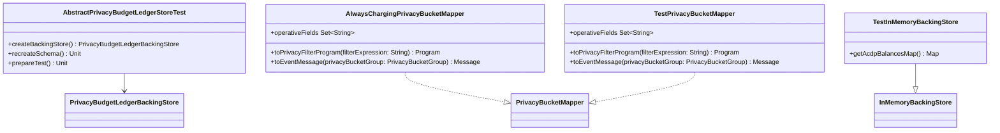

# org.wfanet.measurement.eventdataprovider.privacybudgetmanagement.testing

## Overview
Testing utilities and base classes for privacy budget management components. Provides abstract test suites for validating backing store implementations, test mappers for privacy bucket operations, and in-memory backing store implementations for unit testing.

## Components

### AbstractPrivacyBudgetLedgerStoreTest
Abstract test suite defining contract tests for PrivacyBudgetLedgerBackingStore implementations.

| Method | Parameters | Returns | Description |
|--------|------------|---------|-------------|
| createBackingStore | - | `PrivacyBudgetLedgerBackingStore` | Factory method for backing store instances |
| recreateSchema | - | `Unit` | Resets database schema between tests |
| prepareTest | - | `Unit` | Setup hook executed before each test |

**Test Coverage:**
- Ledger entry existence checks with `hasLedgerEntry`
- ACDP balance retrieval for empty and populated ledgers
- Multi-bucket ACDP charge addition and aggregation
- Batch balance entry queries via `findAcdpBalanceEntries`
- Measurement consumer isolation per requisition
- Charge and refund transaction pairs
- Transaction commit and persistence verification

### AlwaysChargingPrivacyBucketMapper
Test implementation of PrivacyBucketMapper that charges all privacy buckets regardless of event content.

| Method | Parameters | Returns | Description |
|--------|------------|---------|-------------|
| operativeFields | - | `Set<String>` | Returns empty set (no operative fields) |
| toPrivacyFilterProgram | `filterExpression: String` | `Program` | Compiles trivial CEL program always evaluating true |
| toEventMessage | `privacyBucketGroup: PrivacyBucketGroup` | `Message` | Returns default TestEvent instance |

### TestPrivacyBucketMapper
PrivacyBucketMapper implementation for TestEvent instances supporting age group and gender fields.

| Method | Parameters | Returns | Description |
|--------|------------|---------|-------------|
| operativeFields | - | `Set<String>` | Returns set containing "person.age_group" and "person.gender" |
| toPrivacyFilterProgram | `filterExpression: String` | `Program` | Compiles CEL program with operative field constraints |
| toEventMessage | `privacyBucketGroup: PrivacyBucketGroup` | `Message` | Converts PrivacyBucketGroup to TestEvent with person demographics |

### TestInMemoryBackingStore
Extends InMemoryBackingStore with test-specific access to internal state.

| Method | Parameters | Returns | Description |
|--------|------------|---------|-------------|
| getAcdpBalancesMap | - | `Map` | Exposes internal acdpBalances map for test assertions |

## Data Structures

### AgeGroup Mapping
| Privacy AgeGroup | TestEvent Person.AgeGroup |
|------------------|---------------------------|
| `RANGE_18_34` | `YEARS_18_TO_34` |
| `RANGE_35_54` | `YEARS_35_TO_54` |
| `ABOVE_54` | `YEARS_55_PLUS` |

### Gender Mapping
| Privacy Gender | TestEvent Person.Gender |
|----------------|------------------------|
| `MALE` | `MALE` |
| `FEMALE` | `FEMALE` |

## Dependencies
- `org.wfanet.measurement.eventdataprovider.privacybudgetmanagement` - Core privacy budget types and interfaces
- `org.wfanet.measurement.api.v2alpha.event_templates.testing` - TestEvent protobuf definitions
- `org.wfanet.measurement.eventdataprovider.eventfiltration` - CEL program compilation for event filtering
- `com.google.common.truth` - Truth assertion library for test verification
- `org.projectnessie.cel` - CEL (Common Expression Language) runtime
- `org.junit` - JUnit testing framework

## Usage Example
```kotlin
// Implement abstract test base for a concrete backing store
class PostgresBackingStoreTest : AbstractPrivacyBudgetLedgerStoreTest() {
  override fun createBackingStore() = PostgresBackingStore(dataSource)
  override fun recreateSchema() { dropAndCreateTables() }
}

// Use test mappers in privacy budget tests
val mapper = TestPrivacyBucketMapper()
val bucket = PrivacyBucketGroup(
  measurementConsumerId = "MC1",
  eventStart = LocalDate.parse("2024-01-01"),
  eventEnd = LocalDate.parse("2024-01-01"),
  ageGroup = AgeGroup.RANGE_18_34,
  gender = Gender.MALE,
  vidSampleStart = 0.0f,
  vidSampleWidth = 0.1f
)
val eventMessage = mapper.toEventMessage(bucket)
val program = mapper.toPrivacyFilterProgram("person.age_group == 1")
```

## Class Diagram

