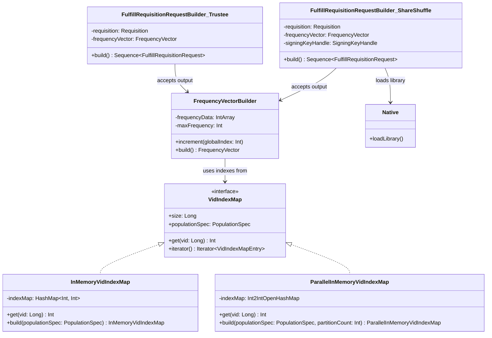

# org.wfanet.measurement.eventdataprovider.requisition

## Overview
Provides requisition fulfillment infrastructure for Event Data Providers in the Cross-Media Measurement system. Implements VID-to-index mapping, frequency vector construction, and protocol-specific request builders for TrusTee and HonestMajorityShareShuffle measurement protocols.

## Components

### Native
JNI native library loader for secret share generation operations.

| Method | Parameters | Returns | Description |
|--------|------------|---------|-------------|
| loadLibrary | - | `Unit` | Loads native secret share generator library from JAR resources |

### VidIndexMap (Interface)
Maps virtual identifiers to frequency vector indexes for population specifications.

| Method | Parameters | Returns | Description |
|--------|------------|---------|-------------|
| get | `vid: Long` | `Int` | Retrieves frequency vector index for given VID |
| iterator | - | `Iterator<VidIndexMapEntry>` | Returns iterator over VID-to-index mappings |
| validatePopulationSpec | `populationSpec: PopulationSpec` | `Unit` | Validates VID ranges in population specification |
| hashVidToLongWithFarmHash | `vid: Long, salt: ByteString` | `Long` | Hashes VID using FarmHash fingerprint algorithm |
| collectVids | `populationSpec: PopulationSpec` | `IntArray` | Extracts all VIDs from population specification ranges |

### InMemoryVidIndexMap
Sequential in-memory VID index map using standard HashMap storage.

| Method | Parameters | Returns | Description |
|--------|------------|---------|-------------|
| get | `vid: Long` | `Int` | Returns index for VID or throws VidNotFoundException |
| iterator | - | `Iterator<VidIndexMapEntry>` | Creates iterator over stored VID entries |
| build | `populationSpec: PopulationSpec` | `InMemoryVidIndexMap` | Constructs map using default FarmHash function |
| build | `populationSpec: PopulationSpec, indexMapEntries: Flow<VidIndexMapEntry>` | `InMemoryVidIndexMap` | Constructs map from pre-computed index entries |
| buildInternal | `populationSpec: PopulationSpec, hashFunction: (Long, ByteString) -> Long` | `InMemoryVidIndexMap` | Builds map with custom hash function for testing |
| generateHashes | `populationSpec: PopulationSpec, hashFunction: (Long, ByteString) -> Long` | `List<VidAndHash>` | Generates VID/hash pairs for all population VIDs |

### ParallelInMemoryVidIndexMap
Parallel-optimized VID index map using FastUtil Int2IntOpenHashMap and coroutine-based sharding.

| Method | Parameters | Returns | Description |
|--------|------------|---------|-------------|
| get | `vid: Long` | `Int` | Returns index for VID or throws VidNotFoundException |
| iterator | - | `Iterator<VidIndexMapEntry>` | Creates iterator over FastUtil map entries |
| build | `populationSpec: PopulationSpec, partitionCount: Int` | `ParallelInMemoryVidIndexMap` | Builds parallel map with specified partition count |
| buildInternal | `populationSpec: PopulationSpec, hashFunction: (Long, ByteString) -> Long, partitionCount: Int` | `ParallelInMemoryVidIndexMap` | Builds parallel map with custom hash function |
| populateIndexMap | `hashesArray: Array<VidAndHash>, indexMap: Int2IntOpenHashMap, partitionCount: Int` | `Unit` | Populates index map from sorted hashes using partitions |
| generateHashes | `populationSpec: PopulationSpec, hashFunction: (Long, ByteString) -> Long, partitionCount: Int?` | `Array<VidAndHash>` | Generates VID/hash pairs using parallel coroutines |
| applyPartitioned | `totalElements: Int, desiredPartitions: Int, task: suspend (PartitionBounds) -> R` | `Unit` | Executes task across partitioned element ranges |

### FrequencyVectorBuilder
Constructs frequency vectors for measurement specifications with VID sampling and frequency capping.

| Method | Parameters | Returns | Description |
|--------|------------|---------|-------------|
| build | - | `FrequencyVector` | Constructs final frequency vector from accumulated data |
| increment | `globalIndex: Int` | `Unit` | Increments frequency at global VID index by 1 |
| incrementBy | `globalIndex: Int, amount: Int` | `Unit` | Increments frequency at global VID index by amount |
| incrementAll | `globalIndexes: Collection<Int>` | `Unit` | Increments all VID indexes in collection by 1 |
| incrementAllBy | `globalIndexes: Collection<Int>, amount: Int` | `Unit` | Increments all VID indexes in collection by amount |
| incrementAll | `other: FrequencyVectorBuilder` | `Unit` | Merges frequency data from another builder |
| build | `populationSpec: PopulationSpec, measurementSpec: MeasurementSpec, overrideImpressionMaxFrequencyPerUser: Int?, bind: FrequencyVectorBuilder.() -> Unit` | `FrequencyVector` | DSL builder for constructing frequency vectors |
| build | `populationSpec: PopulationSpec, measurementSpec: MeasurementSpec, frequencyVector: FrequencyVector, overrideImpressionMaxFrequencyPerUser: Int?, bind: FrequencyVectorBuilder.() -> Unit` | `FrequencyVector` | DSL builder initializing from existing frequency vector |

### FulfillRequisitionRequestBuilder (trustee)
Builds TrusTee protocol requisition fulfillment request sequences with optional envelope encryption.

| Method | Parameters | Returns | Description |
|--------|------------|---------|-------------|
| build | - | `Sequence<FulfillRequisitionRequest>` | Generates header and chunked body requests |
| buildEncrypted | `requisition: Requisition, requisitionNonce: Long, frequencyVector: FrequencyVector, encryptionParams: EncryptionParams` | `Sequence<FulfillRequisitionRequest>` | Creates encrypted fulfillment request sequence |
| buildUnencrypted | `requisition: Requisition, requisitionNonce: Long, frequencyVector: FrequencyVector` | `Sequence<FulfillRequisitionRequest>` | Creates unencrypted fulfillment request sequence |

### FulfillRequisitionRequestBuilder (shareshuffle)
Builds HonestMajorityShareShuffle protocol requisition fulfillment requests with secret share generation.

| Method | Parameters | Returns | Description |
|--------|------------|---------|-------------|
| build | - | `Sequence<FulfillRequisitionRequest>` | Generates header with encrypted seed and chunked share vector |
| build | `requisition: Requisition, requisitionNonce: Long, frequencyVector: FrequencyVector, dataProviderCertificateKey: DataProviderCertificateKey, signingKeyHandle: SigningKeyHandle, etag: String, generateSecretShares: (ByteArray) -> ByteArray` | `Sequence<FulfillRequisitionRequest>` | Creates HMSS fulfillment request sequence |

## Data Structures

### VidAndHash
| Property | Type | Description |
|----------|------|-------------|
| vid | `Int` | Virtual identifier value |
| hash | `Long` | FarmHash fingerprint of VID |

### EncryptionParams (trustee)
| Property | Type | Description |
|----------|------|-------------|
| kmsClient | `KmsClient` | Key management system client instance |
| kmsKekUri | `String` | Key encryption key URI |
| workloadIdentityProvider | `String` | GCP workload identity provider resource name |
| impersonatedServiceAccount | `String` | Service account name for impersonation |

### PartitionBounds
| Property | Type | Description |
|----------|------|-------------|
| startIndex | `Int` | Inclusive starting index of partition |
| endIndexExclusive | `Int` | Exclusive ending index of partition |
| length | `Int` | Number of elements in partition |

## Exceptions

### VidNotFoundException
Thrown when VID lookup fails in VidIndexMap.

### InconsistentIndexMapAndPopulationSpecException
Thrown when VID index map entries don't match PopulationSpec VID ranges.

| Property | Type | Description |
|----------|------|-------------|
| MAX_LIST_SIZE | `Int` | Maximum VIDs displayed in error message (10) |

## Dependencies
- `org.wfanet.measurement.api.v2alpha` - Protocol buffer definitions for requisitions, population specs, and measurement specs
- `org.wfanet.frequencycount` - Native frequency vector and secret share generation
- `org.wfanet.measurement.common.crypto.tink` - Tink-based streaming encryption primitives
- `org.wfanet.measurement.consent.client.dataprovider` - Requisition fingerprinting and random seed operations
- `com.google.crypto.tink` - Cryptographic key management and AEAD operations
- `it.unimi.dsi.fastutil` - High-performance primitive collections (Int2IntOpenHashMap)
- `kotlinx.coroutines` - Coroutine-based parallel execution framework

## Usage Example
```kotlin
// Create VID index map for population
val populationSpec = PopulationSpec.newBuilder()
  .addSubpopulations(subpopulation {
    vidRanges += vidRange {
      startVid = 1000
      endVidInclusive = 2000
    }
  })
  .build()

val vidIndexMap = InMemoryVidIndexMap.build(populationSpec)

// Build frequency vector from measurement events
val measurementSpec = MeasurementSpec.newBuilder()
  .setReach(reach { })
  .setVidSamplingInterval(vidSamplingInterval {
    start = 0.0
    width = 1.0
  })
  .build()

val frequencyVector = FrequencyVectorBuilder.build(
  populationSpec,
  measurementSpec
) {
  increment(vidIndexMap[1234])
  increment(vidIndexMap[1500])
}

// Fulfill requisition using TrusTee protocol
val requests = FulfillRequisitionRequestBuilder.buildUnencrypted(
  requisition,
  requisitionNonce,
  frequencyVector
)
```

## Class Diagram

