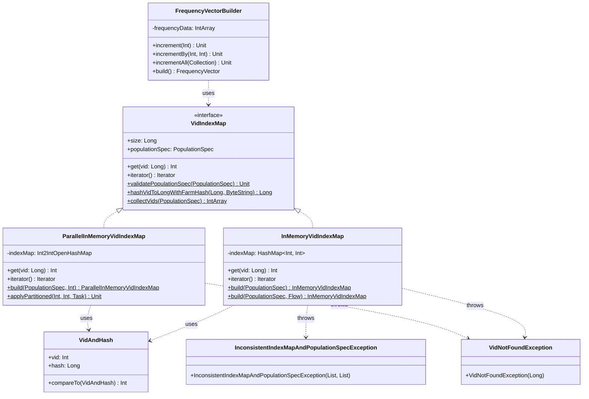

# org.wfanet.measurement.eventdataprovider.requisition.v2alpha.common

## Overview
Provides core data structures and implementations for mapping Virtual IDs (VIDs) to frequency vector indexes in the Event Data Provider requisition system. This package supports population-based measurements by managing VID-to-index mappings with both sequential and parallel processing strategies, and building frequency vectors from measurement specifications.

## Components

### VidIndexMap
Interface defining the contract for mapping VIDs to frequency vector indexes for a given PopulationSpec.

| Method | Parameters | Returns | Description |
|--------|------------|---------|-------------|
| get | `vid: Long` | `Int` | Retrieves frequency vector index for the specified VID |
| iterator | - | `Iterator<VidIndexMapEntry>` | Provides iteration over VID-index map entries |

| Property | Type | Description |
|----------|------|-------------|
| size | `Long` | Total number of VIDs managed by this map |
| populationSpec | `PopulationSpec` | Source population specification for this map |

**Companion Object Methods:**

| Method | Parameters | Returns | Description |
|--------|------------|---------|-------------|
| validatePopulationSpec | `populationSpec: PopulationSpec` | `Unit` | Validates VID ranges in population specification |
| hashVidToLongWithFarmHash | `vid: Long, salt: ByteString` | `Long` | Computes FarmHash fingerprint for VID with salt |
| collectVids | `populationSpec: PopulationSpec` | `IntArray` | Extracts all VIDs from population spec into array |

### InMemoryVidIndexMap
Sequential implementation of VidIndexMap using a standard HashMap for storage. Suitable for smaller populations where simplicity is preferred over parallel processing overhead.

| Method | Parameters | Returns | Description |
|--------|------------|---------|-------------|
| get | `vid: Long` | `Int` | Returns index for VID or throws VidNotFoundException |
| iterator | - | `Iterator` | Provides sequential iteration over entries |

**Static Builder Methods:**

| Method | Parameters | Returns | Description |
|--------|------------|---------|-------------|
| build | `populationSpec: PopulationSpec` | `InMemoryVidIndexMap` | Creates map using default FarmHash function |
| build | `populationSpec: PopulationSpec, indexMapEntries: Flow<VidIndexMapEntry>` | `InMemoryVidIndexMap` | Creates map from pre-computed entries flow |
| buildInternal | `populationSpec: PopulationSpec, hashFunction: (Long, ByteString) -> Long` | `InMemoryVidIndexMap` | Creates map with custom hash function |
| generateHashes | `populationSpec: PopulationSpec, hashFunction: (Long, ByteString) -> Long` | `List<VidAndHash>` | Generates VID-hash pairs for population |

### ParallelInMemoryVidIndexMap
Parallel-optimized VidIndexMap implementation using FastUtil's Int2IntOpenHashMap and coroutine-based partitioning. Recommended for large populations where parallel hashing and map construction provide significant performance benefits.

| Method | Parameters | Returns | Description |
|--------|------------|---------|-------------|
| get | `vid: Long` | `Int` | Returns index for VID from FastUtil map |
| iterator | - | `Iterator` | Provides iteration over FastUtil entries |

**Static Builder Methods:**

| Method | Parameters | Returns | Description |
|--------|------------|---------|-------------|
| build | `populationSpec: PopulationSpec, partitionCount: Int` | `ParallelInMemoryVidIndexMap` | Creates parallel map with specified partitions |
| buildInternal | `populationSpec: PopulationSpec, hashFunction: (Long, ByteString) -> Long, partitionCount: Int` | `ParallelInMemoryVidIndexMap` | Creates map with custom hash and partitioning |
| generateHashes | `populationSpec: PopulationSpec, hashFunction: (Long, ByteString) -> Long, partitionCount: Int?` | `Array<VidAndHash>` | Generates hashes using parallel partitions |
| populateIndexMap | `hashesArray: Array<VidAndHash>, indexMap: Int2IntOpenHashMap, partitionCount: Int` | `Unit` | Populates map from sorted hashes in parallel |
| applyPartitioned | `totalElements: Int, desiredPartitions: Int, task: suspend (PartitionBounds) -> R` | `Unit` | Executes task across element partitions |

### FrequencyVectorBuilder
Builder class for constructing frequency vectors from measurement specifications and population data. Handles VID sampling intervals, frequency capping, and supports both Reach and ReachAndFrequency measurement types.

| Method | Parameters | Returns | Description |
|--------|------------|---------|-------------|
| build | - | `FrequencyVector` | Constructs final frequency vector from accumulated data |
| increment | `globalIndex: Int` | `Unit` | Increments frequency at global index by 1 |
| incrementBy | `globalIndex: Int, amount: Int` | `Unit` | Increments frequency at global index by amount |
| incrementAll | `globalIndexes: Collection<Int>` | `Unit` | Increments all specified global indexes by 1 |
| incrementAllBy | `globalIndexes: Collection<Int>, amount: Int` | `Unit` | Increments all specified indexes by amount |
| incrementAll | `other: FrequencyVectorBuilder` | `Unit` | Merges another builder's data into this one |

| Property | Type | Description |
|----------|------|-------------|
| populationSpec | `PopulationSpec` | Population specification being measured |
| measurementSpec | `MeasurementSpec` | Measurement specification for Reach/ReachAndFrequency |
| strict | `Boolean` | Whether out-of-bounds indexes throw exceptions |
| kAnonymityParams | `KAnonymityParams?` | K-anonymity parameters for reach calculations |
| size | `Int` | Size of the frequency vector being managed |
| frequencyDataArray | `IntArray` | Raw frequency data array |

**Companion Object DSL Methods:**

| Method | Parameters | Returns | Description |
|--------|------------|---------|-------------|
| build | `populationSpec: PopulationSpec, measurementSpec: MeasurementSpec, overrideImpressionMaxFrequencyPerUser: Int?, bind: FrequencyVectorBuilder.() -> Unit` | `FrequencyVector` | Builds vector using DSL block |
| build | `populationSpec: PopulationSpec, measurementSpec: MeasurementSpec, frequencyVector: FrequencyVector, overrideImpressionMaxFrequencyPerUser: Int?, bind: FrequencyVectorBuilder.() -> Unit` | `FrequencyVector` | Builds vector from existing data using DSL |

## Data Structures

### VidAndHash
| Property | Type | Description |
|----------|------|-------------|
| vid | `Int` | Virtual ID value |
| hash | `Long` | Hash value computed for the VID |

Implements `Comparable<VidAndHash>` with comparison by hash first, then VID.

### PartitionBounds
| Property | Type | Description |
|----------|------|-------------|
| startIndex | `Int` | Inclusive start of partition range |
| endIndexExclusive | `Int` | Exclusive end of partition range |
| length | `Int` | Number of elements in partition |

### PopulationSpec Extension
| Property | Type | Description |
|----------|------|-------------|
| size | `Long` | Total VID count across all subpopulations |

## Exceptions

### VidNotFoundException
Thrown when a VID lookup fails in a VidIndexMap.

| Constructor Parameter | Type | Description |
|----------------------|------|-------------|
| vid | `Long` | The VID that was not found |

### InconsistentIndexMapAndPopulationSpecException
Thrown when a VidIndexMap and PopulationSpec have mismatched VID sets.

| Constructor Parameter | Type | Description |
|----------------------|------|-------------|
| vidsNotInPopulationSpec | `List<Long>` | VIDs present in map but missing from spec |
| vidsNotInIndexMap | `List<Long>` | VIDs present in spec but missing from map |

## Dependencies

- `org.wfanet.measurement.api.v2alpha` - PopulationSpec, MeasurementSpec, and validation
- `org.wfanet.measurement.eventdataprovider.shareshuffle` - VidIndexMapEntry protocol buffers
- `org.wfanet.frequencycount` - FrequencyVector protocol buffers
- `org.wfanet.measurement.computation` - KAnonymityParams configuration
- `com.google.common.hash` - FarmHash fingerprinting for VID hashing
- `it.unimi.dsi.fastutil.ints` - Efficient primitive int-to-int map
- `kotlinx.coroutines` - Parallel processing and flow collections

## Usage Example

```kotlin
// Build a VidIndexMap from a PopulationSpec
val populationSpec = PopulationSpec.newBuilder()
  .addSubpopulations(/* ... */)
  .build()

// For large populations, use parallel implementation
val vidIndexMap = ParallelInMemoryVidIndexMap.build(
  populationSpec,
  partitionCount = 8
)

// For smaller populations, use sequential implementation
val simpleMap = InMemoryVidIndexMap.build(populationSpec)

// Build a frequency vector
val measurementSpec = MeasurementSpec.newBuilder()
  .setReachAndFrequency(/* ... */)
  .setVidSamplingInterval(/* ... */)
  .build()

val frequencyVector = FrequencyVectorBuilder.build(
  populationSpec,
  measurementSpec,
  overrideImpressionMaxFrequencyPerUser = null
) {
  // Add frequency data for specific VIDs
  val vid = 12345L
  val index = vidIndexMap[vid]
  increment(index)
}

// Or use imperative style
val builder = FrequencyVectorBuilder(
  populationSpec,
  measurementSpec,
  overrideImpressionMaxFrequencyPerUser = null
)
builder.incrementBy(vidIndexMap[vid], 3)
val result = builder.build()
```

## Class Diagram


